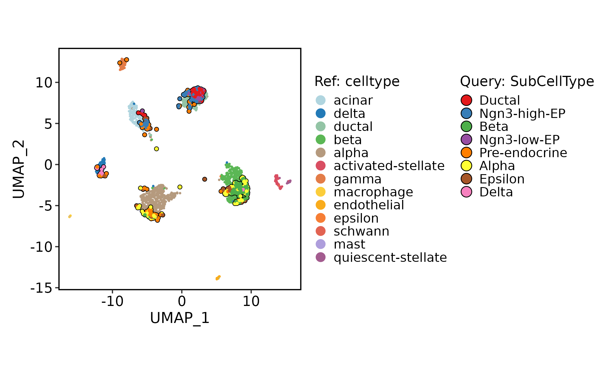
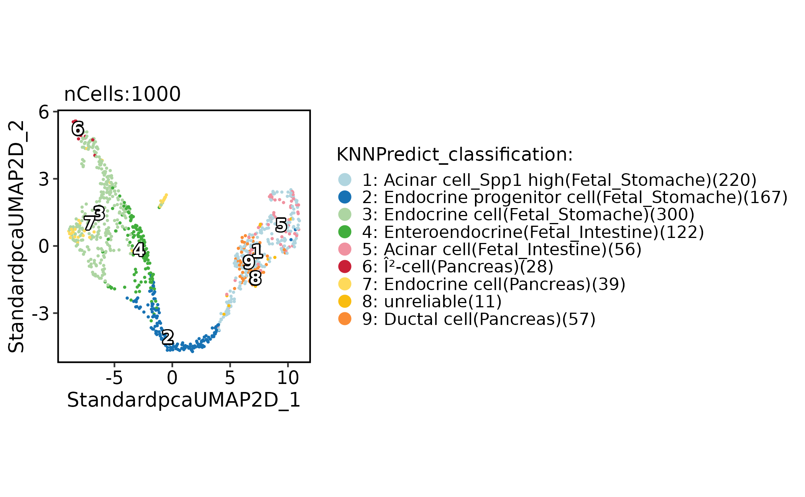
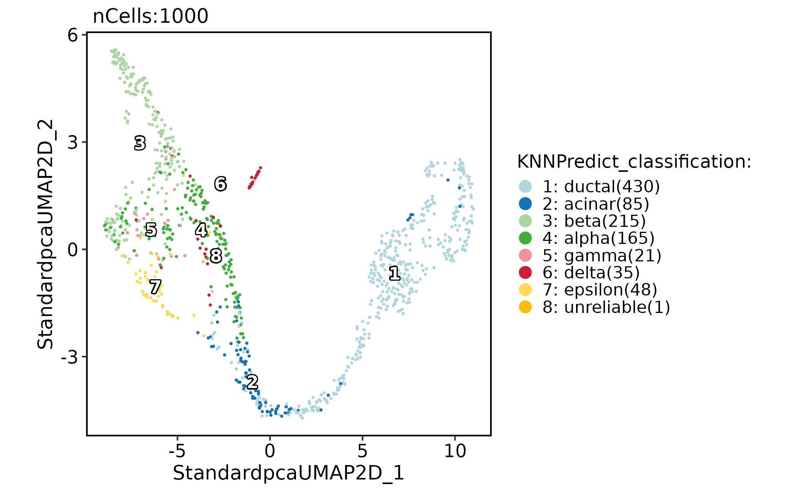
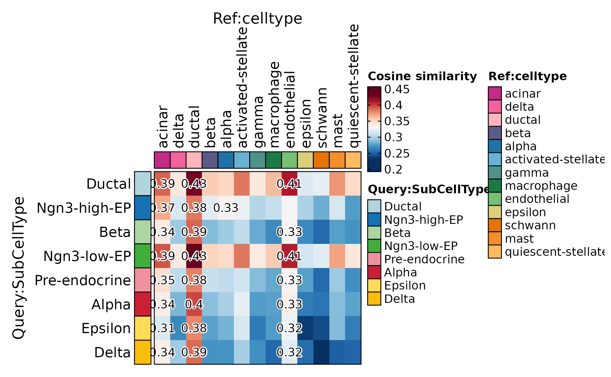

# Cell annotation workflow

This article shows how to annotate query cells in `scop` using reference
single-cell data, bulk-like reference profiles, and correlation-based
summaries. The goal is to make annotation evidence explicit instead of
treating transferred labels as final truth.

Use this workflow after the query object has passed basic preprocessing
and quality control.

Annotation in this article means evidence-backed label assignment.
Projection, nearest-neighbor prediction, and correlation heatmaps answer
related but different questions, so the transferred label should not be
treated as final until it agrees with marker expression and expected
biology.

## Prepare Query and Reference Objects

The query is the bundled mouse pancreas subset. The reference is the
bundled human pancreas integration subset, which has a `celltype`
annotation and an integrated embedding.

``` r

library(scop)
#>           ⬢          .        ⬡             ⬢     .
#>                      _____ _________  ____
#>                     / ___// ___/ __ ./ __ .
#>                    (__  )/ /__/ /_/ / /_/ /
#>                   /____/ .___/.____/ .___/
#>                                   /_/
#>       ⬢               .      ⬡        .          ⬢
#> ------------------------------------------------------------
#> Version: 0.9.1 (2026-09-01 update)
#> Website: https://mengxu98.github.io/scop/
#> 
#> Python environment initialization is disabled
#> To enable it, set: options(scop_env_init = TRUE)
#> 
#> The message can be suppressed by: 
#>   suppressPackageStartupMessages(library(scop))
#>   or options(log_message.verbose = FALSE)
#> ------------------------------------------------------------

data(pancreas_sub)
data(panc8_sub)

pancreas_sub <- RunStandardWorkflow(pancreas_sub, verbose = FALSE)
#> ℹ [2026-09-06 22:45:50] Skip `log1p()` because `layer = data` is not "counts"
panc8_sub <- RunIntegration(
  srt_merge = panc8_sub,
  batch = "tech",
  integration_methods = "Harmony"
)
#> ◌ [2026-09-06 22:45:53] Run integration workflow...
#> ℹ [2026-09-06 22:45:54] Split `srt_merge` into `srt_list` by "tech"
#> ℹ [2026-09-06 22:45:55] Checking a list of <Seurat>...
#> ! [2026-09-06 22:45:55] Data 1/5 of the `srt_list` is "unknown"
#> Warning: Data 1/5 of the `srt_list` is "unknown"
#> ℹ [2026-09-06 22:45:55] Perform `NormalizeData()` with `normalization.method = 'LogNormalize'` on 1/5 of `srt_list`...
#> ℹ [2026-09-06 22:45:55] Perform `FindVariableFeatures()` on 1/5 of `srt_list`...
#> ! [2026-09-06 22:45:55] Data 2/5 of the `srt_list` is "unknown"
#> Warning: Data 2/5 of the `srt_list` is "unknown"
#> ℹ [2026-09-06 22:45:55] Perform `NormalizeData()` with `normalization.method = 'LogNormalize'` on 2/5 of `srt_list`...
#> ℹ [2026-09-06 22:45:55] Perform `FindVariableFeatures()` on 2/5 of `srt_list`...
#> ! [2026-09-06 22:45:55] Data 3/5 of the `srt_list` is "unknown"
#> Warning: Data 3/5 of the `srt_list` is "unknown"
#> ℹ [2026-09-06 22:45:55] Perform `NormalizeData()` with `normalization.method = 'LogNormalize'` on 3/5 of `srt_list`...
#> ℹ [2026-09-06 22:45:55] Perform `FindVariableFeatures()` on 3/5 of `srt_list`...
#> ! [2026-09-06 22:45:55] Data 4/5 of the `srt_list` is "unknown"
#> Warning: Data 4/5 of the `srt_list` is "unknown"
#> ℹ [2026-09-06 22:45:55] Perform `NormalizeData()` with `normalization.method = 'LogNormalize'` on 4/5 of `srt_list`...
#> ℹ [2026-09-06 22:45:55] Perform `FindVariableFeatures()` on 4/5 of `srt_list`...
#> ! [2026-09-06 22:45:56] Data 5/5 of the `srt_list` is "unknown"
#> Warning: Data 5/5 of the `srt_list` is "unknown"
#> ℹ [2026-09-06 22:45:56] Perform `NormalizeData()` with `normalization.method = 'LogNormalize'` on 5/5 of `srt_list`...
#> ℹ [2026-09-06 22:45:56] Perform `FindVariableFeatures()` on 5/5 of `srt_list`...
#> ℹ [2026-09-06 22:45:56] Use the separate HVF from `srt_list`
#> ℹ [2026-09-06 22:45:56] Number of available HVF: 2000
#> ℹ [2026-09-06 22:45:56] Finished check
#> Warning: No layers found matching search pattern provided
#> Warning: Layer 'scale.data' is empty
#> ℹ [2026-09-06 22:46:01] Perform `Seurat::ScaleData()`
#> ℹ [2026-09-06 22:46:02] Perform linear dimension reduction("pca")
#> ℹ [2026-09-06 22:46:02] Perform Harmony integration
#> ℹ [2026-09-06 22:46:02] Using "Harmonypca" (1:20) as input
#> ℹ [2026-09-06 22:46:03] Adjust neighbor k from 20 to 20 for small-sample clustering
#> ℹ [2026-09-06 22:46:03] Perform `Seurat::FindClusters()` with "louvain"
#> ℹ [2026-09-06 22:46:04] Reorder clusters...
#> ℹ [2026-09-06 22:46:04] Skip `log1p()` because `layer = data` is not "counts"
#> ℹ [2026-09-06 22:46:04] Perform umap nonlinear dimension reduction using Harmony (1:20)
#> ℹ [2026-09-06 22:46:06] Perform umap nonlinear dimension reduction using Harmony (1:20)
#> ℹ [2026-09-06 22:46:09] Perform umap nonlinear dimension reduction using Harmonypca (1:20)
#> ✔ [2026-09-06 22:46:12] Harmony integration completed
```

When query and reference use different gene-name conventions,
standardize names before mapping. Keep the name conversion explicit so
that annotation results can be traced later. The example converts human
reference symbols into a mouse-like capitalization style because the
query object is mouse. In real analyses, use the species and ortholog
mapping appropriate for the experiment rather than relying on simple
capitalization.

``` r

genenames <- make.unique(
  thisutils::capitalize(
    rownames(panc8_sub[["RNA"]]),
    force_tolower = TRUE
  )
)
names(genenames) <- rownames(panc8_sub)

panc8_rename <- RenameFeatures(
  panc8_sub,
  newnames = genenames,
  assays = "RNA"
)
#> ℹ [2026-09-06 22:46:12] Rename features for the assay: RNA
```

## Project Query Cells Onto a Reference

Use projection when the reference has a trusted embedding and you want
to see where query cells land in that reference coordinate system.

``` r

srt_query <- RunKNNMap(
  srt_query = pancreas_sub,
  srt_ref = panc8_rename,
  ref_umap = "HarmonyUMAP2D"
)
#> ℹ [2026-09-06 22:46:13] Use the features to calculate distance metric
#> ℹ [2026-09-06 22:46:13] Data type is log-normalized
#> ℹ [2026-09-06 22:46:14] Data type is log-normalized
#> ℹ [2026-09-06 22:46:14] Use 638 features to calculate distance
#> ℹ [2026-09-06 22:46:14] Use raw method to find neighbors
#> ℹ [2026-09-06 22:46:14] Running UMAP projection

ProjectionPlot(
  srt_query = srt_query,
  srt_ref = panc8_rename,
  query_group = "SubCellType",
  ref_group = "celltype",
  ref_param = list(
    xlab = "UMAP_1",
    ylab = "UMAP_2"
  )
)
#> Scale for x is already present.
#> Adding another scale for x, which will replace the existing scale.
#> Scale for y is already present.
#> Adding another scale for y, which will replace the existing scale.
#> Warning: Removed 4 rows containing missing values or values outside the scale range
#> (`geom_point()`).
#> Removed 4 rows containing missing values or values outside the scale range
#> (`geom_point()`).
```



Projection is evidence for similarity, not a replacement for marker
validation. Use it together with marker plots and group-level summaries.
Cells landing near a reference group indicate transcriptional similarity
in the reference embedding. They do not prove identity when the
reference lacks the state, contains batch effects, or uses a broader
label vocabulary than the query.

## Predict Labels From a Bulk-Like Reference

Use
[`RunKNNPredict()`](https://mengxu98.github.io/scop/reference/RunKNNPredict.md)
with a bulk-like reference when reference profiles are available but not
individual reference cells.

``` r

data(ref_scMCA)

pancreas_sub <- RunKNNPredict(
  srt_query = pancreas_sub,
  bulk_ref = ref_scMCA,
  filter_lowfreq = 20
)
#> ℹ [2026-09-06 22:46:17] Use [1] 549 features to calculate distance.
#> ℹ [2026-09-06 22:46:17] Detected query data type: "log_normalized_counts"
#> ℹ [2026-09-06 22:46:17] Detected reference data type: "log_normalized_counts"
#> ℹ [2026-09-06 22:46:17] Calculate similarity...
#> ℹ [2026-09-06 22:46:17] Use raw method to find neighbors
#> ℹ [2026-09-06 22:46:17] Predict cell type...

CellDimPlot(
  pancreas_sub,
  group.by = "KNNPredict_classification",
  reduction = "UMAP",
  label = TRUE
)
```



Bulk-like references are useful for broad labels. They are less reliable
for substates that depend on local single-cell neighborhoods. The
`KNNPredict_classification` column is therefore best read as a suggested
label source. Keep it separate from curated annotations until discordant
groups have been reviewed.

## Predict Labels From a Single-Cell Reference

Use a single-cell reference when the reference annotation and query
biology are close enough for nearest-neighbor transfer.

``` r

pancreas_sub <- RunKNNPredict(
  srt_query = pancreas_sub,
  srt_ref = panc8_rename,
  ref_group = "celltype",
  filter_lowfreq = 20
)
#> ℹ [2026-09-06 22:46:18] Use the HVF to calculate distance metric
#> ℹ [2026-09-06 22:46:18] Use [1] 638 features to calculate distance.
#> As of Seurat v5, we recommend using AggregateExpression to perform pseudo-bulk analysis.
#> ℹ [2026-09-06 22:46:18] Detected query data type: "log_normalized_counts"
#> 
#> ℹ [2026-09-06 22:46:18] Detected reference data type: "log_normalized_counts"
#> 
#> ℹ [2026-09-06 22:46:18] Calculate similarity...
#> 
#> ℹ [2026-09-06 22:46:18] Use raw method to find neighbors
#> 
#> ℹ [2026-09-06 22:46:18] Predict cell type...
#> 
#> This message is displayed once per session.

CellDimPlot(
  pancreas_sub,
  group.by = "KNNPredict_classification",
  reduction = "UMAP",
  label = TRUE
)
```



Check group-level similarity before accepting labels. A correlation
heatmap can show whether query labels map cleanly to expected reference
labels or split across several alternatives. Rows in this heatmap are
query groups and columns are reference groups. High correlation to one
reference label supports a clear annotation; similar correlation to
multiple labels flags ambiguity.

``` r

ht <- CellCorHeatmap(
  srt_query = pancreas_sub,
  srt_ref = panc8_rename,
  query_group = "SubCellType",
  ref_group = "celltype",
  nlabel = 3,
  label_by = "row",
  show_row_names = TRUE,
  show_column_names = TRUE
)
#> ℹ [2026-09-06 22:46:18] Use the HVF to calculate distance metric
#> ℹ [2026-09-06 22:46:18] Use [1] 638 features to calculate distance.
#> ℹ [2026-09-06 22:46:19] Detected query data type: "log_normalized_counts"
#> ℹ [2026-09-06 22:46:19] Detected reference data type: "log_normalized_counts"
#> ℹ [2026-09-06 22:46:19] Calculate similarity...
#> ℹ [2026-09-06 22:46:19] Use raw method to find neighbors
#> ℹ [2026-09-06 22:46:19] Predict cell type...
print(ht$plot)
```



## What to Report

A compact annotation report should include:

- the query object, reference object, and gene-name conversion strategy;
- the reference label column and embedding used for projection;
- whether labels came from bulk-like profiles or single-cell neighbors;
- filtering thresholds such as `filter_lowfreq`;
- projection plots, predicted label plots, and marker-gene checks;
- ambiguous groups where several labels have similar support.

Treat annotation as an evidence layer. Keep transferred labels separate
from manual labels until marker genes and biological context support the
assignment.
