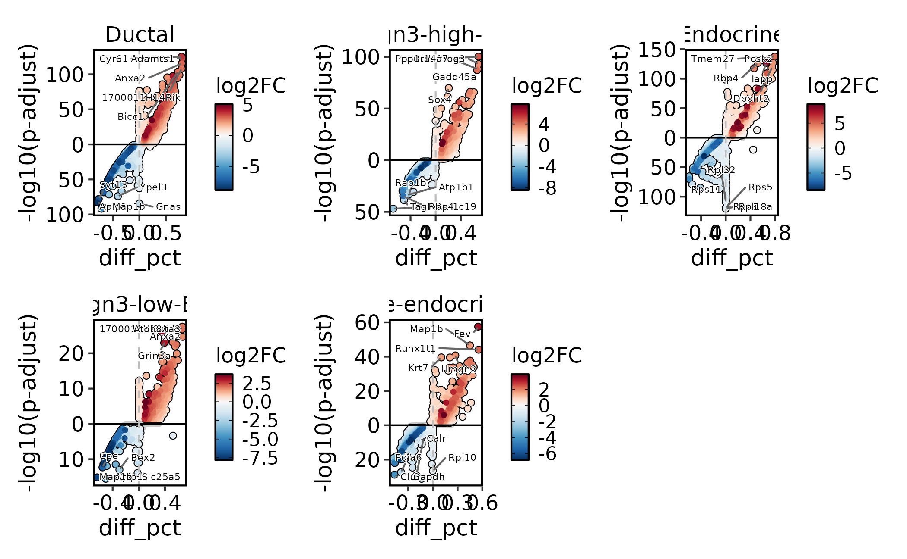
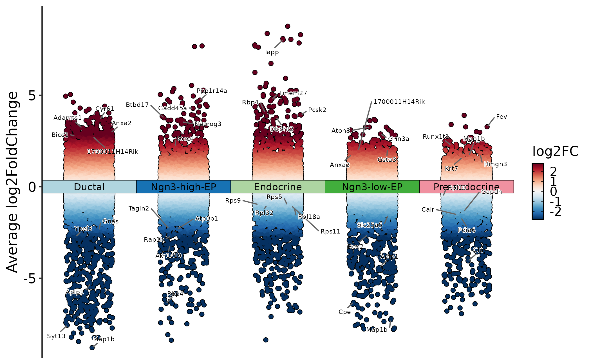
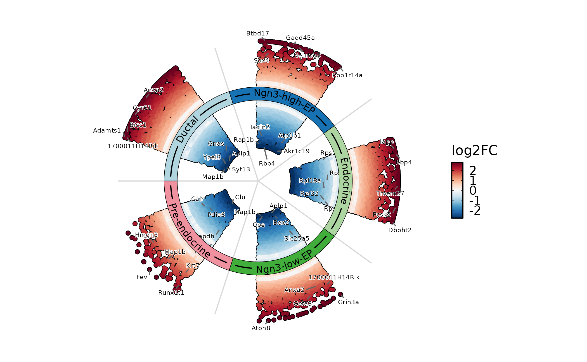
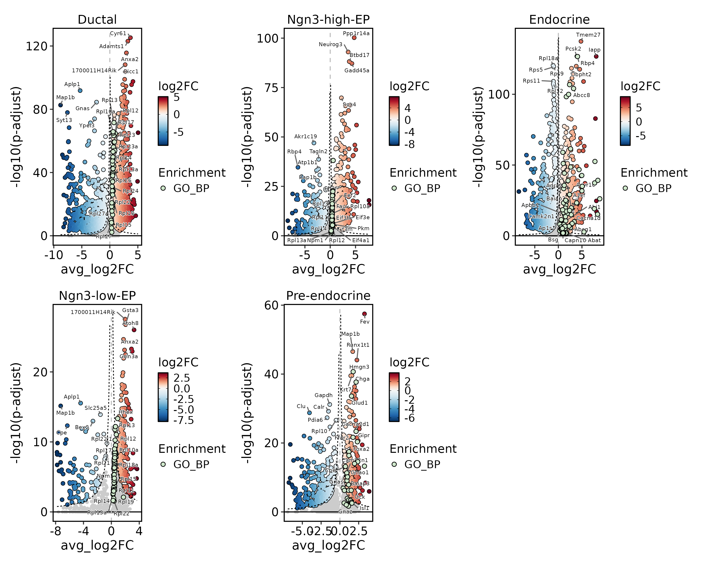
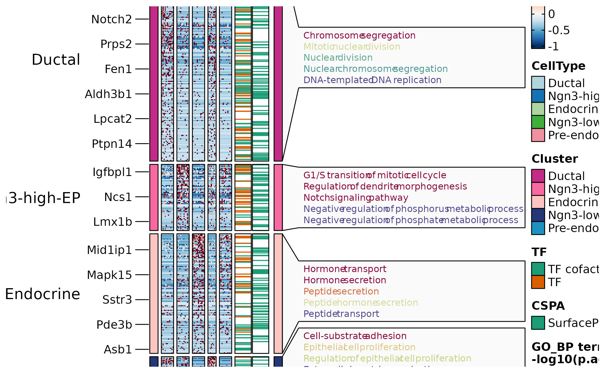
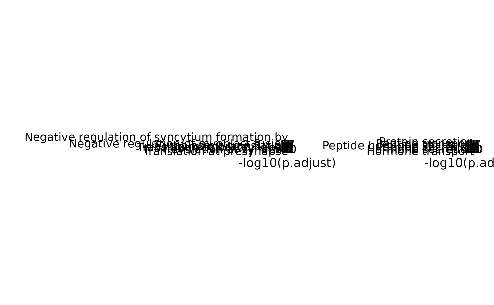
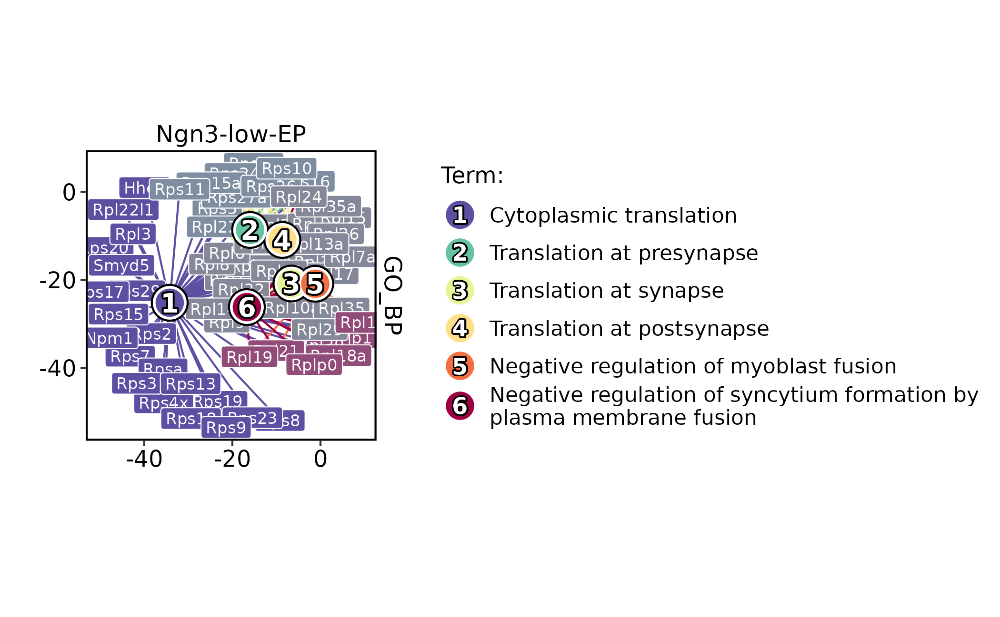
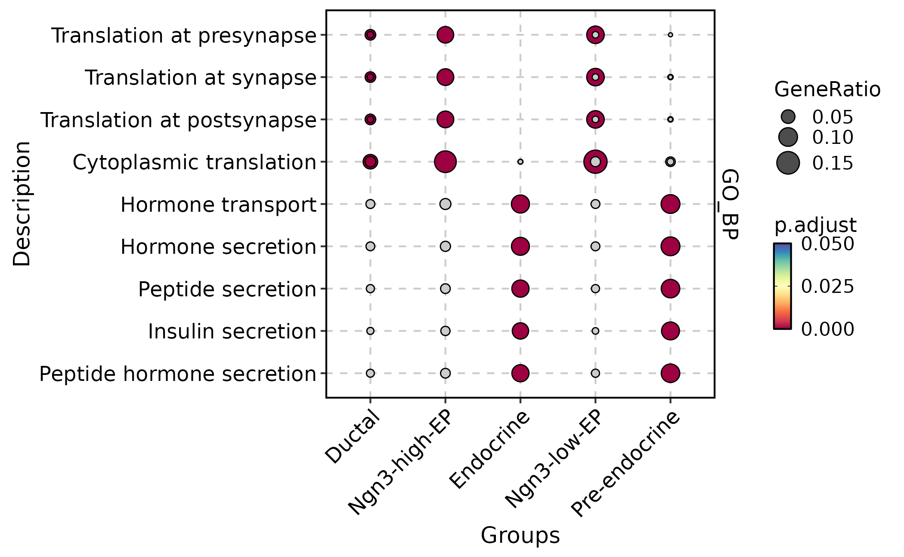

# Differential expression and enrichment workflow

This article shows how to organize differential expression, marker
visualization, and pathway enrichment in `scop`. The main distinction is
between testing genes, summarizing gene sets, and interpreting enriched
biological terms.

Use this workflow after cell identities and major covariates are stable.
Differential expression is gene-level evidence. Enrichment is a summary
of a gene list or ranked statistic against a named database. Keep those
two evidence layers separate in the text of a report.

## Prepare the Object

``` r

library(scop)
#>           ⬢          .        ⬡             ⬢     .
#>                      _____ _________  ____
#>                     / ___// ___/ __ ./ __ .
#>                    (__  )/ /__/ /_/ / /_/ /
#>                   /____/ .___/.____/ .___/
#>                                   /_/
#>       ⬢               .      ⬡        .          ⬢
#> ------------------------------------------------------------
#> Version: 0.9.1 (2026-09-01 update)
#> Website: https://mengxu98.github.io/scop/
#> 
#> Python environment initialization is disabled
#> To enable it, set: options(scop_env_init = TRUE)
#> 
#> The message can be suppressed by: 
#>   suppressPackageStartupMessages(library(scop))
#>   or options(log_message.verbose = FALSE)
#> ------------------------------------------------------------

data(pancreas_sub)
pancreas_sub <- RunStandardWorkflow(pancreas_sub, verbose = FALSE)
#> ℹ [2026-09-06 22:46:35] Skip `log1p()` because `layer = data` is not "counts"

table(pancreas_sub$CellType)
#> 
#>        Ductal     Endocrine  Ngn3-high-EP   Ngn3-low-EP Pre-endocrine 
#>           253           355           169            67           156
```

## Run Differential Expression

[`RunDEtest()`](https://mengxu98.github.io/scop/reference/RunDEtest.md)
writes differential-expression tables under `srt@tools`. The default
single-cell marker workflow is appropriate for exploratory marker
finding. Use sample-aware or pseudobulk methods when biological
replicates are part of the question.

``` r

pancreas_sub <- RunDEtest(
  pancreas_sub,
  group.by = "CellType",
  fc.threshold = 1,
  only.pos = FALSE
)
#> ℹ [2026-09-06 22:46:39] Data type is log-normalized
#> ℹ [2026-09-06 22:46:39] Start differential expression test
#> ℹ [2026-09-06 22:46:39] Find all markers(wilcox) among [1] 5 groups...
#> ℹ [2026-09-06 22:46:39] Using 1 core
#> For a (much!) faster implementation of the Wilcoxon Rank Sum Test,
#> (default method for FindMarkers) please install the presto package
#> --------------------------------------------
#> install.packages('devtools')
#> devtools::install_github('immunogenomics/presto')
#> --------------------------------------------
#> After installation of presto, Seurat will automatically use the more 
#> efficient implementation (no further action necessary).
#> This message will be shown once per session
#> ⠙ [2026-09-06 22:46:39] Running for Ductal [1/5] ■■          20% | ETA:  4m
#> ⠹ [2026-09-06 22:46:39] Running for Ngn3-high-EP [2/5] ■■■■        40% | ETA:  …
#> ⠸ [2026-09-06 22:46:39] Running for Endocrine [3/5] ■■■■■■      60% | ETA:  2m
#> ⠼ [2026-09-06 22:46:39] Running for Ngn3-low-EP [4/5] ■■■■■■■■    80% | ETA:  1m
#> ✔ [2026-09-06 22:46:39] Completed 5 tasks in 4m 23.5s
#> 
#> ℹ [2026-09-06 22:46:39] Building results
#> ✔ [2026-09-06 22:51:03] Differential expression test completed

names(pancreas_sub@tools)
#> [1] "DEtest_CellType"
head(pancreas_sub@tools$DEtest_CellType$AllMarkers_wilcox)
#>           p_val avg_log2FC pct.1 pct.2     p_val_adj          gene group1
#> 1 7.287773e-130   3.679046 0.897 0.096 5.597739e-126         Cyr61 Ductal
#> 2 1.168267e-127   3.217619 0.937 0.118 8.973461e-124       Adamts1 Ductal
#> 3 2.900413e-120   2.956891 0.976 0.173 2.227807e-116         Anxa2 Ductal
#> 4 8.561291e-113   2.733121 0.949 0.147 6.575927e-109 1700011H14Rik Ductal
#> 5 2.559824e-108   2.764483 0.960 0.229 1.966201e-104         Bicc1 Ductal
#> 6 1.495170e-103   2.646007 0.905 0.147  1.148440e-99         Gsta3 Ductal
#>   group2 test_group_number
#> 1 others                 5
#> 2 others                 5
#> 3 others                 5
#> 4 others                 5
#> 5 others                 5
#> 6 others                 5
#>                                                test_group
#> 1 Ductal;Ngn3-high-EP;Endocrine;Ngn3-low-EP;Pre-endocrine
#> 2 Ductal;Ngn3-high-EP;Endocrine;Ngn3-low-EP;Pre-endocrine
#> 3 Ductal;Ngn3-high-EP;Endocrine;Ngn3-low-EP;Pre-endocrine
#> 4 Ductal;Ngn3-high-EP;Endocrine;Ngn3-low-EP;Pre-endocrine
#> 5 Ductal;Ngn3-high-EP;Endocrine;Ngn3-low-EP;Pre-endocrine
#> 6 Ductal;Ngn3-high-EP;Endocrine;Ngn3-low-EP;Pre-endocrine
```

Keep the contrast, grouping column, test method, and threshold in the
report. Those choices define the meaning of each marker table. For
`FindAllMarkers`-style results, `group1` names the group being compared
against the remaining cells unless a specific contrast is stated.

## Plot Differential Results

Use volcano, Manhattan, and ring views for different levels of detail.
Volcano plots are useful for one group or contrast; Manhattan and ring
plots are useful when scanning many groups.

``` r

DEtestPlot(
  pancreas_sub,
  group.by = "CellType",
  plot_type = "volcano",
  label.size = 2
)
```



``` r


DEtestPlot(
  pancreas_sub,
  group.by = "CellType",
  plot_type = "manhattan",
  label.size = 2
)
```



``` r


DEtestPlot(
  pancreas_sub,
  group.by = "CellType",
  plot_type = "ring",
  label.size = 2
)
```



When enrichment results are available, volcano plots can annotate
enriched terms to connect marker genes with pathway-level
interpretation. The enrichment overlay circles genes that belong to
selected enriched terms. The legend title is the analysis layer
(`Enrichment`), and the legend item is the database, for example
`GO_BP`.

``` r

pancreas_sub <- RunEnrichment(
  pancreas_sub,
  group.by = "CellType",
  db = "GO_BP",
  species = "Mus_musculus"
)
#> ℹ [2026-09-06 22:51:24] Start Enrichment analysis
#> ℹ [2026-09-06 22:51:24] Species: "Mus_musculus"
#> ℹ [2026-09-06 22:51:24] Loading cached: GO_BP version: 3.23.0 nterm:14957 created: 2026-09-06 21:27:14
#> ℹ [2026-09-06 22:51:25] Permform enrichment...
#> ℹ [2026-09-06 22:51:27] Using 1 core
#> ⠙ [2026-09-06 22:51:27] Running for 1 [1/5] ■■          20% | ETA:  2s
#> ✔ [2026-09-06 22:51:27] Completed 5 tasks in 2.4s
#> 
#> ℹ [2026-09-06 22:51:27] Building results
#> ✔ [2026-09-06 22:51:30] Enrichment analysis done

DEtestPlot(
  pancreas_sub,
  group.by = "CellType",
  plot_type = "volcano",
  threshold_method = "hyperbolic",
  hyperbola_c = 6,
  annotate_enrichment = TRUE,
  enrich_from = "Enrichment",
  enrich_db = "GO_BP",
  enrich_top_terms = 3,
  enrich_nlabel = 15,
  label.size = 2
)
```



## Summarize Markers in Heatmaps

Feature heatmaps are useful after markers have been filtered. Keep the
filter explicit and avoid showing very large marker sets without
grouping or splitting. `TF` marks transcription-factor annotations and
`CSPA` marks cell-surface protein annotations. They help prioritize
marker genes for follow-up, but they do not change the DE statistics.

``` r

DEGs <- pancreas_sub@tools$DEtest_CellType$AllMarkers_wilcox
DEGs <- DEGs[with(DEGs, avg_log2FC > 1 & p_val_adj < 0.05), ]

pancreas_sub <- AnnotateFeatures(
  pancreas_sub,
  species = "Mus_musculus",
  db = c("TF", "CSPA")
)
#> ℹ [2026-09-06 22:51:38] Species: "Mus_musculus"
#> ℹ [2026-09-06 22:51:38] Loading cached: TF version: AnimalTFDB4 nterm:2 created: 2026-09-06 20:52:04
#> ℹ [2026-09-06 22:51:38] Loading cached: CSPA version: CSPA nterm:1 created: 2026-09-06 21:25:21

ht <- FeatureHeatmap(
  pancreas_sub,
  group.by = "CellType",
  features = DEGs$gene,
  feature_split = DEGs$group1,
  exp_legend_title = "Z-score",
  species = "Mus_musculus",
  db = "GO_BP",
  anno_terms = TRUE,
  feature_annotation = c("TF", "CSPA")
)
#> ℹ [2026-09-06 22:51:42] Start Enrichment analysis
#> ℹ [2026-09-06 22:51:42] Species: "Mus_musculus"
#> ℹ [2026-09-06 22:51:42] Loading cached: GO_BP version: 3.23.0 nterm:14957 created: 2026-09-06 21:27:14
#> ℹ [2026-09-06 22:51:43] Permform enrichment...
#> ℹ [2026-09-06 22:51:44] Using 1 core
#> ⠙ [2026-09-06 22:51:44] Running for 1 [1/5] ■■          20% | ETA:  2s
#> ⠹ [2026-09-06 22:51:44] Running for 2 [2/5] ■■■■        40% | ETA:  1s
#> ✔ [2026-09-06 22:51:44] Completed 5 tasks in 2.4s
#> 
#> ℹ [2026-09-06 22:51:44] Building results
#> ✔ [2026-09-06 22:51:46] Enrichment analysis done
#> `use_raster` is automatically set to TRUE for a matrix with more than
#> 2000 rows. You can control `use_raster` argument by explicitly setting
#> TRUE/FALSE to it.
#> 
#> Set `ht_opt$message = FALSE` to turn off this message.
#> ℹ [2026-09-06 22:51:47] The size of the heatmap is fixed because certain elements are not scalable.
#> ℹ [2026-09-06 22:51:47] The width and height of the heatmap are determined by the size of the current viewport.
#> ℹ [2026-09-06 22:51:47] If you want to have more control over the size, you can manually set the parameters 'width' and 'height'.
print(ht$plot)
```



## Run Over-Representation Analysis

[`RunEnrichment()`](https://mengxu98.github.io/scop/reference/RunEnrichment.md)
tests whether filtered marker sets are enriched for terms from the
selected database. `GO_BP` is Gene Ontology Biological Process. The
specific enriched terms are the rows shown by
[`EnrichmentPlot()`](https://mengxu98.github.io/scop/reference/EnrichmentPlot.md).

``` r

pancreas_sub <- RunEnrichment(
  pancreas_sub,
  group.by = "CellType",
  db = "GO_BP",
  species = "Mus_musculus",
  DE_threshold = "avg_log2FC > log2(1.5) & p_val_adj < 0.05",
  cores = 5
)
#> ℹ [2026-09-06 22:51:58] Start Enrichment analysis
#> ℹ [2026-09-06 22:51:58] Species: "Mus_musculus"
#> ℹ [2026-09-06 22:51:58] Loading cached: GO_BP version: 3.23.0 nterm:14957 created: 2026-09-06 21:27:14
#> ℹ [2026-09-06 22:52:00] Permform enrichment...
#> ℹ [2026-09-06 22:52:01] Using 3 cores
#> ⠙ [2026-09-06 22:52:01] Running for 2 [1/5] ■■          20% | ETA:  2m
#> ✔ [2026-09-06 22:52:01] Completed 5 tasks in 33.1s
#> 
#> ℹ [2026-09-06 22:52:01] Building results
#> ✔ [2026-09-06 22:52:34] Enrichment analysis done

EnrichmentPlot(
  pancreas_sub,
  group.by = "CellType",
  group_use = c("Ductal", "Endocrine"),
  plot_type = "bar"
)
```



Use different plot types for different questions: bar or lollipop plots
for ranked terms, word clouds for broad themes, and networks or
enrichmaps for term relationships.

``` r

EnrichmentPlot(
  pancreas_sub,
  group.by = "CellType",
  group_use = "Ngn3-low-EP",
  plot_type = "network"
)
#> Found more than one class "dist" in cache; using the first, from namespace 'spam'
#> Also defined by 'BiocGenerics'
#> Found more than one class "dist" in cache; using the first, from namespace 'spam'
#> Also defined by 'BiocGenerics'
#> ✔ [2026-09-06 22:52:35] shadowtext installed successfully
```



``` r


EnrichmentPlot(
  pancreas_sub,
  group.by = "CellType",
  plot_type = "comparison",
  topTerm = 3
)
```



## Run GSEA

Use GSEA when ranked gene statistics are more appropriate than a hard
marker cutoff. ORA depends on a marker cutoff, while GSEA uses a ranked
gene list. Use GSEA when many genes shift modestly and a binary marker
threshold would discard useful signal.

``` r

pancreas_sub <- RunGSEA(
  pancreas_sub,
  group.by = "CellType",
  db = "GO_BP",
  species = "Mus_musculus",
  DE_threshold = "p_val_adj < 0.05",
  cores = 5
)

gsea_endocrine <- subset(
  pancreas_sub@tools$GSEA_CellType_wilcox$enrichment,
  Groups == "Endocrine" & Database == "GO_BP"
)
gsea_id <- gsea_endocrine$ID[which.min(gsea_endocrine$p.adjust)]

GSEAPlot(
  pancreas_sub,
  group.by = "CellType",
  group_use = "Endocrine",
  id_use = gsea_id
)

GSEAPlot(
  pancreas_sub,
  group.by = "CellType",
  group_use = "Endocrine",
  plot_type = "bar",
  direction = "both",
  topTerm = 10
)
```

## What to Report

A compact differential and enrichment report should include:

- the grouping column, contrast, and DE method;
- whether the test is single-cell marker detection, sample-level
  pseudobulk, or bulk-style differential testing;
- thresholds for log fold change, adjusted p value, and marker
  filtering;
- the gene-set database, species, and enrichment method;
- the exact `srt@tools` result names used for downstream plots;
- pathway interpretations separated from the gene-level DE evidence.

Use enrichment to summarize marker lists or ranked statistics. Do not
treat an enriched term as proof that every gene in the pathway changes
coherently.
