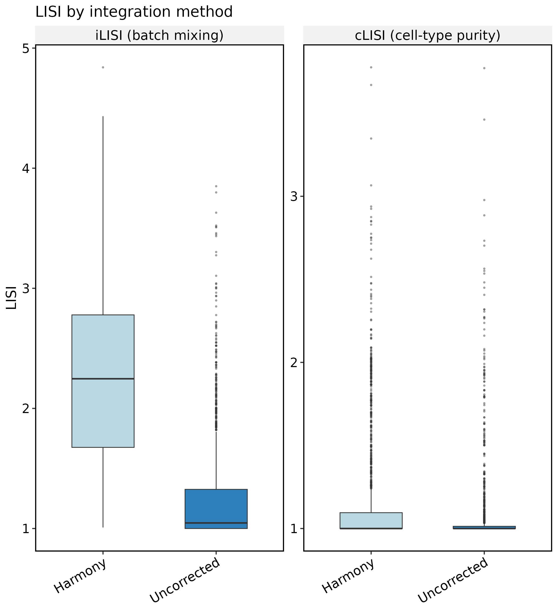
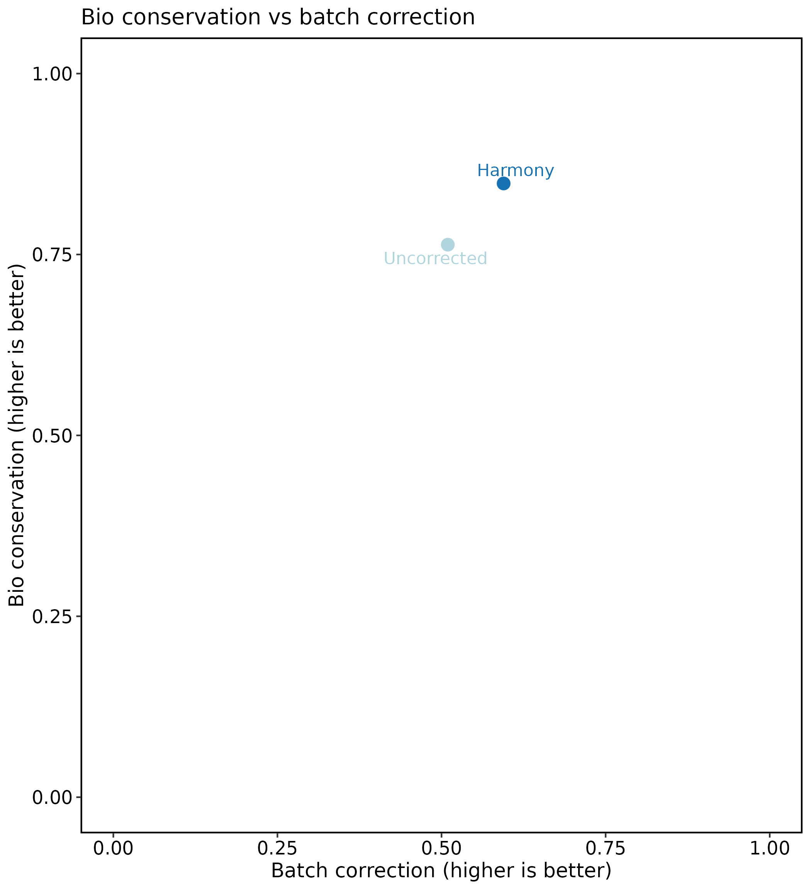
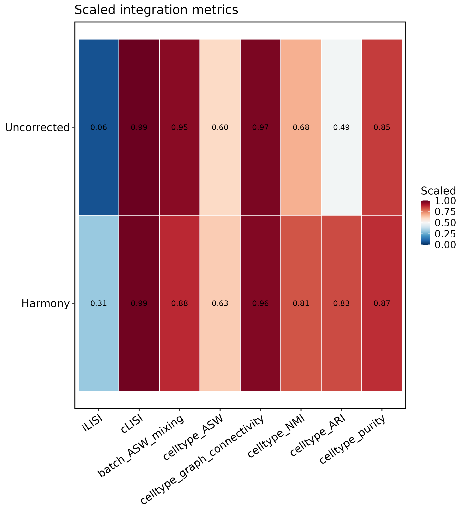

# Integration benchmark workflow

This article compares batch-correction methods on the same scRNA-seq
object with \[RunIntegrationBenchmark()\]. The runner scores each
**latent** embedding (not UMAP) with scIB-style metrics, stores tables
in `srt@tools$IntegrationBenchmark`, and returns the Seurat object for
plotting with \[IntegrationBenchmarkPlot()\].

Use this workflow when you need a reproducible side-by-side report for
`Uncorrected`, `Harmony`, `fastMNN`, or other \[RunIntegration()\]
methods on the same input.

## Load data

``` r

library(scop)
#>           ⬢          .        ⬡             ⬢     .
#>                      _____ _________  ____
#>                     / ___// ___/ __ ./ __ .
#>                    (__  )/ /__/ /_/ / /_/ /
#>                   /____/ .___/.____/ .___/
#>                                   /_/
#>       ⬢               .      ⬡        .          ⬢
#> ------------------------------------------------------------
#> Version: 0.9.1 (2026-09-01 update)
#> Website: https://mengxu98.github.io/scop/
#> 
#> Python environment initialization is disabled
#> To enable it, set: options(scop_env_init = TRUE)
#> 
#> The message can be suppressed by: 
#>   suppressPackageStartupMessages(library(scop))
#>   or options(log_message.verbose = FALSE)
#> ------------------------------------------------------------

data(panc8_sub)
table(panc8_sub$tech)
#> 
#>     celseq    celseq2 fluidigmc1     indrop  smartseq2 
#>        200        200        200        800        200
table(panc8_sub$celltype)
#> 
#>             acinar activated-stellate              alpha               beta 
#>                164                 50                483                428 
#>              delta             ductal        endothelial            epsilon 
#>                111                237                 26                  3 
#>              gamma         macrophage               mast quiescent-stellate 
#>                 67                  9                  7                 14 
#>            schwann 
#>                  1
```

## Run the benchmark

Keep the batch column (`tech`) and a biological label column
(`celltype`) fixed across methods. LISI and clustering metrics are
computed on each method’s latent reduction (for example `Harmony` or
`Uncorrectedpca`).

``` r

panc8_sub <- RunIntegrationBenchmark(
  panc8_sub,
  batch = "tech",
  celltype = "celltype",
  methods = c("Uncorrected", "Harmony"),
  nHVF = 500,
  linear_reduction_dims = 20,
  linear_reduction_dims_use = 1:10,
  perplexity = 10,
  verbose = FALSE
)
#> ℹ [2026-09-06 22:52:54] Checking a list of <Seurat>...
#> ! [2026-09-06 22:52:54] Data 1/5 of the `srt_list` is "unknown"
#> Warning: Data 1/5 of the `srt_list` is "unknown"
#> ℹ [2026-09-06 22:52:54] Perform `NormalizeData()` with `normalization.method = 'LogNormalize'` on 1/5 of `srt_list`...
#> ℹ [2026-09-06 22:52:54] Perform `FindVariableFeatures()` on 1/5 of `srt_list`...
#> ! [2026-09-06 22:52:54] Data 2/5 of the `srt_list` is "unknown"
#> Warning: Data 2/5 of the `srt_list` is "unknown"
#> ℹ [2026-09-06 22:52:54] Perform `NormalizeData()` with `normalization.method = 'LogNormalize'` on 2/5 of `srt_list`...
#> ℹ [2026-09-06 22:52:54] Perform `FindVariableFeatures()` on 2/5 of `srt_list`...
#> ! [2026-09-06 22:52:54] Data 3/5 of the `srt_list` is "unknown"
#> Warning: Data 3/5 of the `srt_list` is "unknown"
#> ℹ [2026-09-06 22:52:55] Perform `NormalizeData()` with `normalization.method = 'LogNormalize'` on 3/5 of `srt_list`...
#> ℹ [2026-09-06 22:52:55] Perform `FindVariableFeatures()` on 3/5 of `srt_list`...
#> ! [2026-09-06 22:52:55] Data 4/5 of the `srt_list` is "unknown"
#> Warning: Data 4/5 of the `srt_list` is "unknown"
#> ℹ [2026-09-06 22:52:55] Perform `NormalizeData()` with `normalization.method = 'LogNormalize'` on 4/5 of `srt_list`...
#> ℹ [2026-09-06 22:52:55] Perform `FindVariableFeatures()` on 4/5 of `srt_list`...
#> ! [2026-09-06 22:52:55] Data 5/5 of the `srt_list` is "unknown"
#> Warning: Data 5/5 of the `srt_list` is "unknown"
#> ℹ [2026-09-06 22:52:55] Perform `NormalizeData()` with `normalization.method = 'LogNormalize'` on 5/5 of `srt_list`...
#> ℹ [2026-09-06 22:52:55] Perform `FindVariableFeatures()` on 5/5 of `srt_list`...
#> ℹ [2026-09-06 22:52:55] Use the separate HVF from `srt_list`
#> ℹ [2026-09-06 22:52:55] Number of available HVF: 500
#> ℹ [2026-09-06 22:52:55] Finished check
#> ℹ [2026-09-06 22:52:59] Perform Uncorrected integration
#> Warning: No layers found matching search pattern provided
#> Warning: Layer 'scale.data' is empty
#> ℹ [2026-09-06 22:53:02] Reorder clusters...
#> ℹ [2026-09-06 22:53:02] Skip `log1p()` because `layer = data` is not "counts"
#> ℹ [2026-09-06 22:53:12] Checking a list of <Seurat>...
#> ℹ [2026-09-06 22:53:12] Data 1/5 of the `srt_list` has been log-normalized
#> ℹ [2026-09-06 22:53:12] Perform `FindVariableFeatures()` on 1/5 of `srt_list`...
#> ℹ [2026-09-06 22:53:12] Data 2/5 of the `srt_list` has been log-normalized
#> ℹ [2026-09-06 22:53:12] Perform `FindVariableFeatures()` on 2/5 of `srt_list`...
#> ℹ [2026-09-06 22:53:12] Data 3/5 of the `srt_list` has been log-normalized
#> ℹ [2026-09-06 22:53:12] Perform `FindVariableFeatures()` on 3/5 of `srt_list`...
#> ℹ [2026-09-06 22:53:13] Data 4/5 of the `srt_list` has been log-normalized
#> ℹ [2026-09-06 22:53:13] Perform `FindVariableFeatures()` on 4/5 of `srt_list`...
#> ℹ [2026-09-06 22:53:13] Data 5/5 of the `srt_list` has been log-normalized
#> ℹ [2026-09-06 22:53:13] Perform `FindVariableFeatures()` on 5/5 of `srt_list`...
#> ℹ [2026-09-06 22:53:13] Use the separate HVF from `srt_list`
#> ℹ [2026-09-06 22:53:13] Number of available HVF: 500
#> ℹ [2026-09-06 22:53:13] Finished check
#> Warning: No layers found matching search pattern provided
#> Warning: Layer 'scale.data' is empty
#> ℹ [2026-09-06 22:53:13] Perform `Seurat::ScaleData()`
#> ℹ [2026-09-06 22:53:13] Perform linear dimension reduction("pca")
#> ℹ [2026-09-06 22:53:14] Reorder clusters...
#> ℹ [2026-09-06 22:53:15] Skip `log1p()` because `layer = data` is not "counts"
```

## Print summary tables

Use
[`thisplot::print_colored_table()`](https://mengxu98.github.io/thisplot/reference/print_colored_table.html)
on the stored tables. The summary view shows scaled overall, bio, and
batch scores; the metrics view lists every metric per method.

``` r

bench <- panc8_sub@tools$IntegrationBenchmark

thisplot::print_colored_table(
  bench$summary,
  by = "row",
  palette = "Chinese"
)
#> method       status   overall    bio        batch      iLISI       cLISI      celltype_ASW  batch_ASW_mixing  celltype_graph_connectivity  celltype_ARI  celltype_NMI  runtime_s  latent          umap             
#> Uncorrected  success  0.6619509  0.7635503  0.5095517  0.06465491  0.9940998  0.5987168     0.9544486         0.9724301                    0.4879958     0.6786843     18.207     Uncorrectedpca  UncorrectedUMAP2D
#> Harmony      success  0.7467326  0.8481556  0.5945980  0.31237004  0.9864901  0.6264387     0.8768259         0.9628357                    0.8281797     0.8149896     13.060     Harmony         HarmonyUMAP2D    

metrics <- bench$metrics
metrics <- metrics[
  !grepl("_LISI_mean$", metrics$metric), ,
  drop = FALSE
]
thisplot::print_colored_table(
  metrics,
  by = "col",
  palette = "Paired"
)
#> metric                       category  value      scaled      direction  method     
#> batch_ASW_mixing             batch     0.9544486  0.95444859  higher     Uncorrected
#> celltype_ASW                 bio       0.1974336  0.59871681  higher     Uncorrected
#> celltype_graph_connectivity  bio       0.9724301  0.97243007  higher     Uncorrected
#> celltype_NMI                 bio       0.6786843  0.67868425  higher     Uncorrected
#> celltype_ARI                 bio       0.4879958  0.48799584  higher     Uncorrected
#> celltype_purity              bio       0.8493750  0.84937500  higher     Uncorrected
#> iLISI                        batch     1.2586196  0.06465491  higher     Uncorrected
#> cLISI                        bio       1.0708023  0.99409981  higher     Uncorrected
#> batch_ASW_mixing             batch     0.8768259  0.87682592  higher     Harmony    
#> celltype_ASW                 bio       0.2528773  0.62643867  higher     Harmony    
#> celltype_graph_connectivity  bio       0.9628357  0.96283573  higher     Harmony    
#> celltype_NMI                 bio       0.8149896  0.81498959  higher     Harmony    
#> celltype_ARI                 bio       0.8281797  0.82817974  higher     Harmony    
#> celltype_purity              bio       0.8700000  0.87000000  higher     Harmony    
#> iLISI                        batch     2.2494802  0.31237004  higher     Harmony    
#> cLISI                        bio       1.1621187  0.98649011  higher     Harmony    
```

## Plot all views

[`IntegrationBenchmarkPlot()`](https://mengxu98.github.io/scop/reference/IntegrationBenchmarkPlot.md)
with `plot_type = "auto"` returns a named list: `box` (per-cell LISI),
`heatmap`, `scatter`, and `umap`.

``` r

plots <- IntegrationBenchmarkPlot(panc8_sub, verbose = FALSE)
names(plots)
#> [1] "box"     "heatmap" "scatter" "umap"
plots$box
```



``` r

plots$scatter
```



``` r

plots$heatmap
```



Individual plot types are also available:

``` r

IntegrationBenchmarkPlot(panc8_sub, plot_type = "box")
IntegrationBenchmarkPlot(panc8_sub, plot_type = "umap")
```

## What to report

A compact integration benchmark report should include:

- batch and cell-type columns used for scoring;
- methods compared and shared integration parameters (`nHVF`, latent
  dimensions);
- the colored summary and metrics tables;
- LISI boxplots, bio-vs-batch scatter, and UMAP panels colored by batch
  and cell type.

Overall score uses scIB weights: `0.6 * bio + 0.4 * batch`. Higher is
better for all scaled metrics shown in the summary table.
