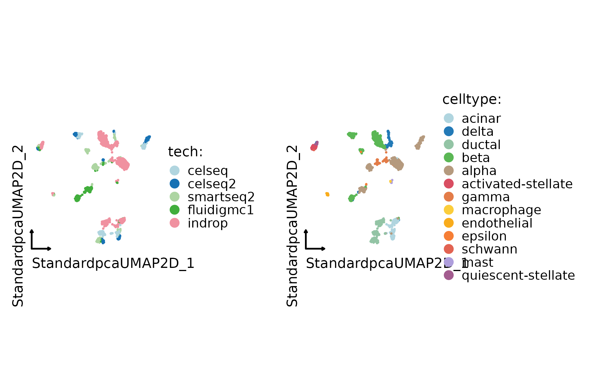
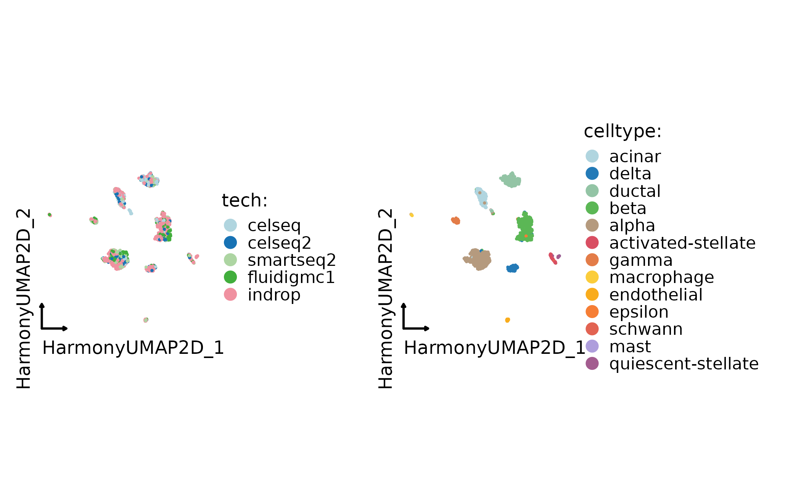
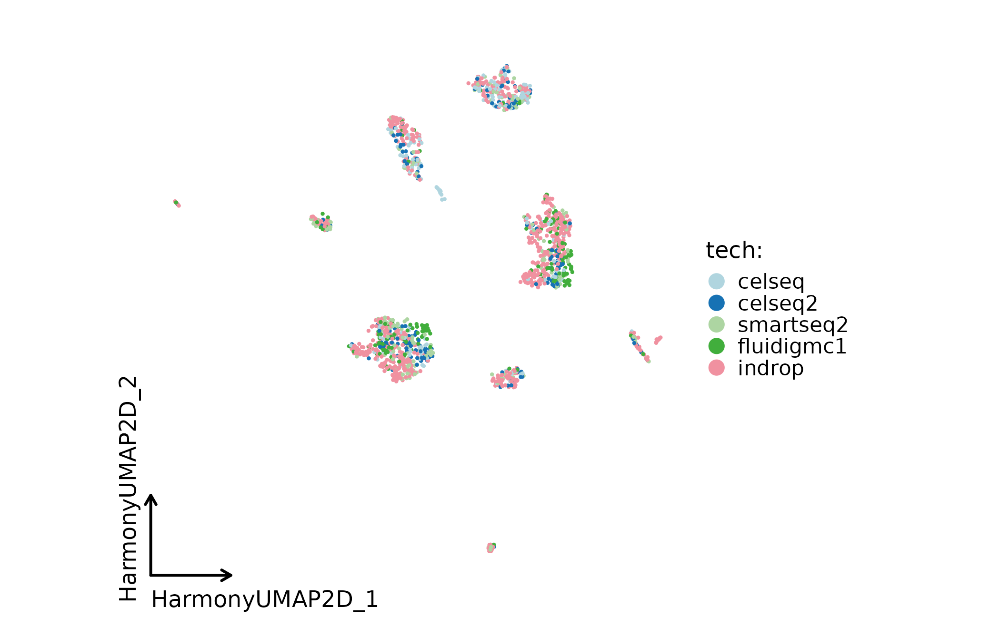
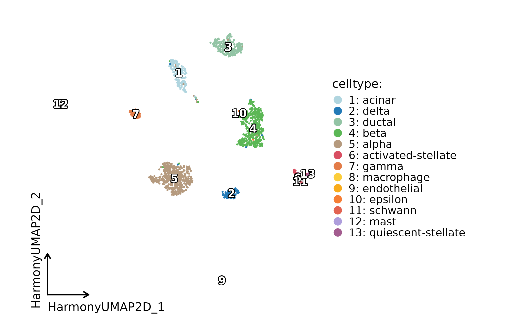
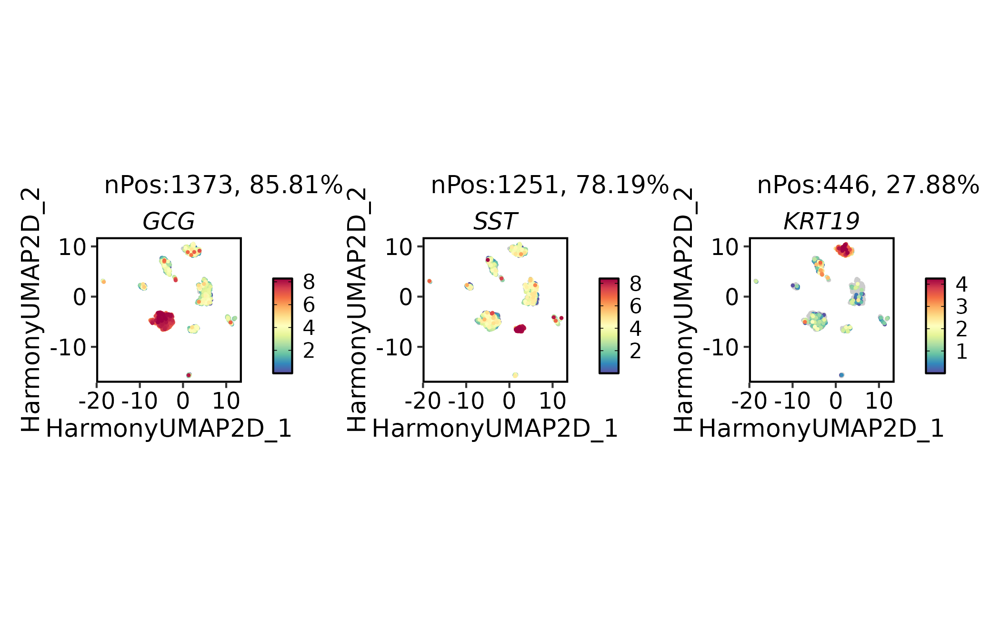

# Data integration workflow

This article shows how to run and inspect dataset integration in `scop`.
Integration should be used when technical batches, platforms, donors, or
experiments obscure the biological structure that should be compared
across datasets.

[`RunIntegration()`](https://mengxu98.github.io/scop/reference/RunIntegration.md)
provides a common entry point for several integration methods. The key
practical decisions are the batch column, the integration method, the
reduction names to inspect, and whether the integrated structure
preserves known biology.

Integration is not a required step for every dataset. Use it when
technical structure prevents comparison across samples or platforms.
Keep an unintegrated baseline so the report can show what changed after
correction.

## Prepare a Merged Object

The example uses the bundled `panc8_sub` object, a subset of human
pancreas datasets. The `tech` column records the batch or technology
label. The `celltype` column is used as known biology for diagnostics,
not as a target to force during integration.

``` r

library(scop)

data(panc8_sub)
table(panc8_sub$tech)
#> 
#>     celseq    celseq2 fluidigmc1     indrop  smartseq2 
#>        200        200        200        800        200
table(panc8_sub$celltype)
#> 
#>             acinar activated-stellate              alpha               beta 
#>                164                 50                483                428 
#>              delta             ductal        endothelial            epsilon 
#>                111                237                 26                  3 
#>              gamma         macrophage               mast quiescent-stellate 
#>                 67                  9                  7                 14 
#>            schwann 
#>                  1
```

Always inspect the unintegrated embedding or PCA first. This gives you a
baseline for deciding whether integration removes technical structure
without erasing cell-type structure.

``` r

panc8_sub <- RunStandardWorkflow(panc8_sub, verbose = FALSE)
#> ℹ [2026-09-20 23:08:30] Skip `log1p()` because `layer = data` is not "counts"

CellDimPlot(
  panc8_sub,
  group.by = c("tech", "celltype"),
  reduction = "UMAP",
  theme_use = "theme_blank"
)
```



## Run an Integration Method

Harmony is a common first pass when the object is already a merged
Seurat object with a batch column.

``` r

panc8_harmony <- RunIntegration(
  srt_merge = panc8_sub,
  batch = "tech",
  integration_methods = "Harmony"
)
#> ◌ [2026-09-20 23:08:35] Run integration workflow...
#> ℹ [2026-09-20 23:08:37] Split `srt_merge` into `srt_list` by "tech"
#> ℹ [2026-09-20 23:08:38] Checking a list of <Seurat>...
#> ℹ [2026-09-20 23:08:38] Data 1/5 of the `srt_list` has been log-normalized
#> ℹ [2026-09-20 23:08:38] Perform `FindVariableFeatures()` on 1/5 of `srt_list`...
#> ℹ [2026-09-20 23:08:39] Data 2/5 of the `srt_list` has been log-normalized
#> ℹ [2026-09-20 23:08:39] Perform `FindVariableFeatures()` on 2/5 of `srt_list`...
#> ℹ [2026-09-20 23:08:39] Data 3/5 of the `srt_list` has been log-normalized
#> ℹ [2026-09-20 23:08:39] Perform `FindVariableFeatures()` on 3/5 of `srt_list`...
#> ℹ [2026-09-20 23:08:39] Data 4/5 of the `srt_list` has been log-normalized
#> ℹ [2026-09-20 23:08:39] Perform `FindVariableFeatures()` on 4/5 of `srt_list`...
#> ℹ [2026-09-20 23:08:39] Data 5/5 of the `srt_list` has been log-normalized
#> ℹ [2026-09-20 23:08:39] Perform `FindVariableFeatures()` on 5/5 of `srt_list`...
#> ℹ [2026-09-20 23:08:40] Use the separate HVF from `srt_list`
#> ℹ [2026-09-20 23:08:40] Number of available HVF: 2000
#> ℹ [2026-09-20 23:08:40] Finished check
#> ℹ [2026-09-20 23:08:40] Perform `Seurat::ScaleData()`
#> Warning: Different features in new layer data than already exists for
#> scale.data
#> ℹ [2026-09-20 23:08:40] Perform linear dimension reduction("pca")
#> ℹ [2026-09-20 23:08:41] Perform Harmony integration
#> ℹ [2026-09-20 23:08:41] Using "Harmonypca" (1:20) as input
#> ℹ [2026-09-20 23:08:41] Adjust neighbor k from 20 to 20 for small-sample clustering
#> ℹ [2026-09-20 23:08:42] Perform `Seurat::FindClusters()` with "louvain"
#> ℹ [2026-09-20 23:08:42] Reorder clusters...
#> ℹ [2026-09-20 23:08:42] Skip `log1p()` because `layer = data` is not "counts"
#> ℹ [2026-09-20 23:08:42] Perform umap nonlinear dimension reduction using Harmony (1:20)
#> ℹ [2026-09-20 23:08:45] Perform umap nonlinear dimension reduction using Harmony (1:20)
#> ℹ [2026-09-20 23:08:48] Perform umap nonlinear dimension reduction using Harmonypca (1:20)
#> ✔ [2026-09-20 23:08:51] Harmony integration completed

SeuratObject::Reductions(panc8_harmony)
#> [1] "Standardpca"       "StandardpcaUMAP2D" "StandardUMAP2D"   
#> [4] "Harmonypca"        "Harmony"           "HarmonyUMAP2D"    
#> [7] "HarmonyUMAP3D"     "HarmonypcaUMAP2D"
```

Use the method-specific integrated UMAP for plotting. The exact
reduction name depends on the selected method; for Harmony, the examples
use `HarmonyUMAP`. When comparing methods, report the reduction name
explicitly. A plot labeled only as UMAP is ambiguous once an object
contains uncorrected and integrated embeddings.

``` r

CellDimPlot(
  panc8_harmony,
  group.by = c("tech", "celltype"),
  reduction = "HarmonyUMAP",
  theme_use = "theme_blank"
)
```



## Choose a Method

Use method choice to match the data and dependency budget:

- `Harmony`, `fastMNN`, `MNN`, `ComBat`, and `Seurat` methods are
  practical R-side choices for many scRNA-seq batch problems.
- `scVI`, `BBKNN`, `Scanorama`, `GLUE`, and `MultiMAP` require
  Python-side dependencies but can be useful for large datasets or
  multimodal settings.
- `WNN` and cross-modality methods are better suited to multimodal RNA +
  ATAC or paired-modality objects than to ordinary batch correction.
- `Uncorrected` is useful as a baseline and should be kept in reports
  when showing that integration changed the object.

``` r

panc8_uncorrected <- RunIntegration(
  srt_merge = panc8_harmony,
  batch = "tech",
  integration_methods = "Uncorrected",
  verbose = FALSE
)
#> ℹ [2026-09-20 23:08:54] Checking a list of <Seurat>...
#> ℹ [2026-09-20 23:08:54] Data 1/5 of the `srt_list` has been log-normalized
#> ℹ [2026-09-20 23:08:54] Perform `FindVariableFeatures()` on 1/5 of `srt_list`...
#> ℹ [2026-09-20 23:08:54] Data 2/5 of the `srt_list` has been log-normalized
#> ℹ [2026-09-20 23:08:54] Perform `FindVariableFeatures()` on 2/5 of `srt_list`...
#> ℹ [2026-09-20 23:08:54] Data 3/5 of the `srt_list` has been log-normalized
#> ℹ [2026-09-20 23:08:54] Perform `FindVariableFeatures()` on 3/5 of `srt_list`...
#> ℹ [2026-09-20 23:08:55] Data 4/5 of the `srt_list` has been log-normalized
#> ℹ [2026-09-20 23:08:55] Perform `FindVariableFeatures()` on 4/5 of `srt_list`...
#> ℹ [2026-09-20 23:08:55] Data 5/5 of the `srt_list` has been log-normalized
#> ℹ [2026-09-20 23:08:55] Perform `FindVariableFeatures()` on 5/5 of `srt_list`...
#> ℹ [2026-09-20 23:08:55] Use the separate HVF from `srt_list`
#> ℹ [2026-09-20 23:08:55] Number of available HVF: 2000
#> ℹ [2026-09-20 23:08:55] Finished check
#> ℹ [2026-09-20 23:08:55] Perform Uncorrected integration
#> Warning: Different features in new layer data than already exists for
#> scale.data
#> ℹ [2026-09-20 23:08:57] Reorder clusters...
#> ℹ [2026-09-20 23:08:57] Skip `log1p()` because `layer = data` is not "counts"
```

Other methods follow the same entry-point pattern, but may require
additional runtime dependencies or matrix backends:

``` r

panc8_rpca <- RunIntegration(
  srt_merge = panc8_sub,
  batch = "tech",
  integration_methods = "RPCA"
)

panc8_fastmnn <- RunIntegration(
  srt_merge = panc8_sub,
  batch = "tech",
  integration_methods = "fastMNN"
)
```

## Inspect Integration Quality

Do not judge integration from batch mixing alone. Also check known
labels, marker genes, and whether rare cell types remain separated.

``` r

CellDimPlot(
  panc8_harmony,
  group.by = "tech",
  reduction = "HarmonyUMAP",
  theme_use = "theme_blank"
)
```



``` r


CellDimPlot(
  panc8_harmony,
  group.by = "celltype",
  reduction = "HarmonyUMAP",
  label = TRUE,
  theme_use = "theme_blank"
)
```



``` r


FeatureDimPlot(
  panc8_harmony,
  features = c("INS", "GCG", "SST", "KRT19"),
  reduction = "HarmonyUMAP"
)
#> ! [2026-09-20 23:09:07] "INS" are not in the features of <Seurat>
#> Warning: "INS" are not in the features of <Seurat>
```



When comparing methods, keep the input object fixed and compare the same
metadata labels, marker genes, and diagnostic plots across methods. The
unintegrated baseline is useful because it shows what the integration
changed. Good integration mixes batches within the same biological state
while keeping distinct cell types and marker programs separated.
Overcorrection is visible when expected marker-defined groups collapse
together.

## What to Report

A compact integration report should include:

- the batch column and biological annotation columns used for
  evaluation;
- the integration method and major parameters;
- the integrated reduction names used for plots;
- before and after plots colored by batch and biological labels;
- marker-gene checks for expected cell types;
- any method-specific dependencies or environment setup needed to
  reproduce the run.

Integration is a preprocessing decision, not a biological result by
itself. Use it only when the integrated representation improves
downstream interpretation without hiding real biological differences.
