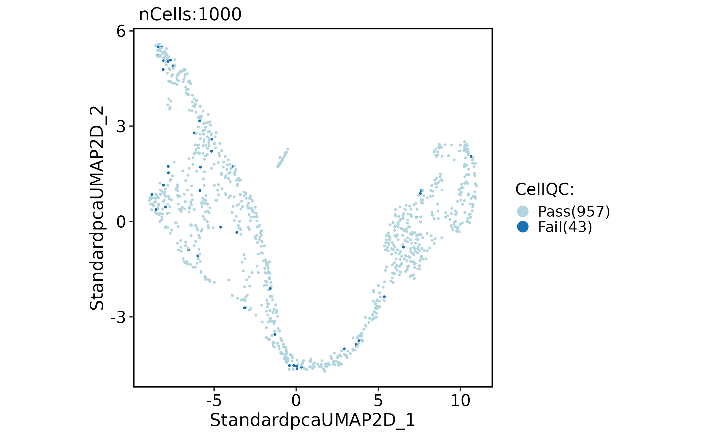
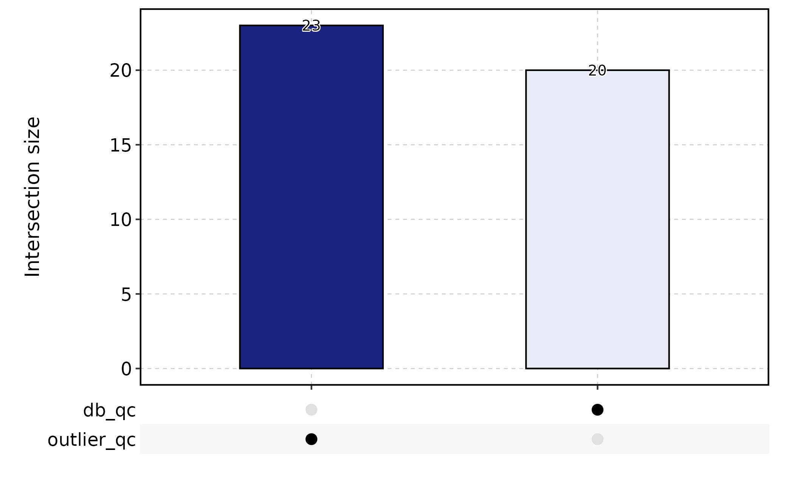
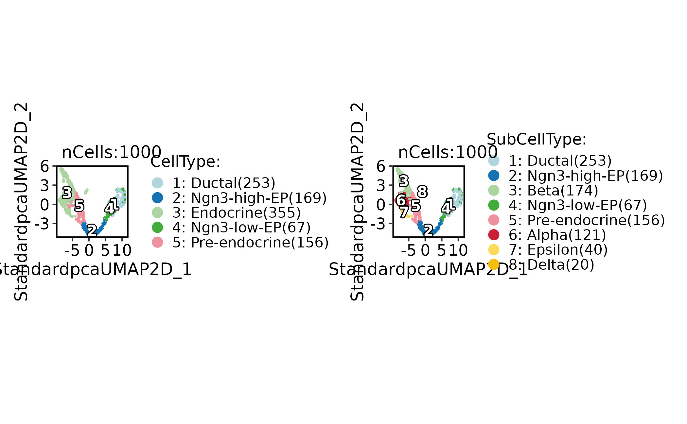
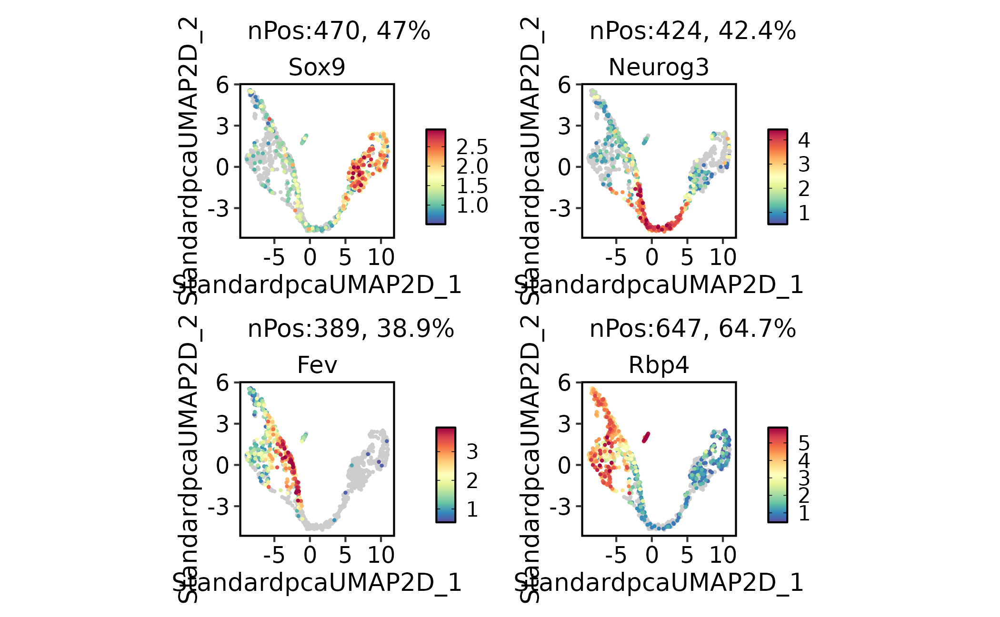
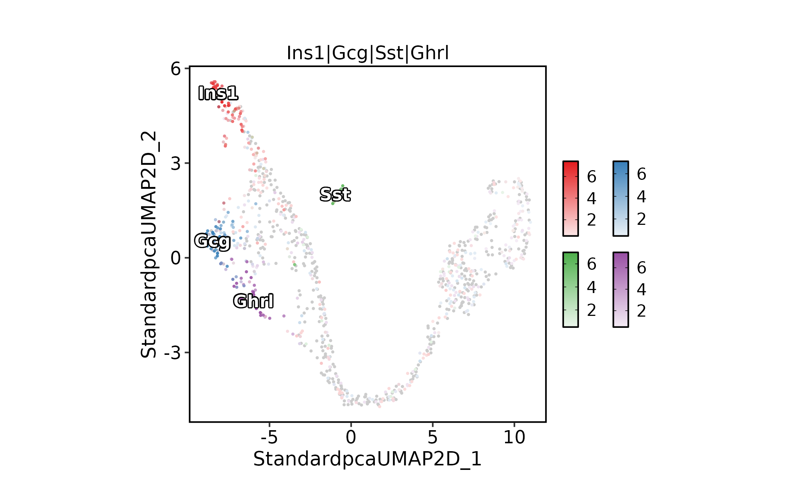
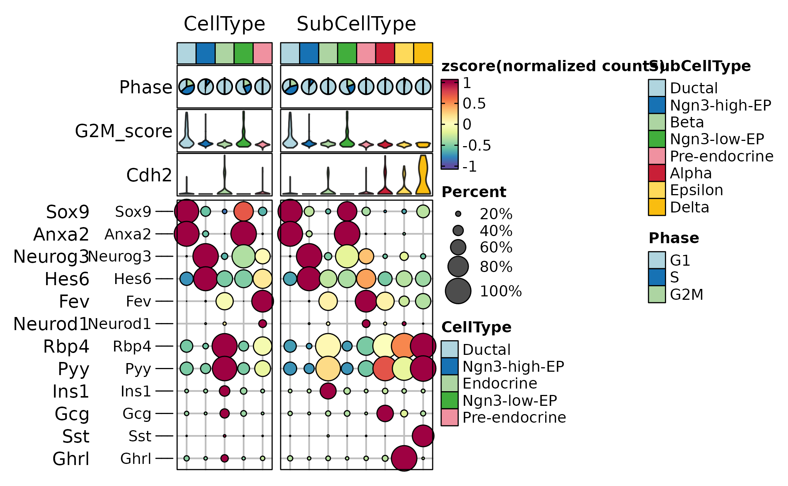

# Single-cell main workflow

This article shows the recommended first-pass workflow for a single-cell
Seurat object in `scop`. It starts from a count matrix stored in a
Seurat object, runs the standard preprocessing workflow, checks
cell-level quality, and creates the basic embedding, feature, and
group-level plots used before choosing more specialized downstream
methods.

Use this workflow as the default entry point when the goal is to inspect
a new single-cell dataset. After this pass, branch into integration,
annotation, trajectory, differential expression, enrichment, or
interactive exploration.

This article deliberately stays at the first-pass level. It explains the
object state that downstream articles assume: which assay is active,
which reductions exist, which metadata columns can be used for grouping,
and where `scop` stores method-specific outputs.

## Load and Inspect the Object

The examples use the bundled mouse pancreas subset. It contains RNA,
spliced, and unspliced assays, so the same object can later be used for
trajectory and RNA-velocity examples.

``` r

library(scop)
#>           ⬢          .        ⬡             ⬢     .
#>                      _____ _________  ____
#>                     / ___// ___/ __ ./ __ .
#>                    (__  )/ /__/ /_/ / /_/ /
#>                   /____/ .___/.____/ .___/
#>                                   /_/
#>       ⬢               .      ⬡        .          ⬢
#> ------------------------------------------------------------
#> Version: 0.9.1 (2026-09-01 update)
#> Website: https://mengxu98.github.io/scop/
#> 
#> Python environment initialization is disabled
#> To enable it, set: options(scop_env_init = TRUE)
#> 
#> The message can be suppressed by: 
#>   suppressPackageStartupMessages(library(scop))
#>   or options(log_message.verbose = FALSE)
#> ------------------------------------------------------------

data(pancreas_sub)
pancreas_sub
#> An object of class Seurat 
#> 47994 features across 1000 samples within 3 assays 
#> Active assay: RNA (15998 features, 0 variable features)
#>  1 layer present: counts
#>  2 other assays present: spliced, unspliced
```

Before running a full workflow, check the active assay, available
assays, metadata columns, and whether a previous dimensional reduction
already exists. These checks prevent a common documentation mistake:
plotting a reduction or metadata column left over from a previous run
without stating where it came from.

``` r

SeuratObject::DefaultAssay(pancreas_sub)
#> [1] "RNA"
SeuratObject::Assays(pancreas_sub)
#> [1] "RNA"       "spliced"   "unspliced"
head(pancreas_sub@meta.data)
#>                     orig.ident nCount_RNA nFeature_RNA     S_score  G2M_score
#> AAACCTGAGCCTTGAT SeuratProject       7071         2613 -0.01470664 -0.2326104
#> AAACCTGGTAAGTGGC SeuratProject       5026         2211 -0.17998111 -0.1260295
#> AAACGGGAGATATGGT SeuratProject       6194         2486 -0.16794573 -0.1666881
#> AAACGGGCAAAGAATC SeuratProject       6370         2581 -0.17434505 -0.2216024
#> AAACGGGGTACAGTTC SeuratProject       9182         2906 -0.18656224 -0.1571970
#> AAACGGGTCAGCTCTC SeuratProject       5892         2282 -0.12347911 -0.2298337
#>                  nCount_spliced nFeature_spliced nCount_unspliced
#> AAACCTGAGCCTTGAT           7071             2613              953
#> AAACCTGGTAAGTGGC           5026             2211             1000
#> AAACGGGAGATATGGT           6194             2486              721
#> AAACGGGCAAAGAATC           6370             2581             1544
#> AAACGGGGTACAGTTC           9182             2906             2262
#> AAACGGGTCAGCTCTC           5892             2282              935
#>                  nFeature_unspliced     CellType  SubCellType Phase
#> AAACCTGAGCCTTGAT                638       Ductal       Ductal    G1
#> AAACCTGGTAAGTGGC                623 Ngn3-high-EP Ngn3-high-EP    G1
#> AAACGGGAGATATGGT                550       Ductal       Ductal    G1
#> AAACGGGCAAAGAATC               1015    Endocrine         Beta    G1
#> AAACGGGGTACAGTTC               1096    Endocrine         Beta    G1
#> AAACGGGTCAGCTCTC                712  Ngn3-low-EP  Ngn3-low-EP    G1
SeuratObject::Reductions(pancreas_sub)
#> NULL
```

## Run the Standard Workflow

[`RunStandardWorkflow()`](https://mengxu98.github.io/scop/reference/RunStandardWorkflow.md)
runs the common preprocessing path: normalization, variable feature
selection, scaling, dimensional reduction, neighbor graph construction,
clustering, and UMAP. The result stays in the same Seurat object.

``` r

pancreas_sub <- RunStandardWorkflow(
  pancreas_sub,
  assay = "RNA",
  nHVF = 2000,
  linear_reduction_dims = 50,
  cluster_resolution = 0.8,
  verbose = FALSE
)
#> ℹ [2026-09-06 22:54:40] Skip `log1p()` because `layer = data` is not "counts"

pancreas_sub
#> An object of class Seurat 
#> 47994 features across 1000 samples within 3 assays 
#> Active assay: RNA (15998 features, 2000 variable features)
#>  3 layers present: counts, data, scale.data
#>  2 other assays present: spliced, unspliced
#>  3 dimensional reductions calculated: Standardpca, StandardpcaUMAP2D, StandardUMAP2D
SeuratObject::Reductions(pancreas_sub)
#> [1] "Standardpca"       "StandardpcaUMAP2D" "StandardUMAP2D"
```

The stable contract is the Seurat object itself: normalized expression
layers are stored in the assay, reductions are stored in `@reductions`,
metadata columns are added to `@meta.data`, and method-specific
summaries are stored under `@tools` when a wrapper has additional
results.

For this object, `CellType` is a coarse biological label and
`SubCellType` contains finer developmental states. Those labels are
useful for examples, but they should still be checked with marker genes
before being used for biological claims.

## Check Cell Quality

Run quality control before interpreting clusters.
[`RunCellQC()`](https://mengxu98.github.io/scop/reference/RunCellQC.md)
combines common cell-level flags, writes summary columns to metadata,
and keeps details under the object tools slot.

``` r

pancreas_sub <- RunCellQC(pancreas_sub)
#> ◌ [2026-09-06 22:54:43] Running cell-level quality control
#> ℹ [2026-09-06 22:54:44] Data type is raw counts
#> ℹ [2026-09-06 22:54:44] Running scDblFinder
#> ! [2026-09-06 22:55:45] Skip "atac" QC because `assay = 'RNA'` is not a <ChromatinAssay>
#> Warning: Skip "atac" QC because `assay = 'RNA'` is not a <ChromatinAssay>
#> ℹ [2026-09-06 22:55:45] Running decontX
#> Warning in .library_size_factors(assay(x, assay.type), ...): 'librarySizeFactors' is deprecated.
#> Use 'scrapper::centerSizeFactors' instead.
#> See help("Deprecated")
#> Warning in .local(x, ...): 'normalizeCounts' is deprecated.
#> Use 'scrapper::normalizeCounts' instead.
#> See help("Deprecated")
#> ℹ [2026-09-06 22:55:54] decontX contamination (median/mean/max): 0.0136 / 0.1628 / 0.7465
#> ℹ [2026-09-06 22:55:55] decontX assay stored as decontXcounts
#> ✔ [2026-09-06 22:55:55] decontX decontamination completed
#> ✔ [2026-09-06 22:55:55] ● Total cells: 1000
#> ✔                       ◉ 957 cells remained
#> ✔                       ◯ 43 cells filtered out:
#> ✔                       ◯   20 potential doublets
#> ✔                       ◯   0 ATAC QC failed cells
#> ✔                       ◯   0 high-contamination cells
#> ✔                       ◯   23 outlier cells
#> ✔                       ◯   0 low-UMI cells
#> ✔                       ◯   0 low-gene cells
#> ✔                       ◯   0 high-mito cells
#> ✔                       ◯   0 high-ribo cells
#> ✔                       ◯   0 ribo_mito_ratio outlier cells
#> ✔                       ◯   0 species-contaminated cells

table(pancreas_sub$CellQC)
#> 
#> Pass Fail 
#>  957   43
names(pancreas_sub@tools)
#> [1] "decontX"
```

Plot the final QC label first, then inspect the individual failure
categories when too many cells fail.

``` r

CellDimPlot(
  pancreas_sub,
  group.by = "CellQC",
  reduction = "UMAP"
)
```



``` r


CellStatPlot(
  pancreas_sub,
  stat.by = c(
    "db_qc", "decontX_qc", "outlier_qc",
    "umi_qc", "gene_qc", "mito_qc",
    "ribo_qc", "ribo_mito_ratio_qc", "species_qc"
  ),
  plot_type = "upset",
  stat_level = "Fail"
)
#> ! [2026-09-06 22:55:56] `stat_type` is forcibly set to "count" when plot "sankey", "chord", "venn", and "upset"
#> Warning: `stat_type` is forcibly set to "count" when plot "sankey", "chord",
#> "venn", and "upset"
#> Warning: Using `size` aesthetic for lines was deprecated in ggplot2 3.4.0.
#> ℹ Please use `linewidth` instead.
#> ℹ The deprecated feature was likely used in the ggupset package.
#>   Please report the issue at <https://github.com/const-ae/ggupset/issues>.
#> This warning is displayed once per session.
#> Call `lifecycle::last_lifecycle_warnings()` to see where this warning was
#> generated.
#> `geom_line()`: Each group consists of only one observation.
#> ℹ Do you need to adjust the group aesthetic?
#> `geom_line()`: Each group consists of only one observation.
#> ℹ Do you need to adjust the group aesthetic?
```



## Plot Cell Groups and Features

Use
[`CellDimPlot()`](https://mengxu98.github.io/scop/reference/CellDimPlot.md)
to inspect discrete annotations and cluster structure.
[`FeatureDimPlot()`](https://mengxu98.github.io/scop/reference/FeatureDimPlot.md)
is the companion for gene expression or metadata-derived numeric
features.

``` r

CellDimPlot(
  pancreas_sub,
  group.by = c("CellType", "SubCellType"),
  reduction = "UMAP",
  label = TRUE
)
```



``` r


FeatureDimPlot(
  pancreas_sub,
  features = c("Sox9", "Neurog3", "Fev", "Rbp4"),
  reduction = "UMAP"
)
```



When several marker genes define related states,
`compare_features = TRUE` helps identify the dominant feature per cell.
In the pancreas example, `Ins1`, `Gcg`, `Sst`, and `Ghrl` are hormone
genes used to distinguish beta, alpha, delta, and epsilon endocrine
states.

``` r

FeatureDimPlot(
  pancreas_sub,
  features = c("Ins1", "Gcg", "Sst", "Ghrl"),
  compare_features = TRUE,
  label = TRUE,
  label_insitu = TRUE,
  reduction = "UMAP"
)
#> Warning: No shared levels found between `names(values)` of the manual scale and the
#> data's colour values.
```



## Summarize Marker Patterns by Group

Use grouped heatmaps after the embedding looks coherent. This is usually
more readable than inspecting many feature plots one by one. Here the
dot layer summarizes the fraction of cells expressing each marker, and
the heatmap color summarizes average expression by group. A marker
should be interpreted from both signals: strong average expression in
very few cells is different from broad expression across a group.

``` r

ht <- GroupHeatmap(
  pancreas_sub,
  features = c(
    "Sox9", "Anxa2",
    "Neurog3", "Hes6",
    "Fev", "Neurod1",
    "Rbp4", "Pyy",
    "Ins1", "Gcg", "Sst", "Ghrl"
  ),
  group.by = c("CellType", "SubCellType"),
  heatmap_palette = "Spectral",
  cell_annotation = c("Phase", "G2M_score", "Cdh2"),
  show_row_names = TRUE,
  row_names_side = "left",
  add_dot = TRUE,
  add_reticle = TRUE
)
#> Warning: No shared levels found between `names(values)` of the manual scale and the
#> data's colour values.
#> No shared levels found between `names(values)` of the manual scale and the
#> data's colour values.
#> No shared levels found between `names(values)` of the manual scale and the
#> data's colour values.
#> No shared levels found between `names(values)` of the manual scale and the
#> data's colour values.
#> No shared levels found between `names(values)` of the manual scale and the
#> data's colour values.
#> No shared levels found between `names(values)` of the manual scale and the
#> data's colour values.
#> No shared levels found between `names(values)` of the manual scale and the
#> data's colour values.
#> No shared levels found between `names(values)` of the manual scale and the
#> data's colour values.
#> No shared levels found between `names(values)` of the manual scale and the
#> data's colour values.
#> No shared levels found between `names(values)` of the manual scale and the
#> data's colour values.
#> No shared levels found between `names(values)` of the manual scale and the
#> data's colour values.
#> No shared levels found between `names(values)` of the manual scale and the
#> data's colour values.
#> No shared levels found between `names(values)` of the manual scale and the
#> data's colour values.
#> No shared levels found between `names(values)` of the manual scale and the
#> data's colour values.
#> No shared levels found between `names(values)` of the manual scale and the
#> data's colour values.
#> No shared levels found between `names(values)` of the manual scale and the
#> data's colour values.
#> No shared levels found between `names(values)` of the manual scale and the
#> data's colour values.
#> No shared levels found between `names(values)` of the manual scale and the
#> data's colour values.
#> No shared levels found between `names(values)` of the manual scale and the
#> data's colour values.
#> No shared levels found between `names(values)` of the manual scale and the
#> data's colour values.
#> No shared levels found between `names(values)` of the manual scale and the
#> data's colour values.
#> No shared levels found between `names(values)` of the manual scale and the
#> data's colour values.
#> No shared levels found between `names(values)` of the manual scale and the
#> data's colour values.
#> No shared levels found between `names(values)` of the manual scale and the
#> data's colour values.
#> No shared levels found between `names(values)` of the manual scale and the
#> data's colour values.
#> No shared levels found between `names(values)` of the manual scale and the
#> data's colour values.
print(ht$plot)
```



## What to Report

A compact first-pass report should include:

- the object source, assay, and expression layer used;
- the cell and feature counts before and after filtering;
- the preprocessing parameters that affect interpretation, especially
  variable features, PCs, clustering resolution, and UMAP reduction
  name;
- QC pass or fail summaries and the dominant failure categories;
- the annotation column used for plots and any marker genes used to
  validate it;
- the output locations used downstream: assay layers, reductions,
  metadata, and `srt@tools`.

Keep this article as the short entry point. Use the specialized articles
for batch integration, annotation transfer, trajectories, differential
expression, pathway analysis, and deployment.
