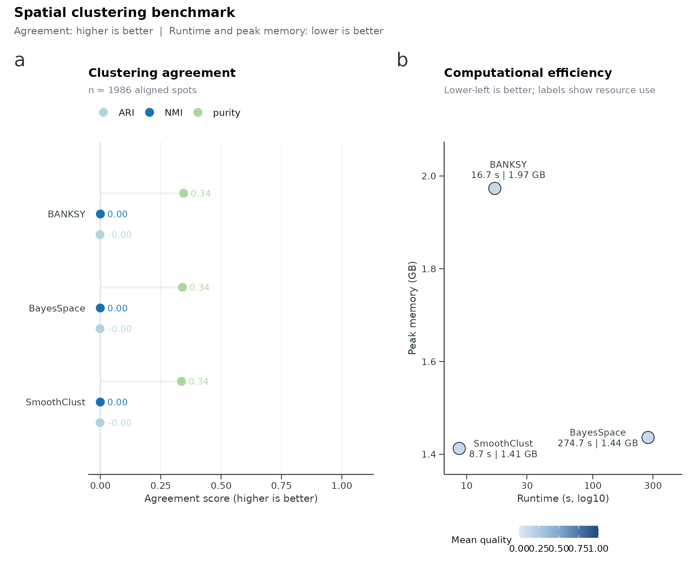

# Spatial domain benchmark workflow

This article compares spatial domain clustering methods with
\[RunSpatialBenchmark()\]. Each method runs in an isolated R process;
results include ARI, NMI, purity, runtime, and peak memory against a
gold-standard label column. Visualize the result with
\[SpatialBenchmarkPlot()\].

Supported producers include `BayesSpace`, `BANKSY`, and `SmoothClust`.
This workflow is separate from scRNA batch integration benchmarking
(\[RunIntegrationBenchmark()\]).

## Load data and define a gold standard

The bundled Visium pancreas subset is used here. For demonstration, a
simple cyclic domain label is assigned as the gold standard. Replace
this with manual annotations or reference domains for real analyses.

``` r

library(scop)
#>           ⬢          .        ⬡             ⬢     .
#>                      _____ _________  ____
#>                     / ___// ___/ __ ./ __ .
#>                    (__  )/ /__/ /_/ / /_/ /
#>                   /____/ .___/.____/ .___/
#>                                   /_/
#>       ⬢               .      ⬡        .          ⬢
#> ------------------------------------------------------------
#> Version: 0.9.1 (2026-09-01 update)
#> Website: https://mengxu98.github.io/scop/
#> 
#> Python environment initialization is disabled
#> To enable it, set: options(scop_env_init = TRUE)
#> 
#> The message can be suppressed by: 
#>   suppressPackageStartupMessages(library(scop))
#>   or options(log_message.verbose = FALSE)
#> ------------------------------------------------------------

data(visium_human_pancreas_sub)
spatial <- visium_human_pancreas_sub

spatial$gold_domain <- factor(
  paste0("domain_", (seq_len(ncol(spatial)) - 1) %% 3 + 1)
)
table(spatial$gold_domain)
#> 
#> domain_1 domain_2 domain_3 
#>      662      662      662
```

## Run the benchmark

Methods share the same spot set. Tune per-method arguments through
`method_params` when backends need different PCA counts or layers.

``` r

bench <- RunSpatialBenchmark(
  spatial,
  gold_standard = "gold_domain",
  method_params = list(
    BayesSpace = list(n.PCs = 5, n.HVGs = 200),
    BANKSY = list(layer = "counts"),
    SmoothClust = list(layer = "counts", min_spots = 1)
  ),
  verbose = FALSE
)

bench$summary
#>        method      workflow           ARI          NMI    purity runtime_s
#> 1  BayesSpace SpatialDomain -0.0007844788 1.295315e-04 0.3398792   274.722
#> 2      BANKSY SpatialDomain -0.0010452685 4.916507e-04 0.3449144    16.713
#> 3 SmoothClust SpatialDomain -0.0009201495 3.559811e-05 0.3358510     8.728
#>   baseline_memory_mb peak_memory_mb memory_delta_mb n_evaluated n_clusters
#> 1           659.9062       1470.707        810.8008        1986          3
#> 2           659.9805       2020.625       1360.6445        1986          6
#> 3           660.0352       1446.555        786.5195        1986          3
#>    status error
#> 1 success      
#> 2 success      
#> 3 success
```

## Inspect the result object

[`RunSpatialBenchmark()`](https://mengxu98.github.io/scop/reference/RunSpatialBenchmark.md)
returns a `spatial_benchmark_result` list:

- `$summary`: quality and resource metrics per method;
- `$predictions`: aligned domain labels per spot;
- `$metrics`: long metric table for custom plots.

``` r

str(bench$summary, max.level = 1)
#> 'data.frame':    3 obs. of  13 variables:
#>  $ method            : chr  "BayesSpace" "BANKSY" "SmoothClust"
#>  $ workflow          : chr  "SpatialDomain" "SpatialDomain" "SpatialDomain"
#>  $ ARI               : num  -0.000784 -0.001045 -0.00092
#>  $ NMI               : num  1.30e-04 4.92e-04 3.56e-05
#>  $ purity            : num  0.34 0.345 0.336
#>  $ runtime_s         : num  274.72 16.71 8.73
#>  $ baseline_memory_mb: num  660 660 660
#>  $ peak_memory_mb    : num  1471 2021 1447
#>  $ memory_delta_mb   : num  811 1361 787
#>  $ n_evaluated       : int  1986 1986 1986
#>  $ n_clusters        : int  3 6 3
#>  $ status            : chr  "success" "success" "success"
#>  $ error             : chr  "" "" ""
head(bench$predictions)
#>              spot_id gold_standard     method prediction
#> 1 TGGTATCGGTCTGTAT-1      domain_1 BayesSpace          1
#> 2 ATTATCTCGACAGATC-1      domain_2 BayesSpace          1
#> 3 TGAGATCAAATACTCA-1      domain_3 BayesSpace          2
#> 4 CTGGTCCTAACTTGGC-1      domain_1 BayesSpace          1
#> 5 ATAGTCTTTGACGTGC-1      domain_2 BayesSpace          1
#> 6 GGGTGGTCCAGCCTGT-1      domain_3 BayesSpace          2
```

## Plot benchmark views

[`SpatialBenchmarkPlot()`](https://mengxu98.github.io/scop/reference/SpatialBenchmarkPlot.md)
defaults to a publication-oriented overview that combines clustering
agreement with runtime and peak-memory efficiency.

``` r

SpatialBenchmarkPlot(data = bench, plot_type = "overview")
```



Other views:

``` r

SpatialBenchmarkPlot(data = bench, plot_type = "quality")
SpatialBenchmarkPlot(data = bench, plot_type = "efficiency")
SpatialBenchmarkPlot(data = bench, plot_type = "heatmap")
```

## What to report

A spatial benchmark report should include:

- the gold-standard column and number of domains;
- methods compared and any `method_params` overrides;
- `$summary` with ARI, NMI, purity, runtime, and peak memory;
- the overview or quality plot;
- failed or unavailable methods (status column) when backends are
  missing.

Agreement metrics are higher when better; runtime and peak memory are
lower when better.
