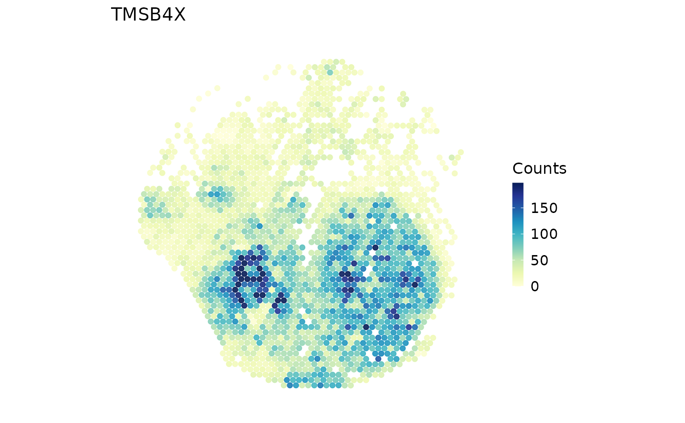

# Spatial framework bridges

This page describes two separate bridges from the [main spatial
workflow](https://mengxu98.github.io/scop/articles/spatial-main-workflow.md):
Seurat↔︎SpatialExperiment and Seurat↔︎Giotto. A bridge moves a data
container; it does not claim that the target framework’s analysis or
plotting backend ran. The [platform
page](https://mengxu98.github.io/scop/articles/spatial-platform-workflows.md)
defines assay, image, and platform-specific input choices.

## What each bridge preserves

| Field | Seurat ↔︎ SpatialExperiment | Seurat ↔︎ Giotto |
|----|----|----|
| Expression | One selected Seurat `assay`/`layer` becomes the `scop_input` assay; it is restored as the requested Seurat assay | The selected image subset is passed to the official GiottoClass converter; native Giotto layers follow that converter’s rules |
| Observation IDs and order | SpatialExperiment column names and coordinate row names must match exactly; reverse conversion reorders to assay-column order | The official converter owns target IDs; convert one selected image and check the returned object before analysis |
| Metadata | `include_meta = TRUE` copies Seurat metadata to `colData`; reverse conversion copies `colData` to Seurat metadata | Metadata retention follows `GiottoClass`; the bridge does not invent or merge sample labels |
| Coordinates | Raw coordinates are the default; an explicit display export records its transform and reverse conversion inverts it | One selected image’s spatial coordinates are sent through the official converter; no extra coordinate system is invented by SCOP |
| Image/raster information | Raster image slots are not represented by the lightweight SpatialExperiment conversion | One image is selected and subset; multiple images/slices are never silently merged |
| Analysis and plots | No SpatialExperiment analysis is run by the bridge | No Giotto analysis or plot is run by the bridge |

The common invariant is identity: expression columns, metadata rows, and
coordinate rows must refer to the same spots/cells in the same intended
order. The bridge keeps provenance where SCOP can invert it, but it
cannot preserve target-framework fields that have no counterpart.

## Seurat and SpatialExperiment round-trip

[`srt_to_spe()`](https://mengxu98.github.io/scop/reference/srt_to_spe.md)
exports one selected assay layer and coordinates. It defaults to raw
acquisition coordinates, which is the safe choice for downstream
distances. `coordinate_space = "legacy_display"` is an explicit
compatibility export; the source and affine transform are stored in
`metadata(spe)$scop_spatial_coordinates`.

``` r

library(scop)
data(visium_human_pancreas_sub)

spatial <- Seurat::NormalizeData(
  visium_human_pancreas_sub,
  assay = "Spatial",
  verbose = FALSE
)
spe <- srt_to_spe(
  spatial,
  assay = "Spatial",
  layer = "counts",
  image = "slice1",
  coordinate_space = "raw"
)
spatial_roundtrip <- spe_to_srt(spe, assay = "Spatial", layer = "scop_input")

stopifnot(identical(colnames(spatial_roundtrip), colnames(spe)))
head(spatial_roundtrip@meta.data)
```

    ##                             orig.ident nCount_Spatial nFeature_Spatial    x   y
    ## TGGTATCGGTCTGTAT-1 GSE254829_PanIN_LG2           3932             2075 3859 662
    ## ATTATCTCGACAGATC-1 GSE254829_PanIN_LG2           9403             3340 3914 662
    ## TGAGATCAAATACTCA-1 GSE254829_PanIN_LG2           9179             3303 3969 662
    ## CTGGTCCTAACTTGGC-1 GSE254829_PanIN_LG2           5909             2525 4024 662
    ## ATAGTCTTTGACGTGC-1 GSE254829_PanIN_LG2           5140             2400 4079 662
    ## GGGTGGTCCAGCCTGT-1 GSE254829_PanIN_LG2           5813             2553 4134 662
    ##                     sample_id geo_accession patient_sample
    ## TGGTATCGGTCTGTAT-1 GSM8058244     GSE254829      PanIN-LG2
    ## ATTATCTCGACAGATC-1 GSM8058244     GSE254829      PanIN-LG2
    ## TGAGATCAAATACTCA-1 GSM8058244     GSE254829      PanIN-LG2
    ## CTGGTCCTAACTTGGC-1 GSM8058244     GSE254829      PanIN-LG2
    ## ATAGTCTTTGACGTGC-1 GSM8058244     GSE254829      PanIN-LG2
    ## GGGTGGTCCAGCCTGT-1 GSM8058244     GSE254829      PanIN-LG2
    ##                                             panin_grade coda_label coda_score
    ## TGGTATCGGTCTGTAT-1 not_manually_annotated_as_epithelial   collagen  100.00000
    ## ATTATCTCGACAGATC-1 not_manually_annotated_as_epithelial   collagen   60.00000
    ## TGAGATCAAATACTCA-1 not_manually_annotated_as_epithelial   collagen  100.00000
    ## CTGGTCCTAACTTGGC-1 not_manually_annotated_as_epithelial     islets   68.75000
    ## ATAGTCTTTGACGTGC-1 not_manually_annotated_as_epithelial   collagen   62.50000
    ## GGGTGGTCCAGCCTGT-1 not_manually_annotated_as_epithelial   collagen   86.36364
    ##                    coda_islets coda_normal.epithelium coda_smooth.muscle
    ## TGGTATCGGTCTGTAT-1        0.00                      0                  0
    ## ATTATCTCGACAGATC-1        0.00                      0                  0
    ## TGAGATCAAATACTCA-1        0.00                      0                  0
    ## CTGGTCCTAACTTGGC-1       68.75                      0                  0
    ## ATAGTCTTTGACGTGC-1       37.50                      0                  0
    ## GGGTGGTCCAGCCTGT-1        0.00                      0                  0
    ##                    coda_fat coda_acini coda_collagen coda_panin
    ## TGGTATCGGTCTGTAT-1        0    0.00000     100.00000          0
    ## ATTATCTCGACAGATC-1        0    0.00000      60.00000         40
    ## TGAGATCAAATACTCA-1        0    0.00000     100.00000          0
    ## CTGGTCCTAACTTGGC-1        0    0.00000      31.25000          0
    ## ATAGTCTTTGACGTGC-1        0    0.00000      62.50000          0
    ## GGGTGGTCCAGCCTGT-1        0   13.63636      86.36364          0
    ##                                               feature_selection
    ## TGGTATCGGTCTGTAT-1 top_5000_shared_with_panc8_by_spatial_counts
    ## ATTATCTCGACAGATC-1 top_5000_shared_with_panc8_by_spatial_counts
    ## TGAGATCAAATACTCA-1 top_5000_shared_with_panc8_by_spatial_counts
    ## CTGGTCCTAACTTGGC-1 top_5000_shared_with_panc8_by_spatial_counts
    ## ATAGTCTTTGACGTGC-1 top_5000_shared_with_panc8_by_spatial_counts
    ## GGGTGGTCCAGCCTGT-1 top_5000_shared_with_panc8_by_spatial_counts

``` r

SpatialSpotPlot(spatial_roundtrip, image = NULL,
               features = rownames(spatial_roundtrip)[1],
               assay = "Spatial", layer = "counts",
               palette = "YlGnBu", legend.title = "Counts")
```



The returned assay contains the exported counts, so the plot explicitly
reads `layer = "counts"`; exporting counts does not also export a
normalized `data` layer. The
[`stopifnot()`](https://rdrr.io/r/base/stopifnot.html) check is
intentionally about IDs, not byte-for-byte equality of every Seurat
slot. The conversion is lightweight: it does not promise to round-trip
Seurat images, reductions, graphs, tools, or all assays. External
SpatialExperiment objects without SCOP coordinate provenance are
interpreted as raw coordinates in their supplied units; verify their
units before using a distance-sensitive method.

## Seurat and Giotto round-trip

The Giotto bridge is a one-image adapter. A single-image object can be
resolved automatically; a multi-image object requires `image =`. SCOP
selects the official `GiottoClass` v4/v5 converter for the installed
Seurat major version, reuses an installed optional package, and does not
initialize Giotto’s optional Python environment.

``` r

library(scop)
data(visium_human_pancreas_sub)

spatial <- Seurat::NormalizeData(
  visium_human_pancreas_sub,
  assay = "Spatial",
  verbose = FALSE
)
giotto <- srt_to_giotto(spatial, image = "slice1")
spatial_from_giotto <- giotto_to_srt(giotto)

SeuratObject::Images(spatial_from_giotto)
SpatialSpotPlot(spatial_from_giotto, features = rownames(spatial_from_giotto)[1])
```

This block runs only when a compatible GiottoClass installation is
available; `eval=FALSE` is deliberate so a documentation build does not
install or download an external backend. A live round-trip must compare
the expression features, observation IDs, metadata columns, and
coordinate values that the installed converter claims to preserve. It
must not be presented as proof that Giotto’s own analysis or plotting
pipeline ran.

## Choosing a bridge

Use SpatialExperiment when a Bioconductor container and explicit
assay/column metadata are the interchange target. Use Giotto when the
native Giotto object and its official converter are the target. For
either route, select one image, record the coordinate space and units,
check IDs immediately after conversion, and re-check the target object’s
own accessors before starting downstream analysis.
