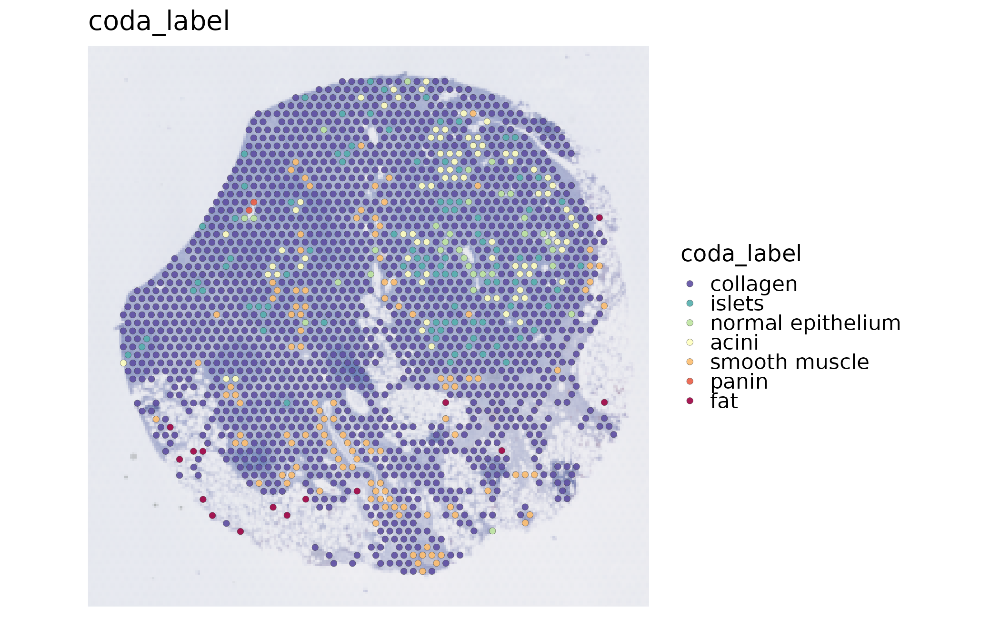
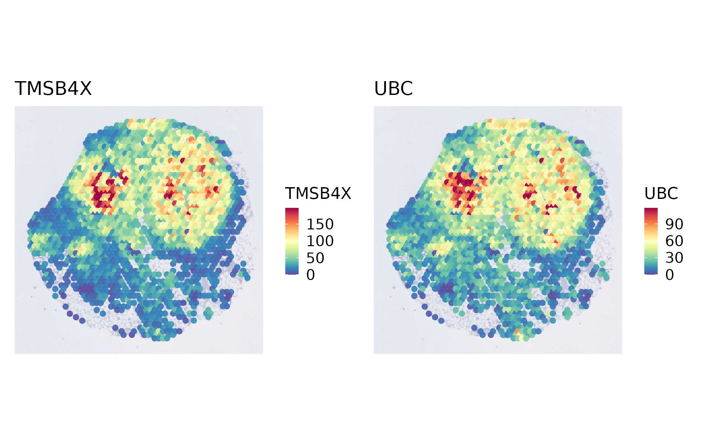
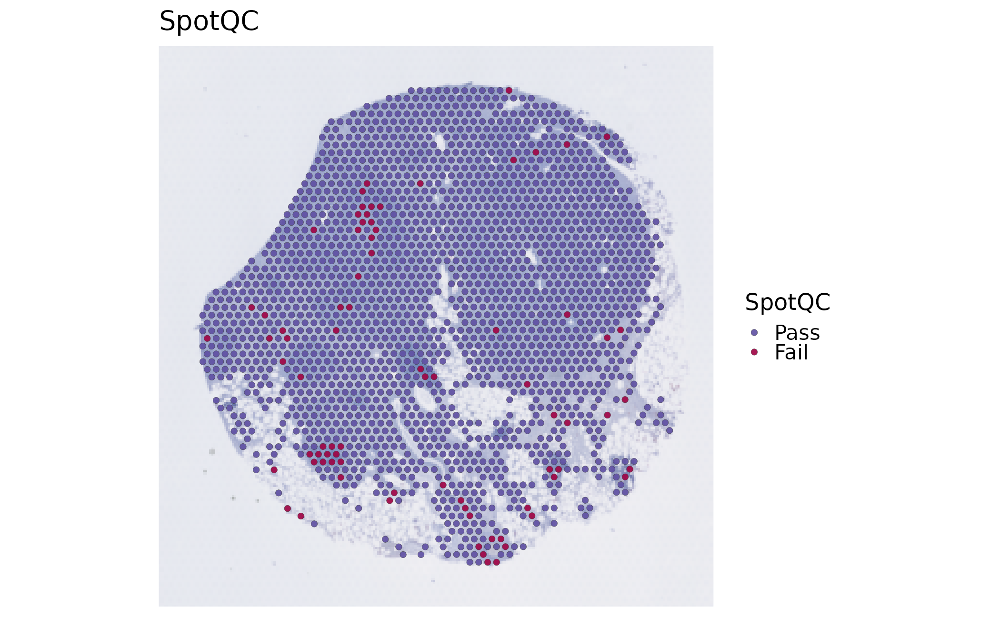
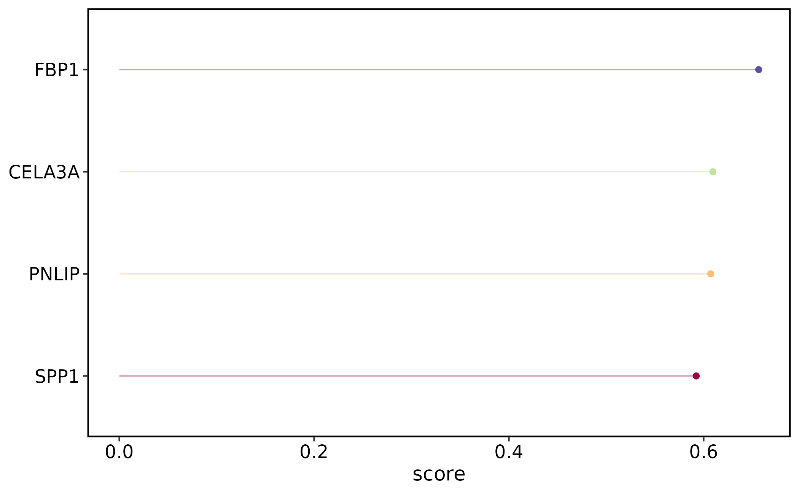
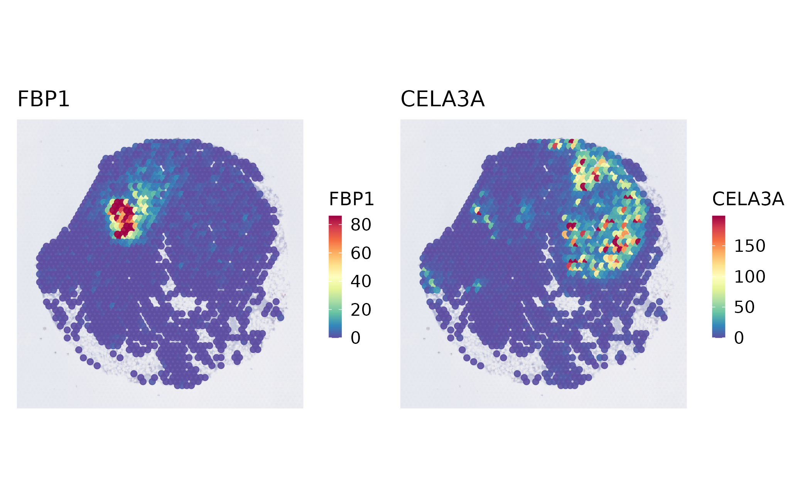
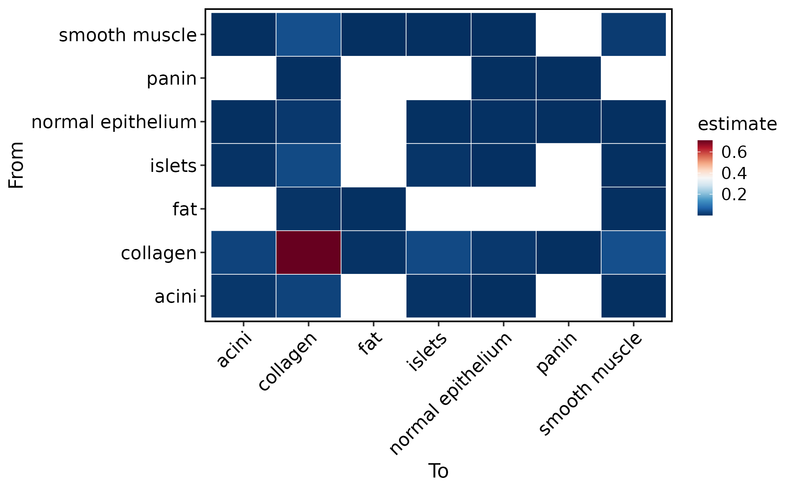
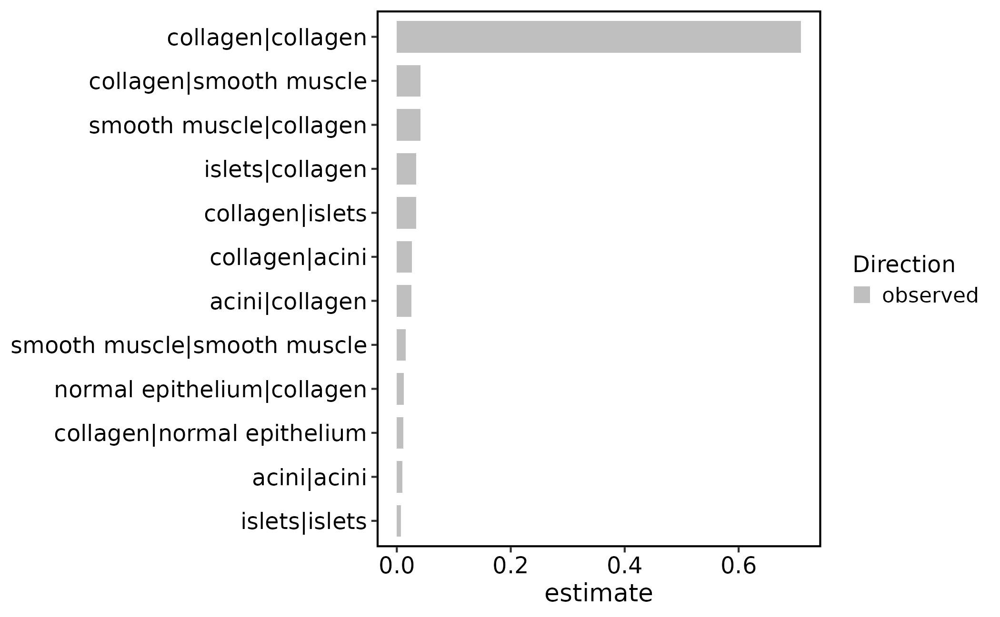

# Spatial transcriptomics main workflow

This article shows the recommended first-pass SCOP workflow for a
spatial transcriptomics object. It uses the bundled Visium pancreas
subset and keeps the main path short: inspect the object, run the
spatial workflow, check summaries, plot spatial features, and branch
into optional backends only when the question requires them.

It is not a catalogue of every spatial backend. Use method pages for
backend specific parameters and dependency notes.

Read the workflow as an evidence ladder: first confirm coordinates and
image orientation, then compute QC and spatially variable features, then
add domains, deconvolution, or neighborhood models only when they answer
the biological question.

## Load a Spatial Object

Start with a Seurat object that has expression, metadata, and spatial
coordinates. The bundled `visium_human_pancreas_sub` object has a
`Spatial` assay, a `slice1` image, and metadata coordinates.

``` r

library(scop)
#>           ⬢          .        ⬡             ⬢     .
#>                      _____ _________  ____
#>                     / ___// ___/ __ ./ __ .
#>                    (__  )/ /__/ /_/ / /_/ /
#>                   /____/ .___/.____/ .___/
#>                                   /_/
#>       ⬢               .      ⬡        .          ⬢
#> ------------------------------------------------------------
#> Version: 0.9.1 (2026-09-01 update)
#> Website: https://mengxu98.github.io/scop/
#> 
#> Python environment initialization is disabled
#> To enable it, set: options(scop_env_init = TRUE)
#> 
#> The message can be suppressed by: 
#>   suppressPackageStartupMessages(library(scop))
#>   or options(log_message.verbose = FALSE)
#> ------------------------------------------------------------

data(visium_human_pancreas_sub)
spatial <- visium_human_pancreas_sub

SeuratObject::DefaultAssay(spatial) <- "Spatial"
SeuratObject::Images(spatial)
#> [1] "slice1"
head(spatial@meta.data[, c("x", "y", "coda_label")])
#>                       x   y coda_label
#> TGGTATCGGTCTGTAT-1 3859 662   collagen
#> ATTATCTCGACAGATC-1 3914 662   collagen
#> TGAGATCAAATACTCA-1 3969 662   collagen
#> CTGGTCCTAACTTGGC-1 4024 662     islets
#> ATAGTCTTTGACGTGC-1 4079 662   collagen
#> GGGTGGTCCAGCCTGT-1 4134 662   collagen
```

Before running methods, make one direct map. This checks whether
coordinates, image orientation, labels, and the default spatial theme
are sensible. If this first map is rotated, mirrored, or shifted,
downstream spatial domains and neighborhood results will be difficult to
interpret even if the model runs. SCOP reads full-resolution raw
coordinates for analysis and applies the selected Seurat scale factor
exactly once for display. The default is the low-resolution raster. If
the image slot contains `tissue_hires_image.png`, pass
`image.scale = "hires"`; do not rewrite `@scale.factors`. Seurat’s
standard `VisiumV2` loader stores source `imagerow`/`imagecol`
positionally as centroid `x`/`y`; SCOP restores horizontal image-column
and vertical image-row order. Generic FOV centroid tables with explicit
`x`/`y` retain their order. Legacy Visium pixel coordinates are
normalized only when explicit image row/column names are available,
before the selected display transform is applied.

Custom VisiumV2 objects with horizontal centroid `x` should record that
convention once with
`SetSpatialImageAxes(spatial, image = "slice1", x_orientation = "horizontal")`.
Standard Seurat `Read10X_Image()` objects use the vertical centroid-x
convention. The marker is stored in `spatial@misc$spatial_image_axes`,
survives subsetting and cell renaming, and is carried by
[`RunSpatialIntegration()`](https://mengxu98.github.io/scop/reference/RunSpatialIntegration.md)
when it merges a list. Migrate older custom objects before subsetting: a
legacy image attribute may be lost by Seurat. Editing ordinary metadata
`x/y` never changes image axes. Reapply the marker if an image is
replaced or copied under another name.

Coordinate contract v3 rejects older coordinate-dependent stored
results; rerun their producers. Metadata/FOV plots now default to
`flip.y = FALSE`, matching network and boundary plots; `flip.y = TRUE`
remains an explicit display override. Numeric text and factor
coordinates are parsed as their values, not level codes.

For multi-sample integration and SpatialEcoTyper `mode = "multi"`, SCOP
resolves one image covering all cells in each sample. If several images
cover the same sample, pass a named map such as
`image = c(S1 = "slice1", S2 = "slice2")`. A scalar image cannot
silently discard other samples. SpatialEcoTyper single discovery uses
the selected image’s raw coordinates and requires explicit image
selection when multiple images are present. Its radius is in those raw
units.

``` r

SpatialSpotPlot(
  spatial,
  group.by = "coda_label"
)
```



``` r


SpatialSpotPlot(
  spatial,
  features = rownames(spatial)[1:2],
  assay = "Spatial",
  layer = "counts"
)
```



``` r


# For an object loaded with a hires raster:
# SpatialSpotPlot(spatial, group.by = "coda_label", image.scale = "hires")
```

## Run the Basic Spatial Workflow

`RunStandardWorkflow(workflow = "spatial")` is the shortest entry point
for a first-pass spatial analysis. Keep optional domain clustering and
deconvolution off at first. This makes the first run fast and gives you
QC and spatial variable features before choosing heavier backends.

``` r

spatial <- RunStandardWorkflow(
  spatial,
  workflow = "spatial",
  assay = "Spatial",
  image = "slice1",
  coord.cols = c("x", "y"),
  do_spot_qc = TRUE,
  do_spatial_variable_features = TRUE,
  spatial_variable_features_params = list(
    method = "moran",
    nfeatures = 50
  ),
  do_spatial_cluster = FALSE,
  do_deconvolution = FALSE
)
#> ℹ [2026-09-06 23:02:10] Start standard spot-level spatial workflow...
#> ◌ [2026-09-06 23:02:10] Running spot-level quality control
#> ✔ [2026-09-06 23:02:11] Spot QC completed: 1986 evaluated, 1907 Pass, 79 Fail
#> ℹ   Scope assay "Spatial", layer "counts"
#> ℹ   Saved metadata column `SpotQC`
#> ℹ   Plot returned object `SpatialSpotPlot(<returned_object>, group.by = "SpotQC")`
#> ℹ [2026-09-06 23:02:11] Start standard processing workflow...
#> ℹ [2026-09-06 23:02:11] Checking a list of <Seurat>...
#> ! [2026-09-06 23:02:11] Data 1/1 of the `srt_list` is "unknown"
#> Warning: Data 1/1 of the `srt_list` is "unknown"
#> ℹ [2026-09-06 23:02:11] Perform `NormalizeData()` with `normalization.method = 'LogNormalize'` on 1/1 of `srt_list`...
#> ℹ [2026-09-06 23:02:11] Perform `FindVariableFeatures()` on 1/1 of `srt_list`...
#> ℹ [2026-09-06 23:02:11] Use the separate HVF from `srt_list`
#> ℹ [2026-09-06 23:02:11] Number of available HVF: 2000
#> ℹ [2026-09-06 23:02:11] Finished check
#> ℹ [2026-09-06 23:02:11] Perform `ScaleData()`
#> ℹ [2026-09-06 23:02:11] Perform pca linear dimension reduction
#> ℹ [2026-09-06 23:02:12] Use stored estimated dimensions 1:30 for Standardpca
#> ℹ [2026-09-06 23:02:13] Perform `Seurat::FindClusters()` with `cluster_algorithm = 'louvain'` and `cluster_resolution = 0.6`
#> ℹ [2026-09-06 23:02:13] Reorder clusters...
#> ℹ [2026-09-06 23:02:13] Skip `log1p()` because `layer = data` is not "counts"
#> ℹ [2026-09-06 23:02:13] Perform umap nonlinear dimension reduction
#> ✔ [2026-09-06 23:02:18] Standard processing workflow completed
#> ◌ [2026-09-06 23:02:18] Running spatial variable feature detection
#> ✔ [2026-09-06 23:02:18] Spatial variable features completed: 2000 tested, 50 ranked in the top set
#> ℹ   Scope method "moran" ("cpp" backend); assay "Spatial", layer "data"; 1986 spots; coordinates "raw"
#> ℹ   Saved full result in returned object tool bundle `SpatialVariableFeatures`
#> ℹ   Plot returned object `SpatialVariableFeaturePlot(<returned_object>, plot_type = "combined", assay = "Spatial", image = "slice1", coord.cols = c("x", "y"))`
#> ✔ [2026-09-06 23:02:18] Standard spot-level spatial workflow completed
```

After the run, look at the stable result locations before making more
plots. Most spatial wrappers write method parameters and summaries under
`srt@tools`. Spatial variable features are genes whose expression varies
with spatial position according to the selected method. They are
candidates for spatial patterning, not automatically domain markers.

``` r

names(spatial@tools)
#> [1] "GSE254829_coda_table"          "SpatialVariableFeatures"      
#> [3] "run_standard_spatial_workflow"
spatial@tools$SpatialVariableFeatures$summary
#> $n_features
#> [1] 2000
#> 
#> $top_features
#>  [1] "FBP1"     "CELA3A"   "PNLIP"    "SPP1"     "CLPS"     "CTRC"    
#>  [7] "PRSS1"    "PLA2G1B"  "CTRB1"    "GCG"      "CEL"      "CPB1"    
#> [13] "CPA2"     "SPINK1"   "TTR"      "CFTR"     "CPA1"     "KRT8"    
#> [19] "ELF3"     "SFRP2"    "SLC4A4"   "ANXA4"    "PNLIPRP1" "LCN2"    
#> [25] "MMP7"     "KRT18"    "SYCN"     "MUSTN1"   "DEFB1"    "TSPAN8"  
#> [31] "IGFBP5"   "PDIA2"    "FN1"      "KRT7"     "EPCAM"    "MYL9"    
#> [37] "ATP1B1"   "JCHAIN"   "GATM"     "HOMER2"   "CITED4"   "PMEPA1"  
#> [43] "SST"      "GPX2"     "TAGLN"    "FXYD2"    "NR5A2"    "CRP"     
#> [49] "GCNT3"    "SERPINA5"
#> 
#> $top_feature_summary
#>    feature rank     score
#> 1     FBP1    1 0.6565080
#> 2   CELA3A    2 0.6094565
#> 3    PNLIP    3 0.6072718
#> 4     SPP1    4 0.5923706
#> 5     CLPS    5 0.5917626
#> 6     CTRC    6 0.5826625
#> 7    PRSS1    7 0.5811954
#> 8  PLA2G1B    8 0.5746198
#> 9    CTRB1    9 0.5745952
#> 10     GCG   10 0.5732244
#> 11     CEL   11 0.5684299
#> 12    CPB1   12 0.5656297
#> 13    CPA2   13 0.5635837
#> 14  SPINK1   14 0.5550198
#> 15     TTR   15 0.5512296
#> 16    CFTR   16 0.5332586
#> 17    CPA1   17 0.5212444
#> 18    KRT8   18 0.5093506
#> 19    ELF3   19 0.4804406
#> 20   SFRP2   20 0.4799576
head(spatial@tools$SpatialVariableFeatures$summary$top_features)
#> [1] "FBP1"   "CELA3A" "PNLIP"  "SPP1"   "CLPS"   "CTRC"
```

## Plot the First Results

The default spatial maps hide axes and crop to the observed spots. Use
`show_axes = TRUE` only when debugging coordinates. `SpotQC` summarizes
spot-level quality-control status. Spatial feature surfaces should be
interpreted together with raw spot maps, because smoothing can make
sparse signal look broader than it is.

``` r

SpatialSpotPlot(
  spatial,
  group.by = "SpotQC"
)
```



``` r


SpatialVariableFeaturePlot(
  spatial,
  plot_type = "summary"
)
```



``` r


SpatialVariableFeaturePlot(
  spatial,
  plot_type = "surface",
  nfeatures = 4
)
```



## Add Spatial Domains When Needed

Run a domain method only after the baseline object looks correct.
BayesSpace is a common Visium choice. BANKSY and SmoothClust are useful
alternatives when their assumptions match the data and optional
dependencies are available. Domain labels are unsupervised spatial
clusters. They are useful for segmenting tissue regions, but they need
marker genes, histology, or reference labels before being named
biologically.

``` r

spatial_bayes <- RunStandardWorkflow(
  spatial,
  workflow = "spatial",
  assay = "Spatial",
  image = "slice1",
  coord.cols = c("x", "y"),
  do_spot_qc = FALSE,
  do_spatial_variable_features = FALSE,
  do_spatial_cluster = TRUE,
  spatial_cluster_method = "BayesSpace",
  spatial_q = 3
)

SpatialSpotPlot(
  spatial_bayes,
  group.by = "BayesSpace_cluster"
)
```

For other domain backends, keep the output contract in mind: cluster
labels should land in metadata and method details should stay under
`srt@tools`.

``` r

spatial <- RunBANKSY(
  spatial,
  assay = "Spatial",
  layer = "counts",
  coord.cols = c("x", "y"),
  cluster_colname = "BANKSY_cluster"
)
SpatialSpotPlot(spatial, group.by = "BANKSY_cluster")
```

## Add Cell Composition Only With a Reference

For spot-level data, deconvolution depends more on reference quality
than on the wrapper choice. Use a matched single-cell reference, then
inspect dominant cell types and maximum proportions before interpreting
spatial biology.

``` r

spatial <- RunSpatialDWLS(
  spatial,
  reference = reference,
  reference_label = "celltype",
  assay = "Spatial",
  reference_assay = "RNA",
  coord.cols = c("x", "y"),
  prefix = "SpatialDWLS"
)

spatial@tools$SpatialDWLS$summary

SpatialSpotPlot(
  spatial,
  group.by = "SpatialDWLS_dominant_type"
)

SpatialSpotPlot(
  spatial,
  group.by = "SpatialDWLS_dominant_type",
  plot_type = "pie"
)
```

`RCTD`, `SPOTlight`, `CARD`, and `STdeconvolve` follow the same
practical rule: first check the result summary, then visualize dominant
labels, maximum proportions, and selected proportions. Deconvolution
estimates cell-type composition per spot. It is constrained by the
reference, so missing reference cell types can be misassigned to the
closest available label.

## Add Neighborhood or Context Models Last

Neighborhood methods answer a different question from domain clustering.
Use them after labels are stable, either from metadata, clustering, or
deconvolution.

For a small observed distance profile,
[`SpatialNeighborhoodProfile()`](https://mengxu98.github.io/scop/reference/SpatialNeighborhoodProfile.md)
returns a plain table without modifying the object. Selecting target
cells does not remove their surrounding tissue from the calculation:

``` r

profile <- SpatialNeighborhoodProfile(
  spatial, group.by = "coda_label", radii = c(100, 200, 400),
  cells = head(colnames(spatial), 20), cumulative = TRUE, verbose = FALSE
)
head(profile)
#>              cell_id sample group lower radius count total  fraction
#> 1 TGGTATCGGTCTGTAT-1    all acini     0    100     0     6 0.0000000
#> 2 ATTATCTCGACAGATC-1    all acini     0    100     0     7 0.0000000
#> 3 TGAGATCAAATACTCA-1    all acini     0    100     1     7 0.1428571
#> 4 CTGGTCCTAACTTGGC-1    all acini     0    100     0     7 0.0000000
#> 5 ATAGTCTTTGACGTGC-1    all acini     0    100     1     7 0.1428571
#> 6 GGGTGGTCCAGCCTGT-1    all acini     0    100     1     7 0.1428571
```

Distances above are illustrative raw coordinate units, not automatically
micrometers. Supply `sample.by` for pooled metadata coordinates and
`image` when multiple images are present. Fractions describe labelled
neighbors; an empty neighborhood has undefined composition (`NA`), not
evidence of depletion.

``` r

spatial <- RunSpatialNeighborhood(
  spatial,
  group.by = "coda_label",
  coord.cols = c("x", "y"),
  k = 6
)
#> ✔ [2026-09-06 23:02:22] Spatial neighborhood analysis completed ("observed")

spatial@tools$SpatialNeighborhood$summary
#> $n_pairs
#> [1] 35
#> 
#> $n_edges
#> [1] 11916
#> 
#> $top_pairs
#>      method comparison condition              from                to   estimate
#> 7  observed        all       all          collagen          collagen 0.70955018
#> 12 observed        all       all          collagen     smooth muscle 0.04170863
#> 31 observed        all       all     smooth muscle          collagen 0.04162471
#> 17 observed        all       all            islets          collagen 0.03423968
#> 9  observed        all       all          collagen            islets 0.03407184
#> 6  observed        all       all          collagen             acini 0.02626720
#> 2  observed        all       all             acini          collagen 0.02526015
#> 35 observed        all       all     smooth muscle     smooth muscle 0.01602887
#> 22 observed        all       all normal epithelium          collagen 0.01216851
#> 10 observed        all       all          collagen normal epithelium 0.01166499
#>    statistic pval FDR direction  sample subject count total   fraction
#> 7         NA   NA  NA  observed sample1 sample1  8455 11916 0.70955018
#> 12        NA   NA  NA  observed sample1 sample1   497 11916 0.04170863
#> 31        NA   NA  NA  observed sample1 sample1   496 11916 0.04162471
#> 17        NA   NA  NA  observed sample1 sample1   408 11916 0.03423968
#> 9         NA   NA  NA  observed sample1 sample1   406 11916 0.03407184
#> 6         NA   NA  NA  observed sample1 sample1   313 11916 0.02626720
#> 2         NA   NA  NA  observed sample1 sample1   301 11916 0.02526015
#> 35        NA   NA  NA  observed sample1 sample1   191 11916 0.01602887
#> 22        NA   NA  NA  observed sample1 sample1   145 11916 0.01216851
#> 10        NA   NA  NA  observed sample1 sample1   139 11916 0.01166499

SpatialNeighborhoodPlot(spatial, plot_type = "heatmap")
```



``` r

SpatialNeighborhoodPlot(spatial, plot_type = "stat", top_n = 12)
```



With `method = NULL`, the package computes observed KNN or radius
summaries when `split.by` is absent and preserves the historical spicyR
route when `split.by` is supplied. For new differential neighborhood
analyses, request spicyR explicitly and provide the condition column;
SCOP errors before execution if that design is incomplete.

``` r

spatial <- RunSpatialNeighborhood(
  spatial,
  group.by = "coda_label",
  method = "spicyR",
  split.by = "condition",
  sample.by = "sample"
)
```

``` r

SpatialNeighborhoodPlot(spatial, plot_type = "network", top_n = 12)
```

Use
[`RunStatialKontextual()`](https://mengxu98.github.io/scop/reference/RunStatialKontextual.md)
when you have explicit `from`, `to`, and `parent` cell populations. Use
[`RunMistyR()`](https://mengxu98.github.io/scop/reference/RunMistyR.md)
when the question is feature-level local or broader spatial context
rather than pairwise label enrichment. Both are independent producers
rather than
[`RunSpatialNeighborhood()`](https://mengxu98.github.io/scop/reference/RunSpatialNeighborhood.md)
method choices. HoodscanR remains unimplemented. Neighborhood enrichment
is label-level spatial association. Context models are feature-level
spatial association. Keep those interpretations separate in reports.

Spatial results follow the same structure as single-cell analyses in
SCOP: each producer stores its output as a plain key in `srt@tools`, for
example `spatial@tools$MistyR` or `spatial@tools$SpatialNeighborhood`,
with method-specific fields at the top level plus `parameters` and
`summary`. Read results directly from `srt@tools[[tool_name]]` and pass
them to the dedicated plot functions. Custom `tool_name` values are
honored exactly as written.

``` r

coords <- SpatialCoordinates(spatial, image = "slice1", space = "raw")
network_result <- spatial@tools$SpatialNetwork
network_graph <- GetSpatialGraph(
  res = network_result,
  format = "sparse",
  value = "weight"
)
names(spatial@tools)
```

Distance-sensitive methods default to full-resolution raw acquisition
coordinates. `coordinate_space = "legacy_display"` remains an explicit
compatibility option only. Plot functions map results to display
coordinates by cell or spot ID and `image.scale` never changes raw
distances or neighborhoods. Objects with multiple spatial images must
always select one explicitly with `image`; analysis, plotting, and
framework conversion never silently use the first image.
Coordinate-dependent results created before contract v2 are not silently
migrated; rerun their producer. Metadata passed directly to
[`SpatialSpotPlot()`](https://mengxu98.github.io/scop/reference/SpatialSpotPlot.md)
cannot be traced to its producer, so users upgrading an old analysis
should rerun that analysis before plotting its metadata.

``` r

spatial <- RunMistyR(
  spatial,
  assay = "Spatial",
  layer = "data",
  features = head(spatial@tools$SpatialVariableFeatures$summary$top_features, 20),
  coord.cols = c("x", "y"),
  views = "para"
)
spatial@tools$MistyR$summary
MistyRPlot(spatial, type = "improvements")
```

For label-level contextual scores, use `StatialKontextualPlot(spatial)`
after
[`RunStatialKontextual()`](https://mengxu98.github.io/scop/reference/RunStatialKontextual.md).
These dedicated plots summarize stored backend output and never rerun
the analysis.

## Add Spatially Constrained Communication Deliberately

[`RunCellChat()`](https://mengxu98.github.io/scop/reference/RunCellChat.md)
and
[`RunSpatialCellChat()`](https://mengxu98.github.io/scop/reference/RunSpatialCellChat.md)
answer different questions. The first estimates expression-supported
communication without a physical spatial constraint. The second uses
micron-scale distances and stores its group-level table under the
distinct method name `"SpatialCellChat"`, so the two results can coexist
in `spatial@tools$CCC` without overwriting one another.

Choose the analysis level from the observation represented by each
column:

- `"cell"` for segmented cells such as Xenium or CosMx;
- `"spot"` for spot/domain communication, which must not be described as
  direct cell-type communication;
- `"composition"` for Visium spots with a spot-by-cell-type proportion
  matrix.

Distance parameters are always interpreted in microns. Micron
coordinates use `ratio = 1`. For Visium full-image pixel coordinates,
[`RunSpatialCellChat()`](https://mengxu98.github.io/scop/reference/RunSpatialCellChat.md)
can derive the conversion ratio as `65 / spot_diameter_fullres` when the
selected image contains exactly one trusted full-resolution spot
diameter; otherwise provide `ratio` explicitly. Never substitute a
low-resolution display scale. This article uses one slice; multi-sample
objects are run independently and require an explicit `sample.by` and
named image mapping.

``` r

spatial <- RunSpatialCellChat(
  spatial,
  group.by = "coda_label",
  image = "slice1",
  technology = "visium",
  analysis.level = "spot",
  coordinate.unit = "pixel",
  tol = 32.5,
  species = "Homo_sapiens",
  database = "protein",
  store.object = "minimal"
)

CCCNetworkPlot(spatial, method = "SpatialCellChat", plot_type = "circle")
CCCNetworkPlot(
  spatial,
  method = "SpatialCellChat",
  condition = "default",
  sample = "slice1",
  plot_type = "spatial",
  signaling = "SPP1",
  top_n = 50
)
CCCHeatmap(spatial, method = "SpatialCellChat", plot_type = "bubble")
SpatialCellChatPlot(spatial, plot_type = "incoming")
result <- spatial@tools$SpatialCellChat
```

`CCCNetworkPlot(plot_type = "spatial")` is the common stored-result
renderer for `SpatialCellChat`, `SpaTalk`, and `COMMOT`. It overlays all
stored cells or spots, draws group-centroid nodes with abundance-scaled
sizes, and draws sender-coloured directed edges whose widths represent
the filtered communication score. For `analysis.level = "composition"`,
the default spot layer is a proportion pie
(`composition_display = "pie"`); use `composition_display = "dominant"`
only when a single representative type is acceptable. This plot does not
rerun an optional backend. A result created before the current spatial
plot payload was stored must be rerun rather than reconstructed from
mutable metadata.

`store.object = "minimal"` stores normalized interaction, pathway,
network, coordinate, and diagnostic results but not the large native S4
object or a materialized cell-by-cell-by-LR edge table. Use `"full"`
only when native SpatialCellChat downstream analysis is required, then
retrieve it with `GetCCCObject(method = "SpatialCellChat")`.

Visium spots form a hexagonal acquisition grid, but six-neighbor
topology is not a replacement for the Euclidean diffusion model.
Contact-dependent signaling is therefore rejected in spot mode. P-values
from spatial permutation and non-spatial CellChat analyses also have
different null models and should not be compared as if they were
interchangeable.

SpatialDM addresses a different question: which ligand-receptor pairs
are spatially associated, and which spots contain local interaction
evidence. It does not infer sender-receiver cell-type edges, so its
Moran’s R must not be reported as communication probability or transport
mass. The official workflow is global selection followed by local spot
selection. Use normalized or log-transformed expression for `layer`, raw
counts for `counts.layer`, and set `l` or `eff_dist` in the raw
coordinate unit of the selected image.

``` r

spatial <- RunSpatialDM(
  spatial,
  species = "human",
  image = "slice1",
  layer = "data",
  counts.layer = "counts",
  l = 1.2,
  cutoff = 0.2,
  global.threshold = 0.1,
  local.threshold = 0.1
)

SpatialDMPlot(spatial, plot_type = "weights", spot = "spot_001")
SpatialDMPlot(spatial, plot_type = "global", highlight = "SPP1_CD44")
SpatialDMPlot(spatial, plot_type = "local", pair = "SPP1_CD44")
GetSpatialDMResult(spatial, type = "global")
```

[`SpatialDMPlot()`](https://mengxu98.github.io/scop/reference/SpatialDMPlot.md)
follows the information content of the official melanoma tutorial while
returning SCOP `ggplot`/`patchwork` objects and using SCOP themes and
palettes. The `weights` view should be checked before interpreting
global or local results because `l`, `cutoff`, and coordinate scale
determine the effective interaction range.

## What to Report

A compact first-pass spatial report should include:

- the source object, assay, image, and coordinate columns;
- spot or cell counts after filtering;
- top spatial variable features and the method used;
- the domain method, cluster count, and domain sizes if clustering was
  run;
- deconvolution dominant labels and maximum proportions if composition
  was run;
- neighborhood or context summaries only after labels are stable.

Keep the main workflow short. Add backend-specific sections only when
they answer a concrete biological question for the current dataset.
