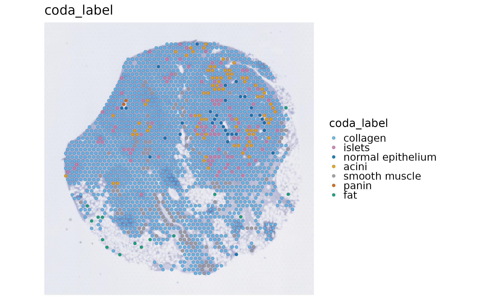
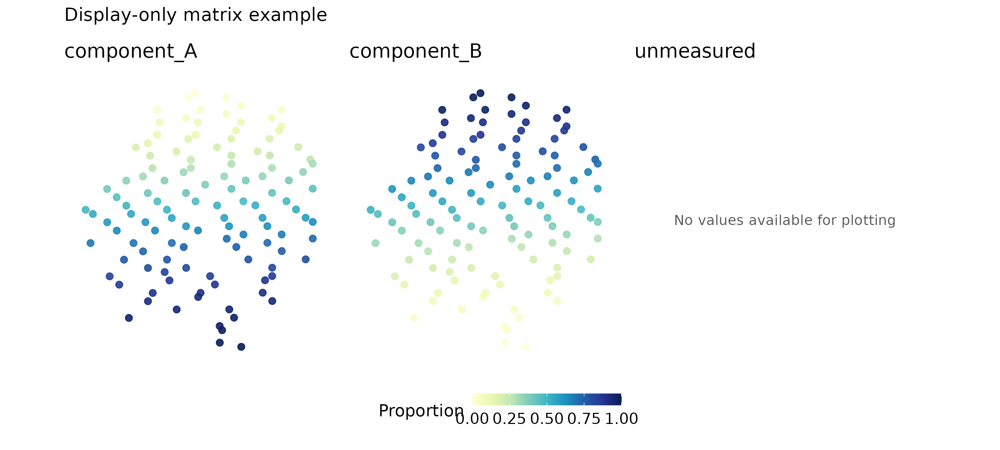
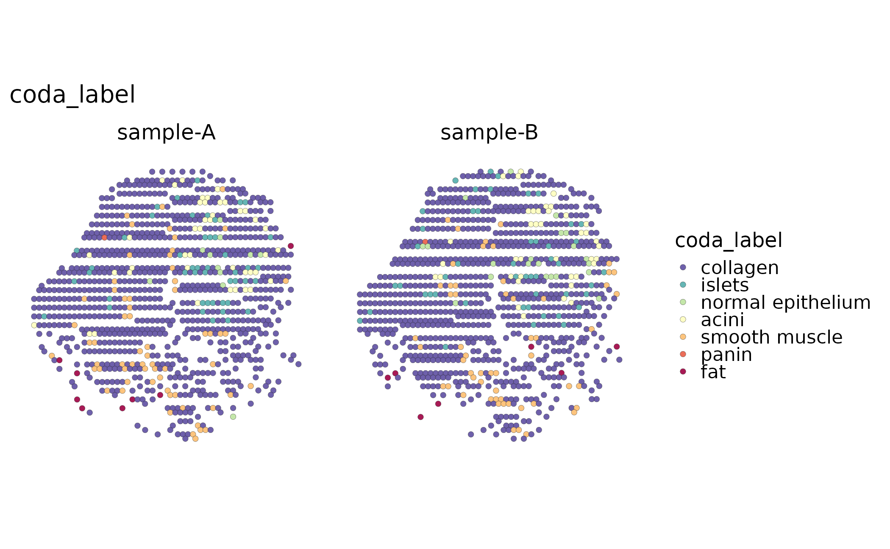

# Spatial transcriptomics main workflow

This is the short, result-first path for a spatial Seurat object:
inspect the input, run a small baseline workflow, inspect the stored
result, and plot it. The bundled `visium_human_pancreas_sub` object is a
real Visium spot-level dataset used for the executable examples below.
It is not a single-cell measurement: one spot can contain transcripts
from several cells.

Use [Spatial imports and standard workflow
methods](https://mengxu98.github.io/scop/articles/spatial-platform-workflows.md)
for Visium/Visium HD/Xenium input choices, assays, units, and
backend-specific parameters. Use [Spatial framework
bridges](https://mengxu98.github.io/scop/articles/spatial-framework-bridges.md)
for Seurat, SpatialExperiment, and Giotto conversion boundaries.

## Check the input before analysis

``` r

library(scop)

data(visium_human_pancreas_sub)
spatial <- visium_human_pancreas_sub
SeuratObject::DefaultAssay(spatial) <- "Spatial"

SeuratObject::Images(spatial)
#> [1] "slice1"
head(spatial@meta.data[, c("x", "y", "coda_label")])
#>                       x   y coda_label
#> TGGTATCGGTCTGTAT-1 3859 662   collagen
#> ATTATCTCGACAGATC-1 3914 662   collagen
#> TGAGATCAAATACTCA-1 3969 662   collagen
#> CTGGTCCTAACTTGGC-1 4024 662     islets
#> ATAGTCTTTGACGTGC-1 4079 662   collagen
#> GGGTGGTCCAGCCTGT-1 4134 662   collagen
raw_coordinates <- SpatialCoordinates(
  spatial,
  image = "slice1",
  space = "raw"
)
raw_coordinates$source
#> $image
#> [1] "slice1"
#> 
#> $coord.cols
#> [1] "x" "y"
#> 
#> $image_policy
#> [1] "strict"
#> 
#> $coordinate_space
#> [1] "raw"
#> 
#> $image_class
#> [1] "VisiumV2"
#> attr(,"package")
#> [1] "Seurat"
#> 
#> $image_width
#> [1] 600
#> 
#> $image_height
#> [1] 340
#> 
#> $scale_name
#> [1] "lowres"
#> 
#> $scale_factor
#> [1] 0.078125
#> 
#> $coordinate_contract_version
#> [1] 3
```

The first checks should answer four questions: which assay contains the
counts, which image is selected, which columns identify the
observations, and whether the coordinate IDs match the expression
columns. SCOP uses raw acquisition coordinates for distance-sensitive
analysis. `image.scale` is a display choice for a selected raster; it
does not change distances or rewrite Seurat scale factors.

For Visium, the observations are spots on an acquisition grid. For
Xenium or other segmented assays, the observations are cells and the
right visualization is \[SpatialCellPlot()\], not a spot-composition
interpretation. A spot label is therefore not automatically a cell type.

## Draw an input map

``` r

SpatialSpotPlot(
  spatial,
  group.by = "coda_label",
  image = "slice1",
  palcolor = c(
    acini = "#E69F00",
    collagen = "#56B4E9",
    fat = "#009E73",
    islets = "#CC79A7",
    `normal epithelium` = "#0072B2",
    panin = "#D55E00",
    `smooth muscle` = "#999999"
  )
)
```



The map is an input and metadata check, not a result from a clustering
or deconvolution model. Named palettes are matched to category names, so
changing the row order or subsetting spots does not silently change the
biological color meaning.
[`SpatialSpotPlot()`](https://mengxu98.github.io/scop/reference/SpatialSpotPlot.md)
keeps equal coordinate scaling by default.

## Run the baseline spatial workflow

Keep the first run small and interpretable. This real Visium example
performs spot QC and native Moran spatial-variable-feature scoring. It
does not run an optional deconvolution or domain backend.

``` r

spatial <- RunStandardWorkflow(
  spatial,
  workflow = "spatial",
  assay = "Spatial",
  image = "slice1",
  coord.cols = c("x", "y"),
  do_spot_qc = TRUE,
  do_spatial_variable_features = TRUE,
  spatial_variable_features_params = list(
    method = "moran",
    nfeatures = 50,
    nperm = 0
  ),
  do_spatial_cluster = FALSE,
  do_deconvolution = FALSE,
  verbose = FALSE
)
#> ℹ [2026-09-20 23:12:30] Skip `log1p()` because `layer = data` is not "counts"
```

## Inspect stored results before plotting

``` r

workflow <- spatial@tools$run_standard_spatial_workflow
workflow$status
#> [1] "completed"
workflow$stages[, c("stage", "requested", "status", "actual_method", "reason")]
#>                       stage requested    status              actual_method
#> 1           quality_control      TRUE completed                  RunSpotQC
#> 2 spatial_variable_features      TRUE completed RunSpatialVariableFeatures
#> 3        spatial_clustering     FALSE   skipped                       <NA>
#> 4             deconvolution     FALSE   skipped                       <NA>
#>          reason
#> 1          <NA>
#> 2          <NA>
#> 3 not requested
#> 4 not requested
spatial@tools$SpatialVariableFeatures$summary
#> $n_features
#> [1] 2000
#> 
#> $top_features
#>  [1] "FBP1"     "CELA3A"   "PNLIP"    "SPP1"     "CLPS"     "CTRC"    
#>  [7] "PRSS1"    "PLA2G1B"  "CTRB1"    "GCG"      "CEL"      "CPB1"    
#> [13] "CPA2"     "SPINK1"   "TTR"      "CFTR"     "CPA1"     "KRT8"    
#> [19] "ELF3"     "SFRP2"    "SLC4A4"   "ANXA4"    "PNLIPRP1" "LCN2"    
#> [25] "MMP7"     "KRT18"    "SYCN"     "MUSTN1"   "DEFB1"    "TSPAN8"  
#> [31] "IGFBP5"   "PDIA2"    "FN1"      "KRT7"     "EPCAM"    "MYL9"    
#> [37] "ATP1B1"   "JCHAIN"   "GATM"     "HOMER2"   "CITED4"   "PMEPA1"  
#> [43] "SST"      "GPX2"     "TAGLN"    "FXYD2"    "NR5A2"    "CRP"     
#> [49] "GCNT3"    "SERPINA5"
#> 
#> $top_feature_summary
#>    feature rank     score
#> 1     FBP1    1 0.6565080
#> 2   CELA3A    2 0.6094565
#> 3    PNLIP    3 0.6072718
#> 4     SPP1    4 0.5923706
#> 5     CLPS    5 0.5917626
#> 6     CTRC    6 0.5826625
#> 7    PRSS1    7 0.5811954
#> 8  PLA2G1B    8 0.5746198
#> 9    CTRB1    9 0.5745952
#> 10     GCG   10 0.5732244
#> 11     CEL   11 0.5684299
#> 12    CPB1   12 0.5656297
#> 13    CPA2   13 0.5635837
#> 14  SPINK1   14 0.5550198
#> 15     TTR   15 0.5512296
#> 16    CFTR   16 0.5332586
#> 17    CPA1   17 0.5212444
#> 18    KRT8   18 0.5093506
#> 19    ELF3   19 0.4804406
#> 20   SFRP2   20 0.4799576
head(spatial@tools$SpatialVariableFeatures$summary$top_features)
#> [1] "FBP1"   "CELA3A" "PNLIP"  "SPP1"   "CLPS"   "CTRC"
```

The stage table is the execution receipt. `completed`, `skipped`, and
`failed` are different states; an unavailable optional backend is not
relabelled as a successful result. A spatially variable feature is a
candidate spatial pattern, not automatically a domain marker or a
cell-type marker.

## Plot QC and spatial features

``` r

SpatialSpotPlot(spatial, group.by = "SpotQC", image = "slice1")
```


``` r

SpatialVariableFeaturePlot(
  spatial,
  plot_type = "summary",
  nfeatures = 4
)
```


``` r

SpatialSpotPlot(
  spatial,
  features = head(spatial@tools$SpatialVariableFeatures$summary$top_features, 2),
  assay = "Spatial",
  layer = "counts",
  image = "slice1"
)
```


`combine = FALSE` returns named plots for independent editing, including
long-format point maps and dominant deconvolution maps. Long-format
`plot.data` accepts explicit cutoffs and quantiles; its default range
remains the full data range. Plotting reads stored results or the
explicitly selected assay/layer; it does not rerun QC or spatial-feature
detection. A saved Seurat object can be reloaded and plotted again as
long as the stored result and the selected spatial context remain
complete.

## Proportion and empty-panel display

Composition plots require a spot-by-cell-type result. The following
compact fixture deliberately creates a display-only matrix from real
spot IDs so that the layout contract is executable without installing an
optional deconvolution backend. It is not a biological inference and
must not be reported as one.

``` r

display_object <- spatial[, unique(round(seq(1, ncol(spatial), length.out = 120)))]
#> Warning: Not validating Centroids objects
#> Not validating Centroids objects
#> Warning: Not validating FOV objects
#> Not validating FOV objects
#> Not validating FOV objects
#> Not validating FOV objects
#> Not validating FOV objects
#> Not validating FOV objects
#> Warning: Not validating Seurat objects
fraction <- seq(0, 1, length.out = ncol(display_object))
demo_proportions <- cbind(component_A = fraction, component_B = 1 - fraction,
                         unmeasured = NA_real_)
rownames(demo_proportions) <- colnames(display_object)
display_object@tools$display_only_proportions <- list(proportions = demo_proportions)

SpatialDeconvolutionPlot(
  display_object,
  tool_name = "display_only_proportions",
  combine = TRUE,
  overlay_image = FALSE,
  ncol = 3,
  palette = "YlGnBu",
  legend.position = "bottom",
  legend.direction = "horizontal"
) + patchwork::plot_annotation(title = "Display-only matrix example")
```



In a real analysis, replace that fixture with the stored output of
[`RunRCTD()`](https://mengxu98.github.io/scop/reference/RunRCTD.md),
[`RunSPOTlight()`](https://mengxu98.github.io/scop/reference/RunSPOTlight.md),
or another supported producer and keep the producer’s provenance. The
common matrix renderer keeps numeric values and colors identical between
`combine = TRUE` and `combine = FALSE`; all-missing panels remain
informative empty panels. q05 abundance from cell2location is a
different quantity from a proportion and is not forced onto a 0–1 scale.

For a proportion pie, use the explicit numeric matrix with
`SpatialSpotPlot(..., plot_type = "pie")` when `scatterpie` is
installed. Pie fractions are relative to the selected components; they
are not cell counts.

## Multiple samples and optional backends

`split.by` is useful for a quick faceted view of metadata:

``` r

spatial$display_sample <- rep(c("sample-A", "sample-B"), length.out = ncol(spatial))
SpatialSpotPlot(
  spatial,
  group.by = "coda_label",
  split.by = "display_sample",
  overlay_image = FALSE
)
```



This facet does not register images or create a cross-sample inference.
A multi-image analysis must select one covering image per sample;
ambiguous coverage errors instead of dropping a sample. The platform
page contains the
[`RunSpatialIntegration()`](https://mengxu98.github.io/scop/reference/RunSpatialIntegration.md)
example with an explicit named image map and labels the PRECAST
dependency as an execution condition.

Domain clustering, deconvolution, neighborhood, communication, and
framework conversion are separate questions. Add one only after the
baseline map and stage receipt are sensible, then report the observation
unit, assay, image, coordinate columns, method, and result status.

## Save, reload, and redraw

Save the analysis object, not only its figure. This example uses a
temporary file; choose a persistent filename when keeping your own
results. The real analysis object is separate from the display-only
fixture above.

``` r

result_file <- tempfile(fileext = ".rds")
saveRDS(spatial, result_file)
reloaded <- readRDS(result_file)
stopifnot(identical(colnames(reloaded), colnames(spatial)))
stopifnot(identical(reloaded@tools$SpatialVariableFeatures,
                    spatial@tools$SpatialVariableFeatures))
SpatialSpotPlot(reloaded, group.by = "SpotQC", image = "slice1")
```


``` r

unlink(result_file)
```

The redraw does not rerun QC, normalization, or spatial-feature
detection.

## What to report

At minimum record:

- the source object and platform, assay/layer, selected image,
  coordinate columns, and coordinate space;
- the number of spots or cells retained at each stage;
- QC status and the selected spatial-variable-feature method;
- domain or composition methods only when they were actually run;
- backend availability and failed/skipped stages, rather than presenting
  unexecuted code as a result.
