# scop: Single-Cell Omics analysis Pipeline

## Introduction

The [scop](https://github.com/mengxu98/scop) package provides a
comprehensive set of tools for single-cell omics data processing and
downstream analysis:

- Integrated single-cell quality control methods, including doublet
  detection methods
  ([scDblFinder](https://github.com/plger/scDblFinder),
  [scds](https://github.com/kostkalab/scds),
  [Scrublet](https://github.com/swolock/scrublet),
  [DoubletDetection](https://github.com/JonathanShor/DoubletDetection)).
- Pipelines embedded with multiple methods for normalization, feature
  reduction (PCA, ICA, NMF, MDS,
  [GLMPCA](https://github.com/willtownes/glmpca),
  [UMAP](https://github.com/lmcinnes/umap),
  [TriMap](https://github.com/eamid/trimap),
  [LargeVis](https://github.com/lferry007/LargeVis),
  [PaCMAP](https://github.com/YingfanWang/PaCMAP),
  [PHATE](https://github.com/KrishnaswamyLab/PHATE),
  [DM](https://bioconductor.org/packages/release/bioc/html/destiny.html),
  FR), and cell population identification.
- Pipelines embedded with multiple integration methods for scRNA-seq,
  including Uncorrected, [Seurat](https://github.com/satijalab/seurat),
  [scVI](https://github.com/scverse/scvi-tools),
  [MNN](http://www.bioconductor.org/packages/release/bioc/html/batchelor.md),
  [fastMNN](http://www.bioconductor.org/packages/release/bioc/html/batchelor.md),
  [Harmony](https://github.com/immunogenomics/harmony),
  [Scanorama](https://github.com/brianhie/scanorama),
  [BBKNN](https://github.com/Teichlab/bbknn),
  [CSS](https://github.com/quadbiolab/simspec),
  [LIGER](https://github.com/welch-lab/liger),
  [Conos](https://github.com/kharchenkolab/conos),
  [ComBat](https://bioconductor.org/packages/release/bioc/html/sva.html).
- Multiple methods for automatic annotation of single-cell data
  ([CellTypist](https://github.com/Teichlab/celltypist),
  [SingleR](https://github.com/dviraran/SingleR),
  [Scmap](https://github.com/hemberg-lab/scmap), KNNPredict) and methods
  for projection between single-cell datasets (CSSMap, PCAMap,
  SeuratMap, [SymphonyMap](https://github.com/immunogenomics/symphony)).
- Multiple single-cell downstream analyses:
  - **Differential expression analysis**: identification of differential
    features, expressed marker identification.
  - **Enrichment analysis**: over-representation analysis,
    [GSEA](https://www.gsea-msigdb.org/gsea/index.jsp) analysis, dynamic
    enrichment analysis.
  - **Cellular potency**: [CytoTRACE
    2](https://github.com/digitalcytometry/cytotrace2) for predicting
    cellular differentiation potential.
  - **RNA velocity**: [RNA
    velocity](https://github.com/theislab/scvelo),
    [PAGA](https://github.com/theislab/paga),
    [Palantir](https://github.com/dpeerlab/Palantir),
    [CellRank](https://github.com/theislab/cellrank),
    [WOT](https://github.com/broadinstitute/wot).
  - **Trajectory inference**:
    [Slingshot](https://bioconductor.org/packages/release/bioc/html/slingshot.html),
    [Monocle2](https://github.com/mengxu98/monocle),
    [Monocle3](https://github.com/cole-trapnell-lab/monocle3),
    identification of dynamic features.
  - **Cell-Cell Communication**:
    [CellChat](https://github.com/jinworks/CellChat) for cell-cell
    communication.
- High-quality data visualization methods.
- Fast deployment of single-cell data into SCExplorer, a
  [shiny](https://shiny.rstudio.com/) app that provides an interactive
  visualization interface.

The functions in [scop](https://github.com/mengxu98/scop) are all
developed around the
[Seurat](https://github.com/satijalab/seurat-object) object and are
compatible with other Seurat functions.

## Quick Start

- [scop: Single-Cell Omics analysis
  Pipeline](#scop-single-cell-omics-analysis-pipeline)
  - [Introduction](#introduction)
  - [Quick Start](#quick-start)
  - [Credits](#credits)
  - [Installation](#installation)
    - [R version requirement](#r-version-requirement)
    - [Prepare python environment](#prepare-python-environment)
    - [Data exploration](#data-exploration)
    - [CellQC](#cellqc)
    - [Standard pipeline](#standard-pipeline)
    - [Integration pipeline](#integration-pipeline)
    - [Cell projection between single-cell
      datasets](#cell-projection-between-single-cell-datasets)
    - [Cell annotation using bulk RNA-seq
      datasets](#cell-annotation-using-bulk-rna-seq-datasets)
    - [Cell annotation using single-cell
      datasets](#cell-annotation-using-single-cell-datasets)
    - [Cellular potency](#cellular-potency)
      - [CytoTRACE 2](#cytotrace-2)
    - [Velocity analysis](#velocity-analysis)
      - [SCVELO](#scvelo)
    - [Trajectory inference](#trajectory-inference)
      - [PAGA analysis](#paga-analysis)
      - [Slingshot](#slingshot)
      - [Monocle3](#monocle3)
    - [Dynamic features](#dynamic-features)
    - [Differential expression
      analysis](#differential-expression-analysis)
    - [Enrichment
      analysis(over-representation)](#enrichment-analysisover-representation)
    - [Enrichment analysis(GSEA)](#enrichment-analysisgsea)
    - [Interactive data visualization with
      SCExplorer](#interactive-data-visualization-with-scexplorer)
    - [Other visualization examples](#other-visualization-examples)

## Credits

The [scop](https://github.com/mengxu98/scop) package is developed based
on the [SCP](https://github.com/zhanghao-njmu/SCP) package, making it
compatible with [Seurat](https://github.com/mojaveazure/seurat) V5 and
adding support for single-cell omics data.

## Installation

### R version requirement

- R \>= 4.1.0

You can install the latest version of
[scop](https://github.com/mengxu98/scop) with
[pak](https://github.com/r-lib/pak) from
[GitHub](https://github.com/mengxu98/scop) with:

``` r
if (!require("pak", quietly = TRUE)) {
  install.packages("pak")
}
pak::pak("mengxu98/scop")
```

### Prepare python environment

To run functions such as
[`RunPAGA()`](https://mengxu98.github.io/scop/reference/RunPAGA.md),
[`RunSCVELO()`](https://mengxu98.github.io/scop/reference/RunSCVELO.md),
[scop](https://github.com/mengxu98/scop) requires
[conda](https://docs.conda.io/en/latest/miniconda.html) to create a
separate python environment. The default environment name is
`"scop_env"`. You can specify the environment name for scop by setting
`options(scop_envname = "new_name")`.

Now, you can run
[`PrepareEnv()`](https://mengxu98.github.io/scop/reference/PrepareEnv.md)
to create the python environment for
[scop](https://github.com/mengxu98/scop). If the conda binary is not
found, it will automatically download and install miniconda.

``` r
scop::PrepareEnv()
```

To force [scop](https://github.com/mengxu98/scop) to use a specific
conda binary, it is recommended to set `reticulate.conda_binary` R
option:

``` r
options(reticulate.conda_binary = "/path/to/conda")
scop::PrepareEnv()
```

If the download of miniconda or pip packages is slow, you can specify
the miniconda repo and PyPI mirror according to your network region.

``` r
scop::PrepareEnv(
  miniconda_repo = "https://mirrors.bfsu.edu.cn/anaconda/miniconda",
  pip_options = "-i https://pypi.tuna.tsinghua.edu.cn/simple"
)
```

Available miniconda repositories:

- <https://repo.anaconda.com/miniconda> (default)

- <http://mirrors.aliyun.com/anaconda/miniconda>

- <https://mirrors.bfsu.edu.cn/anaconda/miniconda>

- <https://mirrors.pku.edu.cn/anaconda/miniconda>

- <https://mirror.nju.edu.cn/anaconda/miniconda>

- <https://mirrors.sustech.edu.cn/anaconda/miniconda>

- <https://mirrors.xjtu.edu.cn/anaconda/miniconda>

- <https://mirrors.hit.edu.cn/anaconda/miniconda>

Available PyPI mirrors:

- <https://pypi.python.org/simple> (default)

- <https://mirrors.aliyun.com/pypi/simple>

- <https://pypi.tuna.tsinghua.edu.cn/simple>

- <https://mirrors.pku.edu.cn/pypi/simple>

- <https://mirror.nju.edu.cn/pypi/web/simple>

- <https://mirrors.sustech.edu.cn/pypi/simple>

- <https://mirrors.xjtu.edu.cn/pypi/simple>

- <https://mirrors.hit.edu.cn/pypi/web/simple>

### Data exploration

The analysis is based on a subsetted version of [mouse pancreas
data](https://doi.org/10.1242/dev.173849).

``` r
library(scop)
data(pancreas_sub)
print(pancreas_sub)
#> An object of class Seurat
#> 47886 features across 1000 samples within 3 assays
#> Active assay: RNA (15962 features, 2000 variable features)
#>  3 layers present: counts, data, scale.data
#>  2 other assays present: spliced, unspliced
#>  2 dimensional reductions calculated: pca, umap
```

``` r
CellDimPlot(
  pancreas_sub,
  group.by = c("CellType", "SubCellType"),
  reduction = "UMAP",
  theme_use = "theme_blank"
)
```

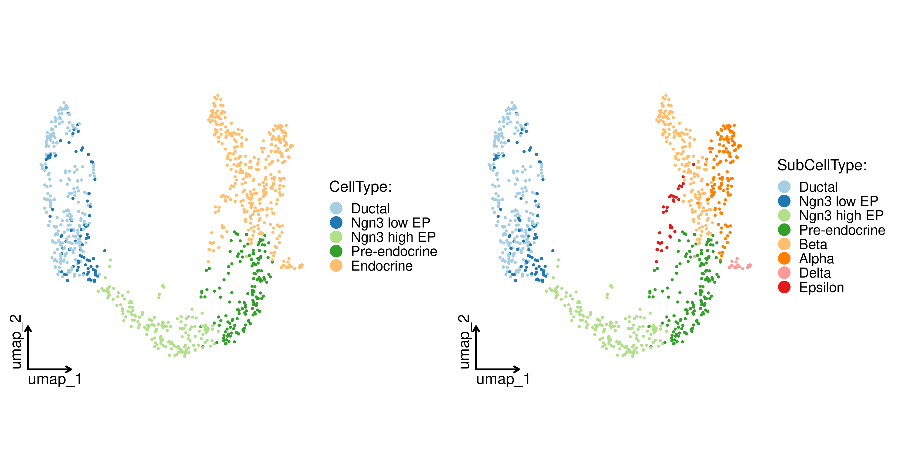

``` r
CellDimPlot(
  pancreas_sub,
  group.by = "SubCellType",
  stat.by = "Phase",
  reduction = "UMAP",
  theme_use = "theme_blank"
)
```

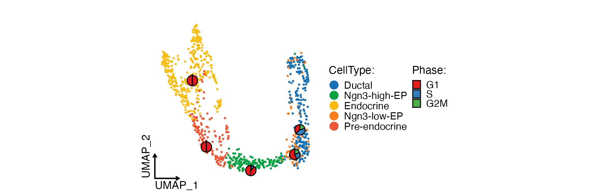

``` r
FeatureDimPlot(
  pancreas_sub,
  features = c("Sox9", "Neurog3", "Fev", "Rbp4"),
  reduction = "UMAP",
  theme_use = "theme_blank"
)
```

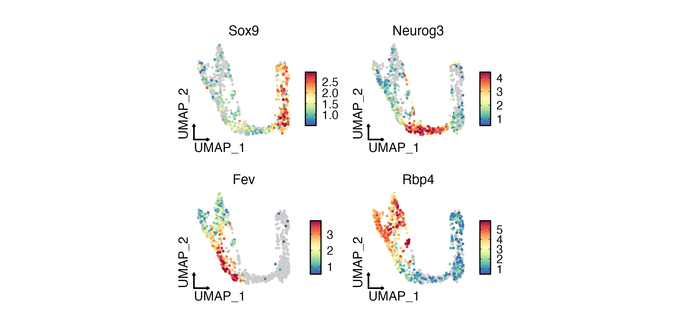

``` r
FeatureDimPlot(
  pancreas_sub,
  features = c("Ins1", "Gcg", "Sst", "Ghrl"),
  compare_features = TRUE,
  label = TRUE,
  label_insitu = TRUE,
  reduction = "UMAP",
  theme_use = "theme_blank"
)
```

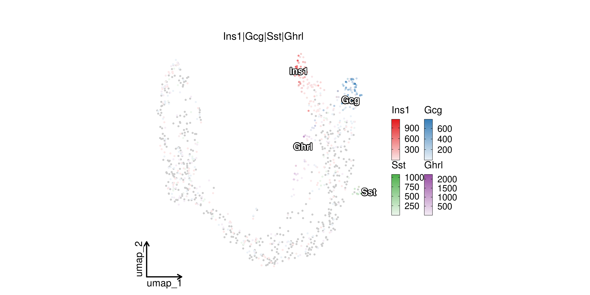

``` r
ht <- GroupHeatmap(
  pancreas_sub,
  features = c(
    "Sox9", "Anxa2", # Ductal
    "Neurog3", "Hes6", # EPs
    "Fev", "Neurod1", # Pre-endocrine
    "Rbp4", "Pyy", # Endocrine
    "Ins1", "Gcg", "Sst", "Ghrl" # Beta, Alpha, Delta, Epsilon
  ),
  group.by = c("CellType", "SubCellType"),
  heatmap_palette = "YlOrRd",
  cell_annotation = c("Phase", "G2M_score", "Cdh2"),
  cell_annotation_palette = c("Dark2", "Paired", "Paired"),
  show_row_names = TRUE, row_names_side = "left",
  add_dot = TRUE, add_reticle = TRUE
)
print(ht$plot)
```

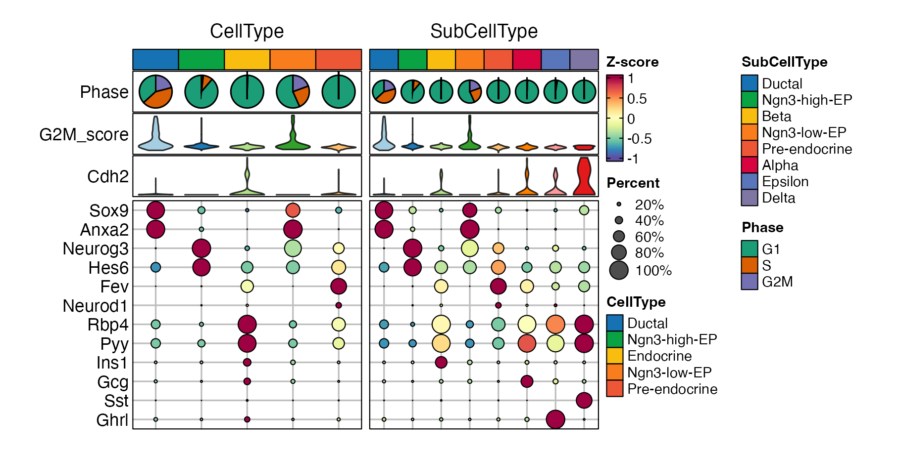

### CellQC

``` r
pancreas_sub <- RunCellQC(pancreas_sub)
CellDimPlot(pancreas_sub, group.by = "CellQC", reduction = "UMAP")
```

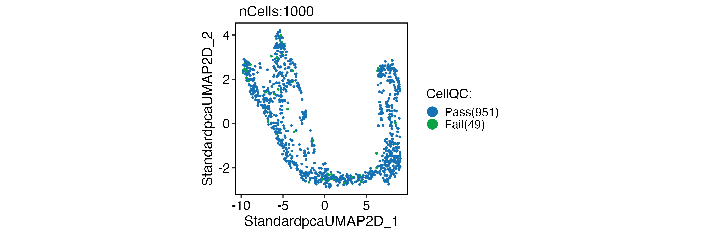

``` r
CellStatPlot(pancreas_sub, stat.by = "CellQC", group.by = "CellType", label = TRUE)
```

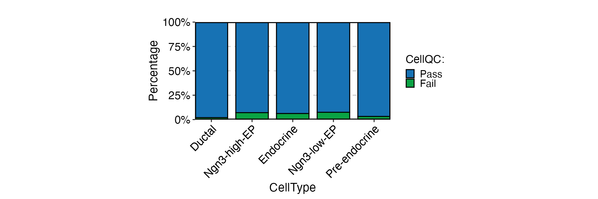

``` r
CellStatPlot(
  pancreas_sub,
  stat.by = c(
    "db_qc", "outlier_qc",
    "umi_qc", "gene_qc",
    "mito_qc", "ribo_qc",
    "ribo_mito_ratio_qc", "species_qc"
  ),
  plot_type = "upset",
  stat_level = "Fail"
)
```

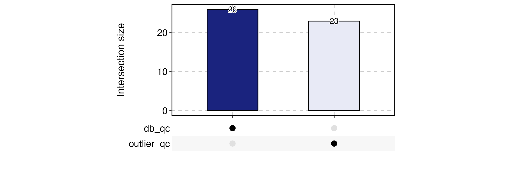

### Standard pipeline

``` r
pancreas_sub <- standard_scop(pancreas_sub)
CellDimPlot(
  pancreas_sub,
  group.by = c("CellType", "SubCellType"),
  reduction = "StandardUMAP2D",
  theme_use = "theme_blank"
)
```

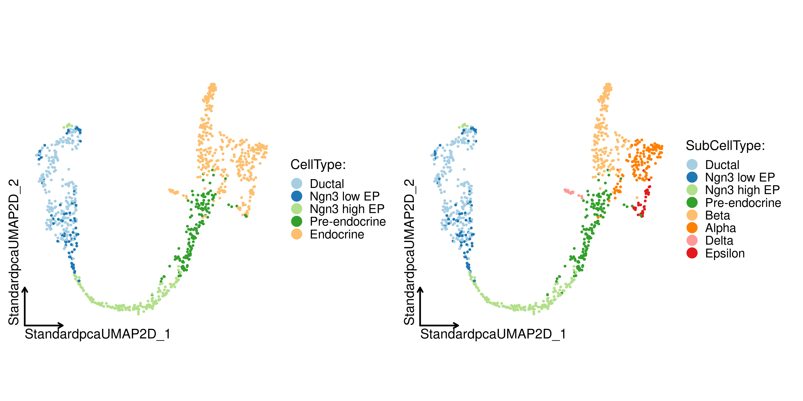

``` r
CellDimPlot3D(
  pancreas_sub,
  group.by = "SubCellType"
)
```

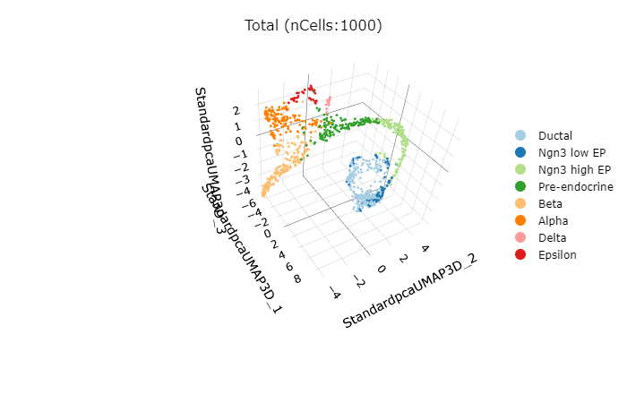

CellDimPlot3D

``` r
FeatureDimPlot3D(
  pancreas_sub,
  features = c("Sox9", "Neurog3", "Fev", "Rbp4")
)
```

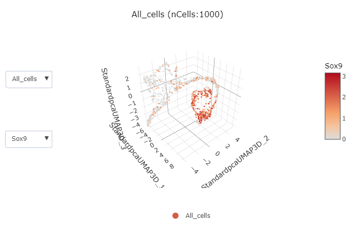

FeatureDimPlot3D

### Integration pipeline

Example data for integration is a subsetted version of [panc8(eight
human pancreas datasets)](https://github.com/satijalab/seurat-data)

``` r
data("panc8_sub")
panc8_sub <- integration_scop(
  srt_merge = panc8_sub,
  batch = "tech",
  integration_method = "Seurat"
)
CellDimPlot(
  panc8_sub,
  group.by = c("celltype", "tech"),
  reduction = "SeuratUMAP2D",
  title = "Seurat",
  theme_use = "theme_blank"
)
```

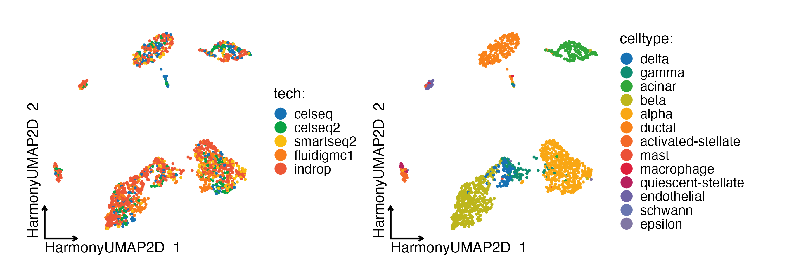

### Cell projection between single-cell datasets

``` r
genenames <- make.unique(
  thisutils::capitalize(
    rownames(panc8_sub[["RNA"]]
  ),
  force_tolower = TRUE)
)
names(genenames) <- rownames(panc8_sub)
panc8_rename <- RenameFeatures(
  panc8_sub,
  newnames = genenames,
  assays = "RNA"
)
srt_query <- RunKNNMap(
  srt_query = pancreas_sub,
  srt_ref = panc8_rename,
  ref_umap = "SeuratUMAP2D")
ProjectionPlot(
  srt_query = srt_query,
  srt_ref = panc8_rename,
  query_group = "SubCellType",
  ref_group = "celltype"
)
```

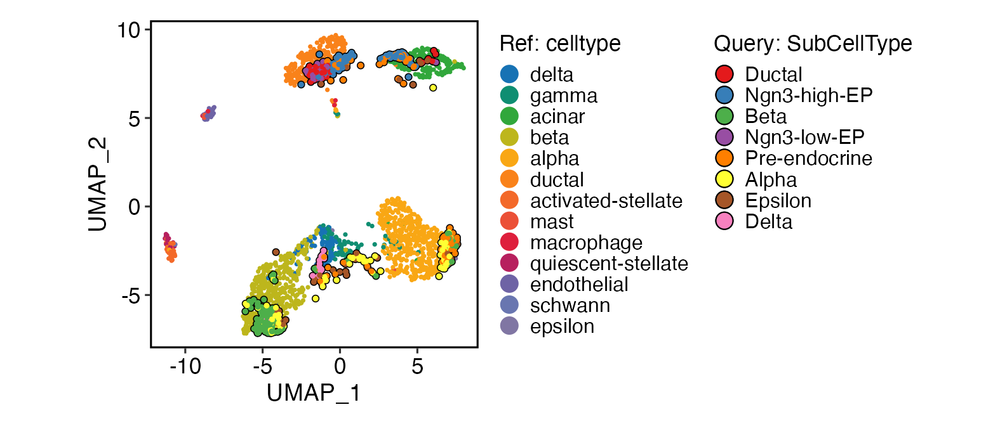

### Cell annotation using bulk RNA-seq datasets

``` r
data("ref_scMCA")
pancreas_sub <- RunKNNPredict(
  srt_query = pancreas_sub,
  bulk_ref = ref_scMCA,
  filter_lowfreq = 20
)
CellDimPlot(
  pancreas_sub,
  group.by = "KNNPredict_classification",
  reduction = "UMAP",
  label = TRUE
)
```

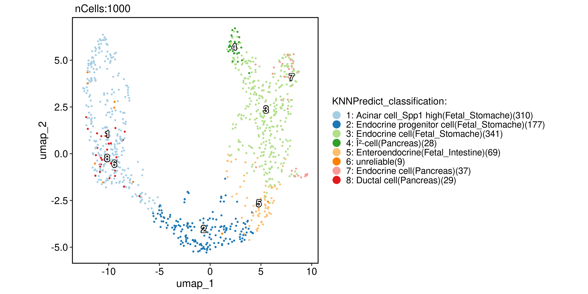

### Cell annotation using single-cell datasets

``` r
pancreas_sub <- RunKNNPredict(
  srt_query = pancreas_sub,
  srt_ref = panc8_rename,
  ref_group = "celltype",
  filter_lowfreq = 20
)
CellDimPlot(
  pancreas_sub,
  group.by = "KNNPredict_classification",
  reduction = "UMAP",
  label = TRUE
)
```

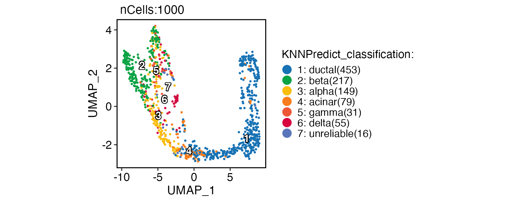

``` r
ht <- CellCorHeatmap(
  srt_query = pancreas_sub,
  srt_ref = panc8_rename,
  query_group = "SubCellType",
  ref_group = "celltype",
  nlabel = 3,
  label_by = "row",
  show_row_names = TRUE,
  show_column_names = TRUE
)
print(ht$plot)
```

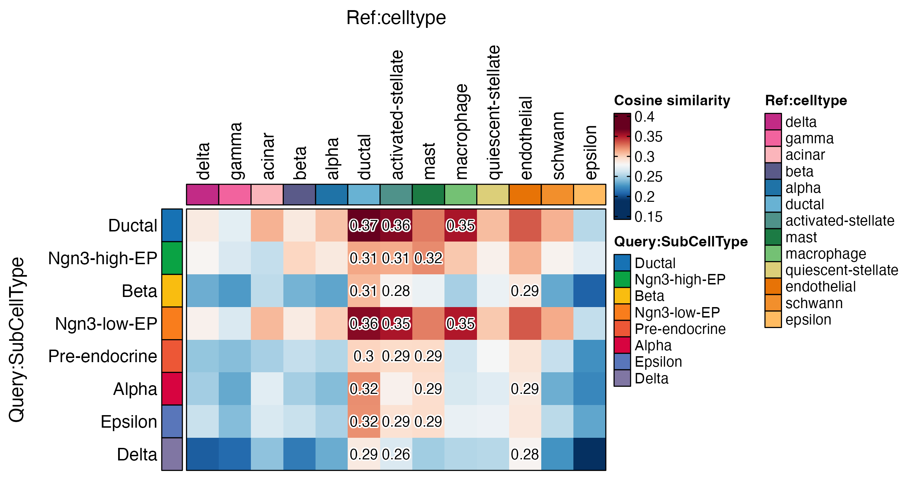

### Cellular potency

#### CytoTRACE 2

``` r
pancreas_sub <- RunCytoTRACE(
  pancreas_sub,
  species = "mouse"
)
CytoTRACEPlot(
  pancreas_sub,
  group.by = "SubCellType"
)
```

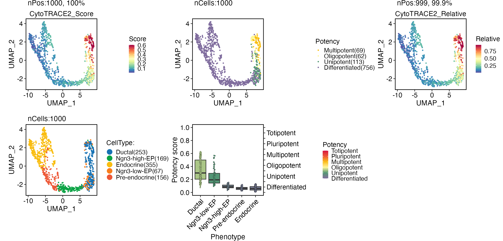

### Velocity analysis

To estimate RNA velocity, both “spliced” and “unspliced” assays in
Seurat object. You can generate these matrices using
[velocyto](http://velocyto.org/velocyto.py/index.md),
[bustools](https://bustools.github.io/BUS_notebooks_R/velocity.html), or
[alevin](https://combine-lab.github.io/alevin-fry-tutorials/2021/alevin-fry-velocity/).

#### SCVELO

``` r
pancreas_sub <- RunSCVELO(
  pancreas_sub,
  group_by = "SubCellType",
  linear_reduction = "PCA",
  nonlinear_reduction = "UMAP"
)
VelocityPlot(
  pancreas_sub,
  reduction = "UMAP",
  group_by = "SubCellType"
)
```

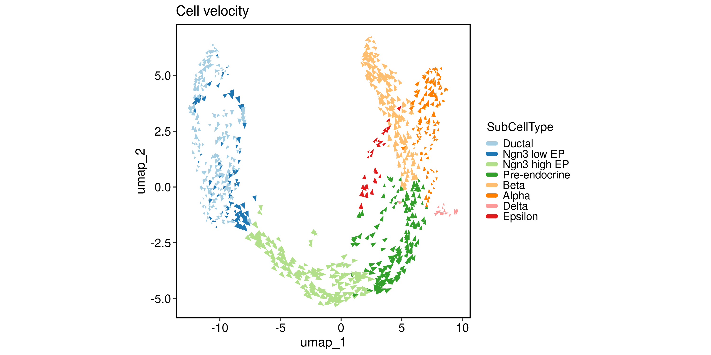

``` r
VelocityPlot(
  pancreas_sub,
  reduction = "UMAP",
  plot_type = "stream"
)
```


### Trajectory inference

#### PAGA analysis

``` r
PrepareEnv()
pancreas_sub <- RunPAGA(
  pancreas_sub,
  group_by = "SubCellType",
  linear_reduction = "PCA",
  nonlinear_reduction = "UMAP"
)
PAGAPlot(
  pancreas_sub,
  reduction = "UMAP",
  label = TRUE,
  label_insitu = TRUE,
  label_repel = TRUE
)
```

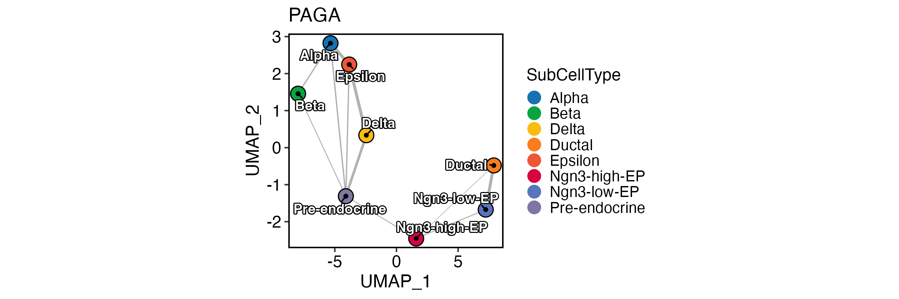

#### Slingshot

``` r
pancreas_sub <- RunSlingshot(
  pancreas_sub,
  group.by = "SubCellType",
  reduction = "UMAP"
)
```

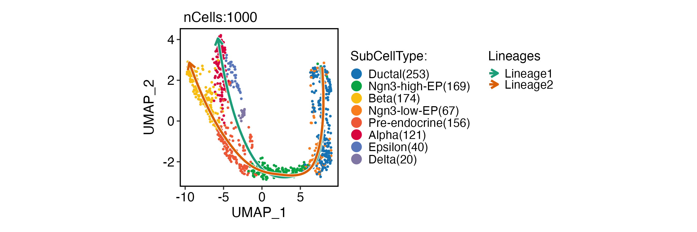

``` r
FeatureDimPlot(
  pancreas_sub,
  features = paste0("Lineage", 1:3),
  reduction = "UMAP",
  theme_use = "theme_blank"
)
```

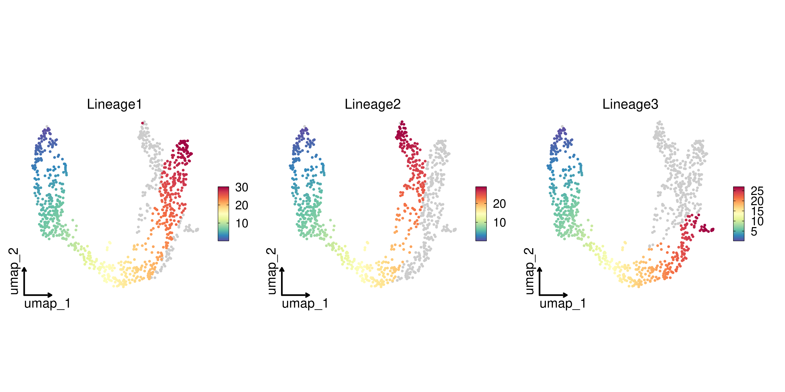

#### Monocle3

``` r
pancreas_sub <- RunMonocle3(
  pancreas_sub,
  group.by = "SubCellType"
)
```


### Dynamic features

``` r
pancreas_sub <- RunDynamicFeatures(
  pancreas_sub,
  lineages = c("Lineage1", "Lineage2"),
  n_candidates = 200
)
ht <- DynamicHeatmap(
  pancreas_sub,
  lineages = c("Lineage1", "Lineage2"),
  use_fitted = TRUE,
  n_split = 6,
  reverse_ht = "Lineage1",
  species = "Mus_musculus",
  db = "GO_BP",
  anno_terms = TRUE,
  anno_keys = TRUE,
  anno_features = TRUE,
  heatmap_palette = "viridis",
  cell_annotation = "SubCellType",
  separate_annotation = list(
    "SubCellType", c("Nnat", "Irx1")
  ),
  separate_annotation_palette = c("Paired", "Set1"),
  feature_annotation = c("TF", "CSPA"),
  feature_annotation_palcolor = list(
    c("gold", "steelblue"), c("forestgreen")
  ),
  pseudotime_label = 25,
  pseudotime_label_color = "red",
  height = 5,
  width = 2
)
print(ht$plot)
```

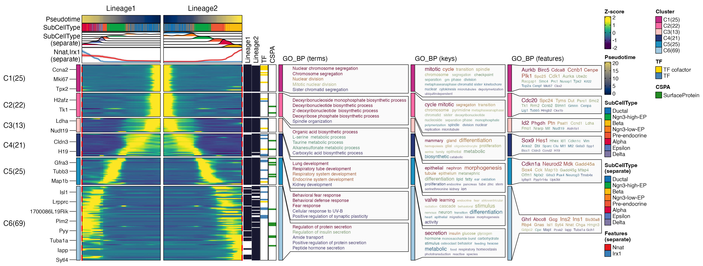

``` r
DynamicPlot(
  pancreas_sub,
  lineages = c("Lineage1", "Lineage2"),
  group.by = "SubCellType",
  features = c(
    "Plk1", "Hes1", "Neurod2", "Ghrl", "Gcg", "Ins2"
  ),
  compare_lineages = TRUE,
  compare_features = FALSE
)
```

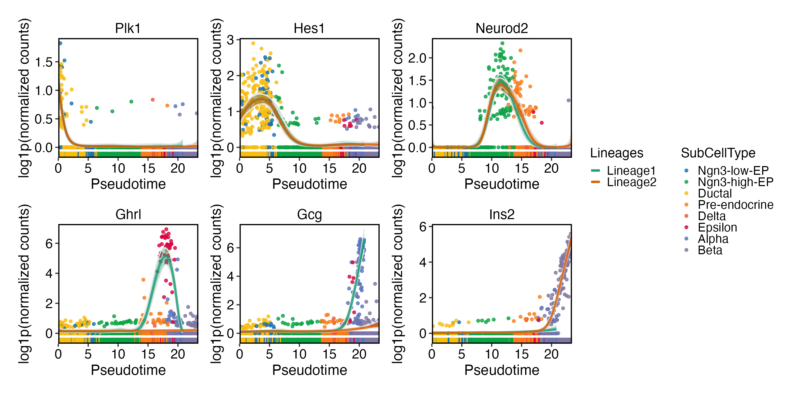

``` r
FeatureStatPlot(
  pancreas_sub,
  group.by = "SubCellType",
  bg.by = "CellType",
  stat.by = c("Sox9", "Neurod2", "Isl1", "Rbp4"),
  add_box = TRUE,
  comparisons = list(
    c("Ductal", "Ngn3 low EP"),
    c("Ngn3 high EP", "Pre-endocrine"),
    c("Alpha", "Beta")
  )
)
```

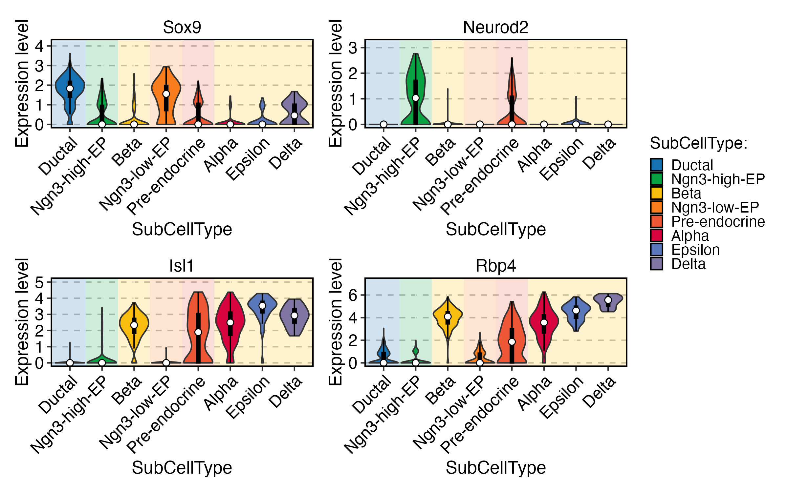

### Differential expression analysis

``` r
pancreas_sub <- RunDEtest(
  pancreas_sub,
  group_by = "CellType",
  fc.threshold = 1,
  only.pos = FALSE
)
VolcanoPlot(
  pancreas_sub,
  group_by = "CellType"
)
```

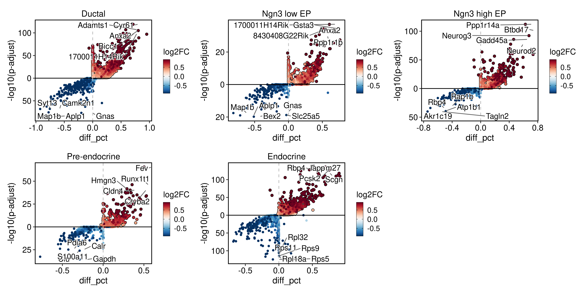

``` r
DEGs <- pancreas_sub@tools$DEtest_CellType$AllMarkers_wilcox
DEGs <- DEGs[with(DEGs, avg_log2FC > 1 & p_val_adj < 0.05), ]
# Annotate features with transcription factors and surface proteins
pancreas_sub <- AnnotateFeatures(
  pancreas_sub,
  species = "Mus_musculus",
  db = c("TF", "CSPA")
)
ht <- FeatureHeatmap(
  pancreas_sub,
  group.by = "CellType",
  features = DEGs$gene,
  feature_split = DEGs$group1,
  species = "Mus_musculus",
  db = c("GO_BP", "KEGG", "WikiPathway"),
  anno_terms = TRUE,
  feature_annotation = c("TF", "CSPA"),
  feature_annotation_palcolor = list(
    c("gold", "steelblue"), c("forestgreen")
  ),
  height = 5, width = 4
)
print(ht$plot)
```

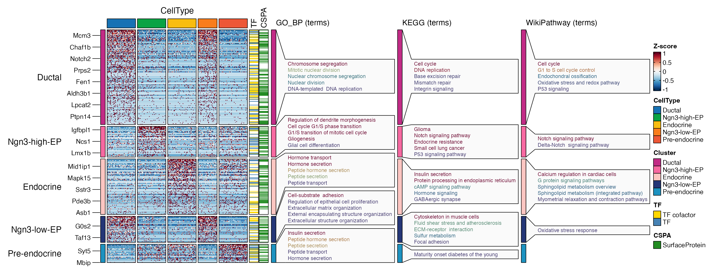

### Enrichment analysis(over-representation)

``` r
pancreas_sub <- RunEnrichment(
  pancreas_sub,
  group_by = "CellType",
  db = "GO_BP",
  species = "Mus_musculus",
  DE_threshold = "avg_log2FC > log2(1.5) & p_val_adj < 0.05"
)
EnrichmentPlot(
  pancreas_sub,
  group_by = "CellType",
  group_use = c("Ductal", "Endocrine"),
  plot_type = "bar"
)
```

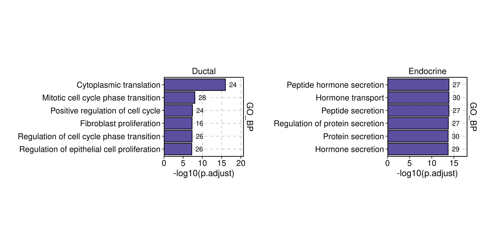

``` r
EnrichmentPlot(
  pancreas_sub,
  group_by = "CellType",
  group_use = c("Ductal", "Endocrine"),
  plot_type = "wordcloud"
)
```

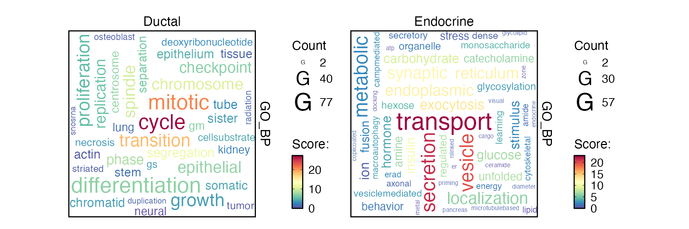

``` r
EnrichmentPlot(
  pancreas_sub,
  group_by = "CellType",
  group_use = c("Ductal", "Endocrine"),
  plot_type = "wordcloud",
  word_type = "feature"
)
```

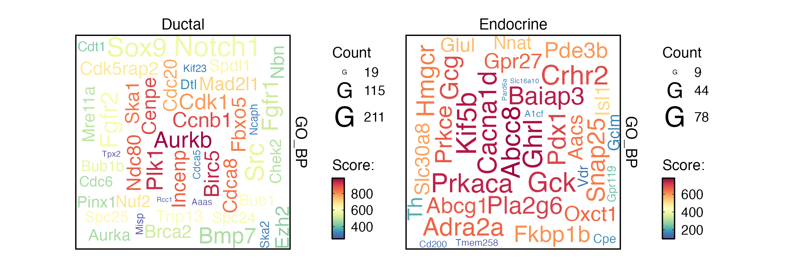

``` r
EnrichmentPlot(
  pancreas_sub,
  group_by = "CellType",
  group_use = "Ductal",
  plot_type = "network"
)
```

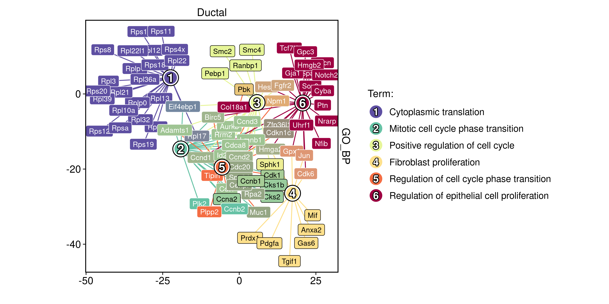

To ensure that labels are visible, you can adjust the size of the viewer
panel on Rstudio IDE.

``` r
EnrichmentPlot(
  pancreas_sub,
  group_by = "CellType",
  group_use = "Ductal",
  plot_type = "enrichmap"
)
```

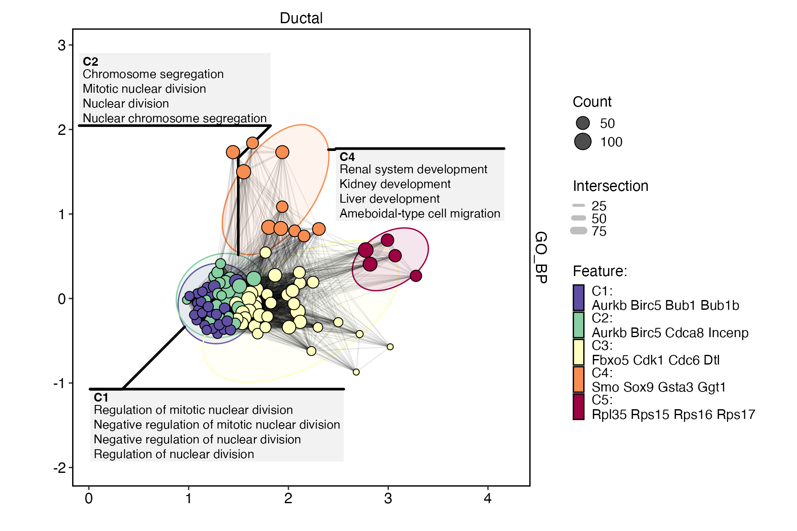

``` r
EnrichmentPlot(
  pancreas_sub,
  group_by = "CellType",
  plot_type = "comparison"
)
```

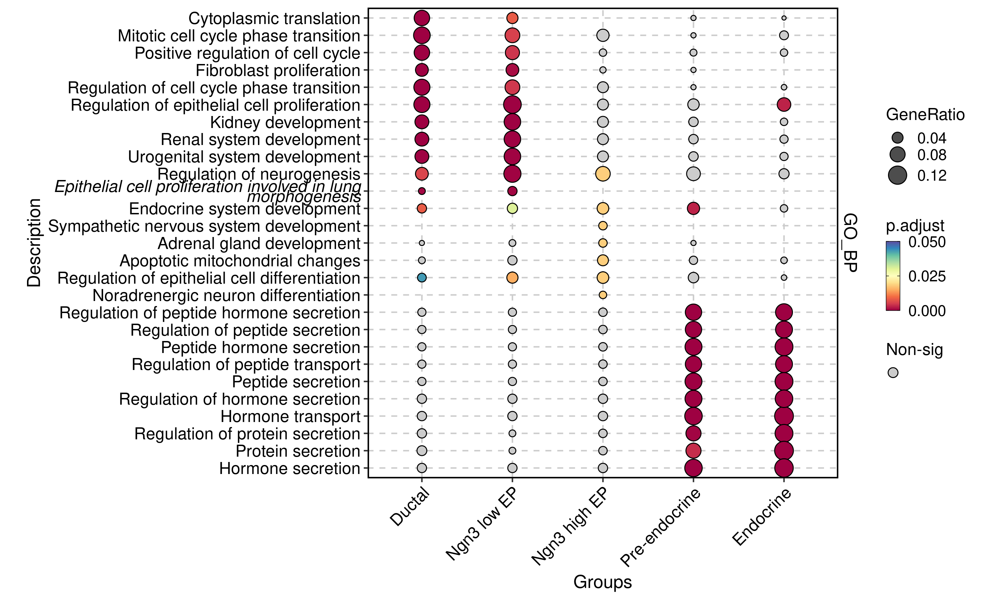

### Enrichment analysis(GSEA)

``` r
pancreas_sub <- RunGSEA(
  pancreas_sub,
  group_by = "CellType",
  db = "GO_BP",
  species = "Mus_musculus",
  DE_threshold = "p_val_adj < 0.05"
)
GSEAPlot(
  pancreas_sub,
  group_by = "CellType",
  group_use = "Endocrine",
  id_use = "GO:0007186"
)
```

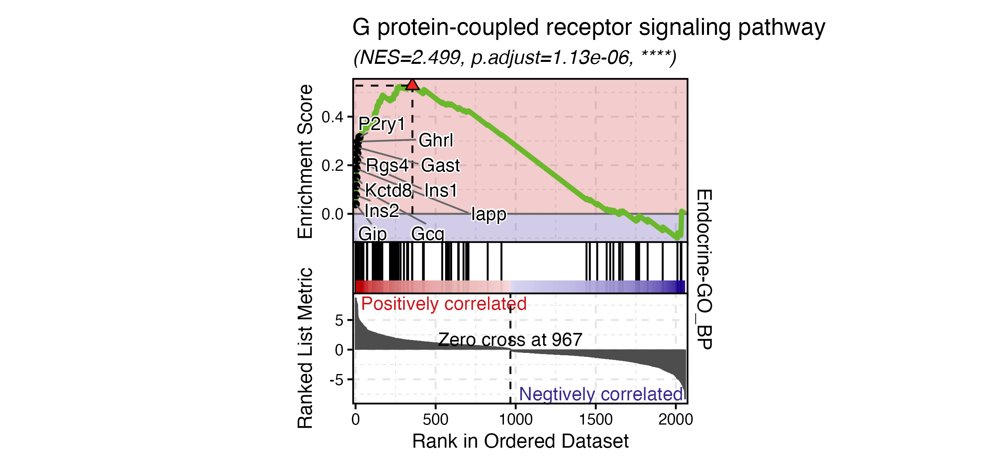

``` r
GSEAPlot(
  pancreas_sub,
  group_by = "CellType",
  group_use = "Endocrine",
  plot_type = "bar",
  direction = "both",
  topTerm = 20
)
```

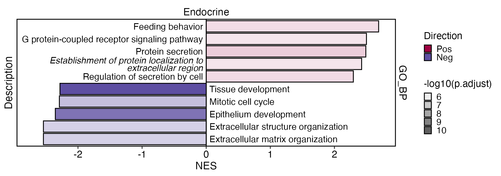

### Interactive data visualization with SCExplorer

``` r
PrepareSCExplorer(
  list(
    mouse_pancreas = pancreas_sub,
    human_pancreas = panc8_sub
  ),
  base_dir = "./SCExplorer"
)
app <- RunSCExplorer(base_dir = "./SCExplorer")
list.files("./SCExplorer") # This directory can be used as site directory for Shiny Server.

if (interactive()) {
  shiny::runApp(app)
}
```

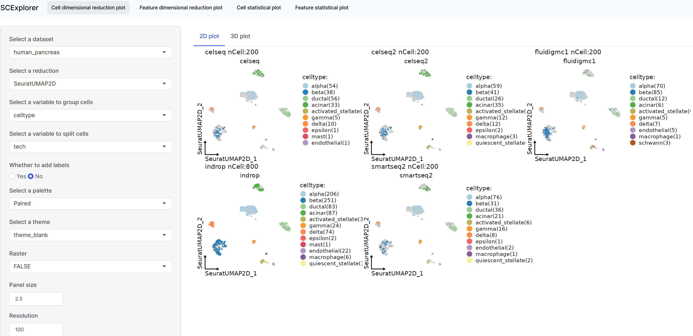

SCExplorer1

### Other visualization examples

[**CellDimPlot**](https://mengxu98.github.io/scop/reference/CellDimPlot.html)

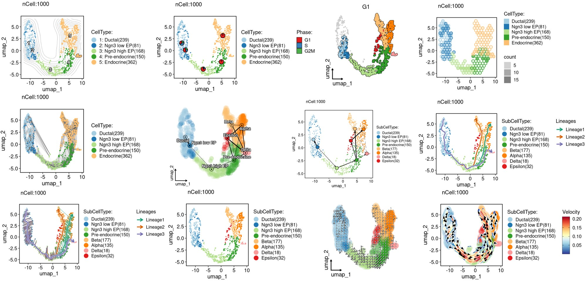[**CellStatPlot**](https://mengxu98.github.io/scop/reference/CellStatPlot.html)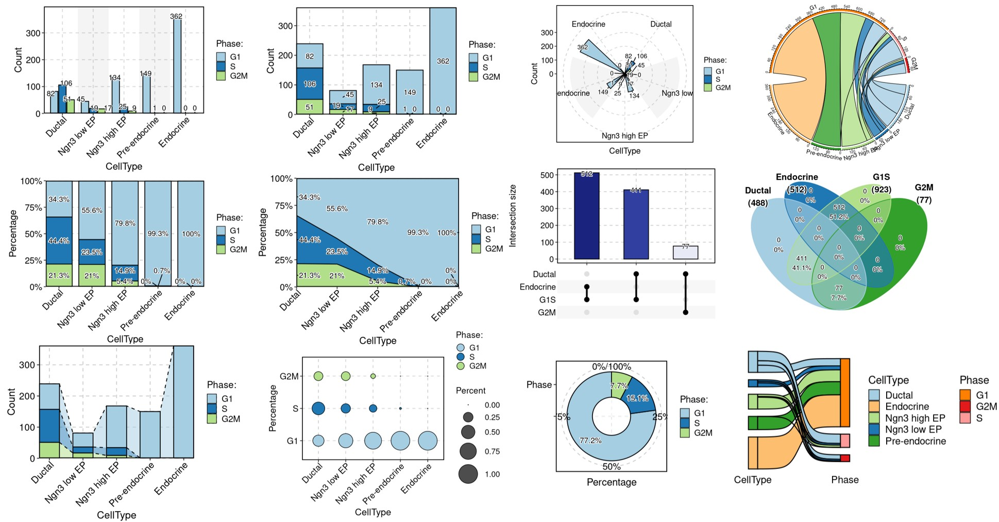[**FeatureStatPlot**](https://mengxu98.github.io/scop/reference/FeatureStatPlot.html)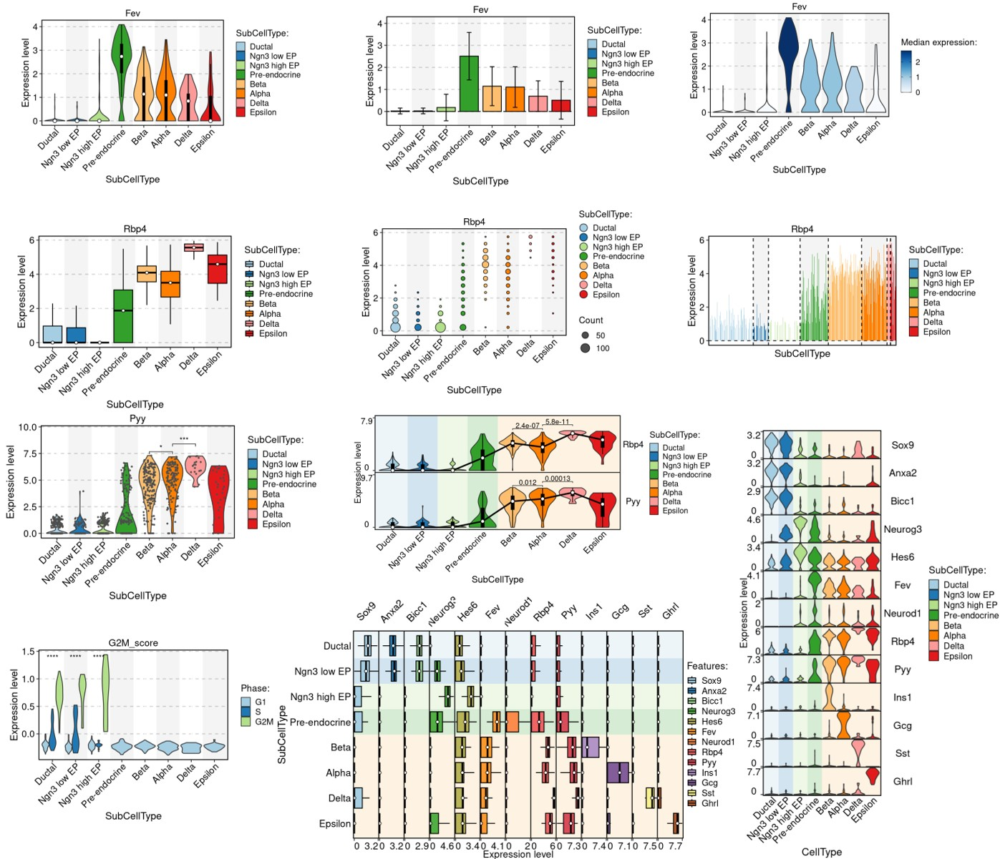[**GroupHeatmap**](https://mengxu98.github.io/scop/reference/GroupHeatmap.html)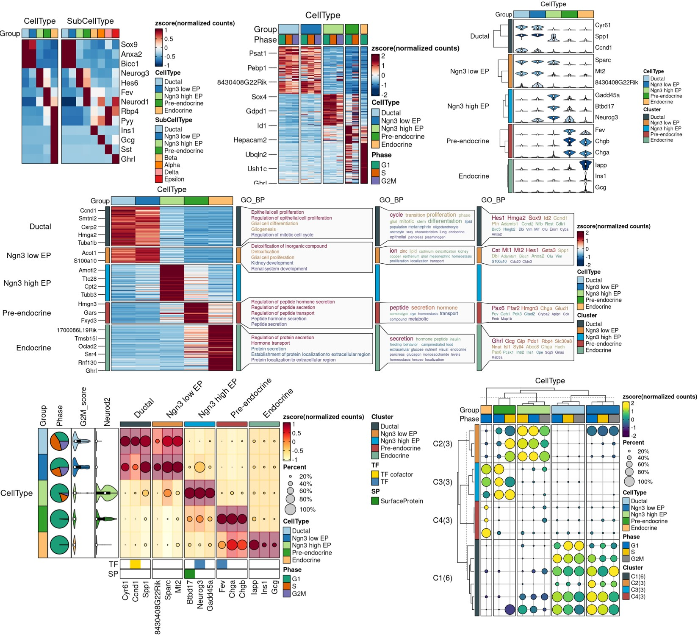

You can also find more examples in the documentation of the function:
[integration_scop](https://mengxu98.github.io/scop/reference/integration_scop.html),
[RunKNNMap](https://mengxu98.github.io/scop/reference/RunKNNMap.html),
[RunPalantir](https://mengxu98.github.io/scop/reference/RunPalantir.html),
etc.
